Redis 开发与运维书籍

<!-- more -->

## 一. 使用场景

### 1. 缓存

加快数据的访问速度，降低服务器端压力

- 提供了 键值过期时间
- 提供了 灵活控制最大内存
- 提供了 内存溢出之后的淘汰策略

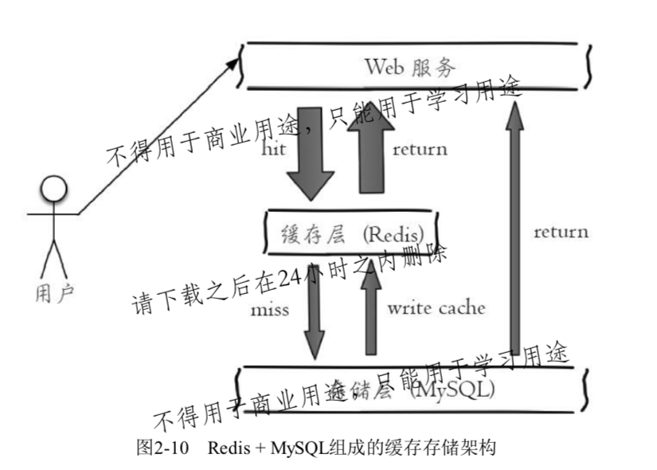

合理的设置键名

```
推荐的方式是使用 "业务名: 对象名: id: [属性]"
```


- 伪代码

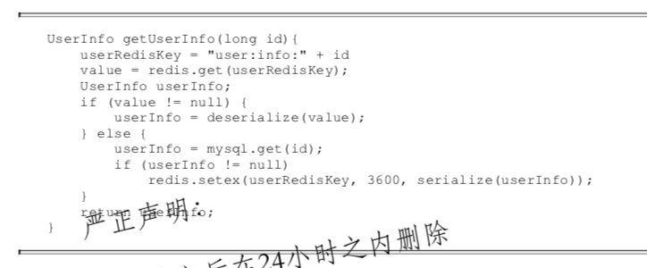

### 2. 排行榜系统

比如记录用户视频点赞排行榜

- 添加用户点赞数

  假定 用户 mike 获取 3个赞

```
zadd user:ranking:2016_03_16 mike 3
```

- 增加点赞数

```
zincrby user:ranking:2016_03_16 mike 1
```

- 获取点赞数做多的10个用户

```
zrevrangebyrank user:ranking:2016_03_16 0 9
```

- 展示用户分数 和 排名

```
zscore user:ranking:2016_03_16 mike
zrank user:ranking:2016_03_16 mike
```


### 3. 计数器应用

Redis 天然支持计数功能，并且计数功能性能非常好

- 伪代码

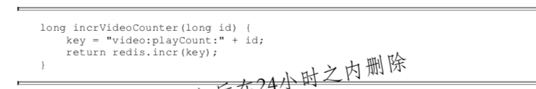

### 4. 社交网络

### 5. 消息队列系统

Redis 提供了 发布订阅 和 阻塞队列的功能。虽然与 专业的消息队列比还不够强大，大事对一般的消息队列基本可以满足

### 6. 共享session

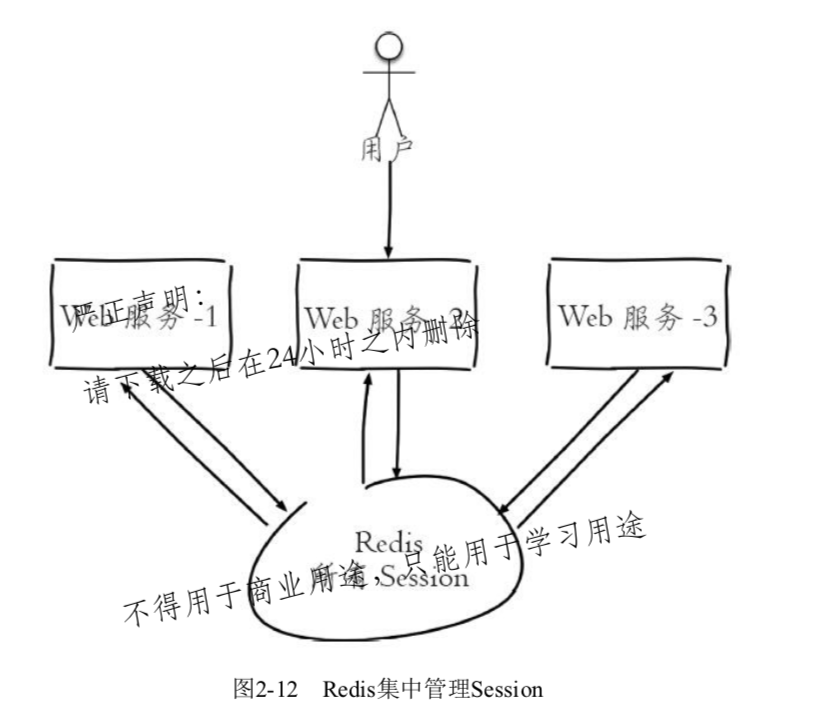

### 7. 限速

假定限制用户每分钟获取验证码的频率不能超过 5次

- 伪代码

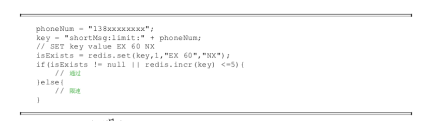

### 8. 保存数据

- 关系型数据库表记录

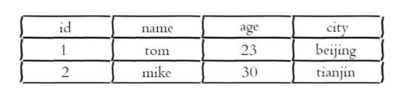

- 使用哈希类型存储

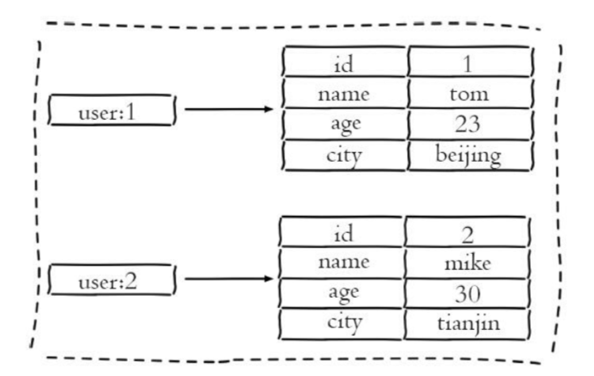

### 9. 消息队列

Redis 的 lpush + brpop 可以实现 阻塞队列

- 生产者使用 lpush 从列表左侧插入元素
- 多个消费之 使用 brpop 阻塞式的 ”抢“ 尾部的元素

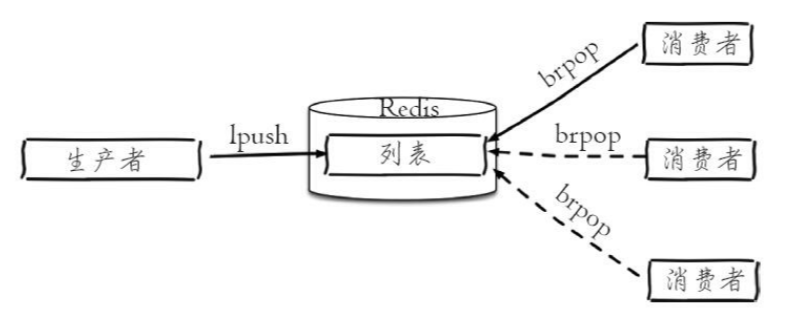

列表其他场景

- 栈

  ```
  lpush + lpop = Stack
  ```

- 队列

  ```
  lpush + rpop = Queue
  ```

- 有限集合

  ```
  lpush + ltrim = Capped Collection
  ```

  

### 10.文章列表

对于用户文章列表 （由于文章有序，且会用到分页), 可以考虑使用 列表，并且可以按照索引范围来进行元素的获取

- 哈希存储每篇文章

```
hmset article:1 prop1 v1 prop2 v2 ...
...
hmset article:k prop1 vk prop2 vk ...
```

- 每个用户文章列表，使用 list

  列表中保存的是 哈希存储的key

```
lpush user:1:articles article:1 article:2 article：3
```

- 分页获取

  比如，获取 id=1用户前10篇文章

```
// 获取 文章 key
articles = lrange user:1:articles 0 9
// 获取文章具体信息
for article in articles:
	hegetall article
```

### 11. 用户标签

网站对不同喜好的用户，添加不同的标签

- 添加标签

```
sadd user:1:tags tag1 tag2 tag3
sadd user:2:tags tag2 tag3 tag5
```

- 使用 sinter ，计算用户共同感兴趣的标签

集合类型的用处:

- 标签

- 生成随机数（比如抽奖)

  spop srandmember

- 社交需求

  sadd + sinter

### 不适合的场景

- 由于Redis 数据存储在内存中，不适合 大规模的数据
- 冷数据(访问较少)的数据不适合放在 Redis 中

## 二. API的使用

### 1. 全局命令

#### 1. 查看所有键

```
keys *
```

#### 2. 查看键总数

```
dbsize
```

##### 注意:

dbsize 在计算键总数的时候，是直接获取Redis内置的键总数变量，而不是遍历所有键 =》 时间复杂度是 O(1)

#### 3. 检查键是否存在

存在返回 1， 不存在返回 0

```
exists key
```

#### 4. 删除键

1. 可以同时删除多个
2. 返回值为成功删除键的个数
3. 如果删除一个不存在的键，返回 0

```
del key [key ...]
```

#### 5. 键过期

对键添加过期时间。在超过过期时间之后，会自动删除键。 单位是秒

```
expire key seconds
```

#### 6. 查看键的剩余过期时间

返回值:

- 大于等于0的整数 => 键剩余的过期时间
- -1  => 键没有设置过期时间
- -2 => 键不存在

```
ttl key
```

#### 7. 键的数据结构类型

返回值:

- 对应数据类型
- none  => 键不存在

```
type key
```

### 2. 数据结构

type 命令返回的是 当前键的数据结构类型 （对外的数据结构):

- string (字符串)
- Hash (哈希)
- list (列表)
- set （集合)
- zset (有序集合)

每种数据结构都有自己底层的内部编码实现，而且是多种实现！

#### 1. Redis 数据结构

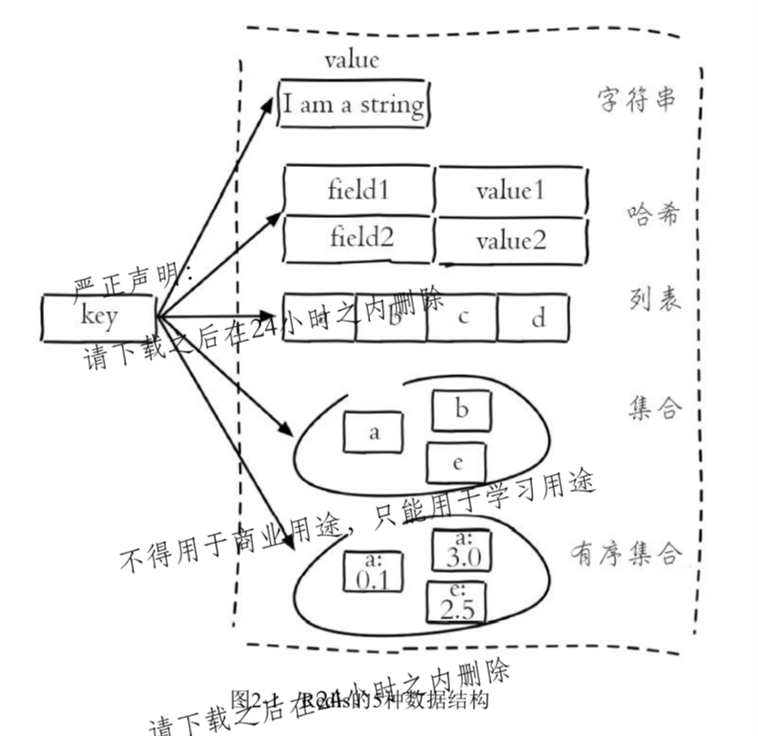

Redis 提供内部编码与外部数据结构的好处:

- 改进内部编码，对外部数据结构没有影响
- 多种内部编码可以适用于多种不同的场景。可以根据对应场景自动切换

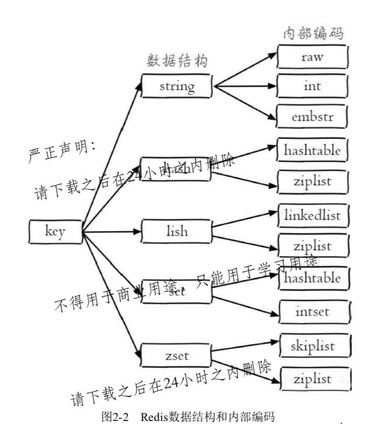

### 3. 架构

Redis 使用 单线程架构 + I/O 多路复用模型 来实现高性能的内存数据库服务

Redis 每次客户端调用，都会经历 发送命令，执行命令，返回结果3个步骤

其中:

	1. 由于Redis是单线程处理命令，所以命令到达Redis 服务端的时候，不会被立即执行，而是进入一个队列，然后被逐个执行 ==> 不会有两条命令同时执行

#### 为什么单线程速度还这么快

- 纯内存访问

  Redis 将所有的数据都放在了内存中，内存的响应时间大约为 100纳秒 ==> Redis 可以每秒万级别访问的重要基础

- 非阻塞I/O 

  Redis 使用 epoll 作为 I/o梭路复用技术的实现

  加上 Redis自身的事件处理模型，将 epoll中 链接，读写，关闭都转为 时间，因此不用再 网络i/o上浪费过多的时间

  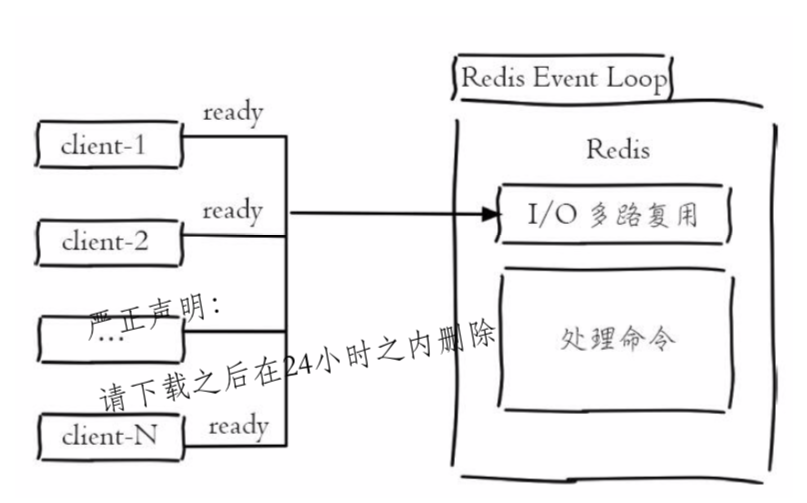

- 单线程避免了线程切换与竞态产生的消耗

  单线程的好处

  - 简化数据结构和算法的实现
  - 避免了线程切换和竞态 产生的消耗（锁和线程切换通常都是性能杀手)

  注意点:

  ​	单线程对于每一个命令的执行时间是有要求的。因为如果一个命令执行时间过长，则会导致其他命令的阻塞 =》 Redis 是面向快速执行场景的数据库

### 4. 字符串

字符串类型的值，可以为

- 简单字符串

- 复杂字符串（JSON, XML等)

- 数字 (整数，浮点数)

- 二进制 (图片，视频，音频)

  此类型值最大不能超过 521MB

#### 1. 设置值（set, setnx, setxx, mset)

分布式锁: setnx

```
/*
 *	返回 OK 标识设置成功
 *  ex seconds: 为键设置 过期时间 （秒为单位)
 *  px milliseconds: 为键设置 毫秒过期时间 (毫秒为单位)
 *  nx: 键必须不存在，才可以设置成功 (用于添加)  ==> setnx
 *  xx: 键必须存在，才可以设置成功 （用于更新)   ==> setxx
 */
set key value [ex seconds] [px milliseconds] [mx|xx]

/*
 *	批量设置值
 */
mset key value [key value ...]
```

#### 2. 获取值 (get, mget)

```
/*
 * 如果键不存在，返回 nil
 */
get key

/*
 * 批量获取值
 * 返回的值，按照 key的顺序，如果key不存在，该处的值为 nil
 */
 mget key [key ...]
```

批量操作命令的好处:

​	可以有效的提高开发效率。

```
n次get时间 = n次网络时间 + n次命令时间
mget时间 = 1次网络时间 + n次命令时间
```

注意:

​	每次批量操作发送的命令数不是无限制的，数量过多可能造成Redis阻塞或者网络拥塞

#### 3. 计数

- incr (自增)
- decr (自减)
- Incrby (自增指定的数字)
- decrby (自减指定数字)
- incrbyfloat (自增浮点数)

```
/*
 * 对值做自增操作
 * 返回值:
 			返回错误: 由于值不是整数
 			返回自增后的结果: 值是整数
 			按照0自增，返回1：键不存在
 */
 incr key
 
```

#### 4. 设置并返回原值

设置一个新的值，并返回原来的旧值

```
getset key value
```

### 5. 哈希

哈希类型，在不同的语言中可能是 哈希，字典，关联数组等等。

- 字符串与哈希的对比

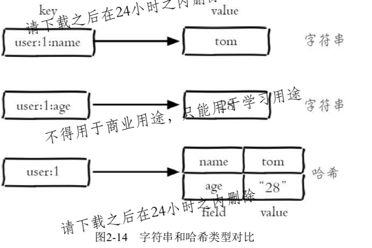

#### 1. 设置值

```
/*
 * 返回值:
 		1 =》 成功
 		0 =》 失败
 */
hset key field value

/*
 *	hsetnx 与 setnx 类似，只是针对的对象是 field，而非 key
 */
```

#### 2. 获取值

返回值:

- 对应值
- 如果键或者field不存在，返回nil

```
hget key field
```

#### 3. 删除field

返回结果为 成功删除field的个数

```
hdel key field [field ...]
```

#### 4. 计算field个数

```
hlen key
```

#### 5. 批量设置或获取field-value

```
hmget key field [field ...]
hmset key field value [field value ...]
```

#### 6. 判断 field 是否存在

返回值:

- 1  => 存在
- 0  => 不存在

```
hexists key field
```

#### 7. 获取所有 field

```
hkeys key
```

#### 8. 获取所有value

```
hvals key
```

#### 9. 获取所有的 field-value

注意:

- 如果 field个数比较多，可能会阻塞 Redis
- 如果还需要获取部分field, 可以选择使用 hmget
- 如果一定要获取全部，可以选择使用 hscan

```
hgetall key
```

#### 10. 递增

```
hincrby key field
hincrbyfloat key field
```

### 6. 列表

- 用来存储多个有序的字符串

- 列表中每个字符串成为 元素(element)

- 一个列表最多可以存储 2^32-1个元素
- Redis中，可以对列表两端进行 插入(push) 和 弹出(pop) 操作
- Redis中，可以获取指定范围的元素列表，获取指定索引的元素等

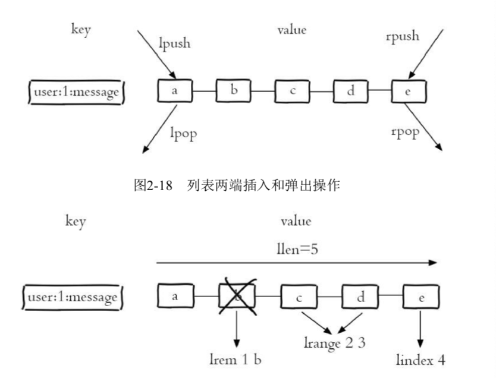

列表类型的特点:

	- 有序
	- 可以重复

#### 1. 添加操作

- 从右边插入元素

```
rpush key value [value ...]
```

- 从左边插入元素

```
lpush key value [value ...]
```

- 向某个元素前或者后插入元素

```
linsert key before|after list中已有值 value
```

#### 2. 查找

- 获取指定范围内的元素列表
  - 索引下标从左到右分别是 0 到 N-1
  - 索引下标从右到左分别是 -1 到 -N
  - lrange中的 end 包含了自身

```
lrange key start end
```

- 获取指定索引下标的元素

```
lindex key index
```

- 获取列表长度

```
llen key
```

#### 3. 删除

- 从左测弹出

```
lpop key
```

- 从右侧弹出

```
rpop key
```

- 删除指定元素

  从列表中，找到 key 中等于 value的元素进行删除，根据count分为下面三种情况

  - count>0  =》 从左向右，删除最多 count个元素
  - count<0  =>   从右向左，删除最多 count 绝对值个元素
  - count =0     => 删除所有

```
lrem key count value
```

#### 4. 按照所有范围修剪列表

```
ltrim key start end
```

#### 5. 修改

```
lset key index newValue
```

#### 6. 阻塞操作

是 lpop 和 rpop的阻塞版本

timeout:

- 大于0  => 等待对应秒数
- 等于0  => 一直等待下去

```
blpop key [key ...] timeout
brpop key [key ...] timeout
```

注意:

​	1. 如果是多个键，则会按照顺序进行遍历，一旦有一个键可以弹出，则会立即返回 ==> 返回出值的元素可能会与 key的顺序不一致

​	2. 如果多个客户端对同一个 列表进行 blpop或者 brpop, 如果只有一个元素，那么只有一个客户端可以抢到，其他客户端进行阻塞

### 7. 集合

集合(set) 也是用来保存多个的字符串元素。

与列表类型的不同点:

- 集合中不允许重复元素
- 集合中元素无序
- 不能通过索引下标获取元素

一个集合最多存储 2^32-1 个元素

Redis 不仅仅支持集合内部的增删改查，还支持多个集合 取 交并差 等操作

#### 1. 添加元素

返回成功添加的元素个数

```
sadd key elment [element ...]
```

#### 2. 删除元素

返回j结果为 成功删除元素个数

```
srem key element [element ...]
```

#### 3. 计算元素个数

时间复杂度为 O(1), 直接使用 Redis内部的遍历，而非遍历

```
scard key
```

#### 4. 判断元素是否在集合内

返回值:

​	0 => 不在

​	1 => 在

```
sismember key element
```

#### 5. 随机从集合返回指定个数元素

count 是可选，默认为 1

```
srandmember key [count]
```

#### 6. 随机从集合弹出元素

```
spop key
```

#### 7. 获取所有元素

如果元素过多，存在阻塞可能

```
smember key
```

#### 8. 多个集合的交集

```
sinter key [key ...]
```

#### 9. 多个集合的并集

```
sunion key [key ...]
```

#### 10. 多个集合的差集

```
sdiff key [key ...]
```

#### 11. 缓存 集合操作结果

如果元素较多，那么集合间的元素可能比较耗时，可以将结果保存在另外的key中,下次直接使用

```
sinterstore destination key [key ...]
sunionstore destination key [key ...]
sdiffstore destination key [key ...]
```

### 8. 有序集合

相对有序集合特点:

- 不能有重复成员

- 元素可以排序

  给每个元素设置一个分数(score) 作为排序的依据（Score 可以重复)

  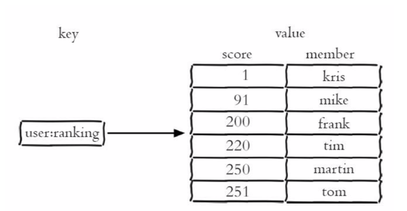

#### 1. 添加成员

返回结果代表 成功添加成员的个数

zadd的时间复杂度为 O(log(n)), sadd 的时间复杂度为 O(1)

```
zadd key score member [score member ...]
```

#### 2. 计算成员个数

```
zcard key
```

#### 3. 返回成员分数

如果不存在，返回 nil

```
zscore key member
```

#### 4. 计算成员的排名

Zrank: 按照分数，从低到高返回排名（排名从 0 开始)

Zrevrank: 相反

```
zrank key member
zrevrank key member
```

#### 5. 删除成员

```
zrem key member [member ...]
```

#### 6. 增加 成员的分数

```
zincrby key increment member
```

#### 7. 返回指定排名范围成员

添加 withscore 选项，则同时返回成员的分数

```
zrange key start end [withscore]
zrevrange key start end [withscore]
```

#### 8. 返回指定分数范围内的成员

limit offset count 选项用来限制 输出的 起始位置和个数

min 和 max 还支持 开区间(小括号) 和 闭区间 (中括号)

-inf 和 +inf 分别代表 无线小 和 无限大

```
zrangebyscore key min max [withscore] [limit offset count]
zrevrangebyscore key min max [withscore] [limit offset count]

zrangebyscore  user:ranking (200 +inf withscore
```

#### 9. 返回指定分数范围内成员个数

```
zcount key min max
```

#### 10. 删除指定排名内的升序元素

```
zremrangebyrank key start end
```

#### 11. 删除指定分数范围的成员

```
zremrangebyscore key min max
```

#### 12. 集合间操作

导入有序集合

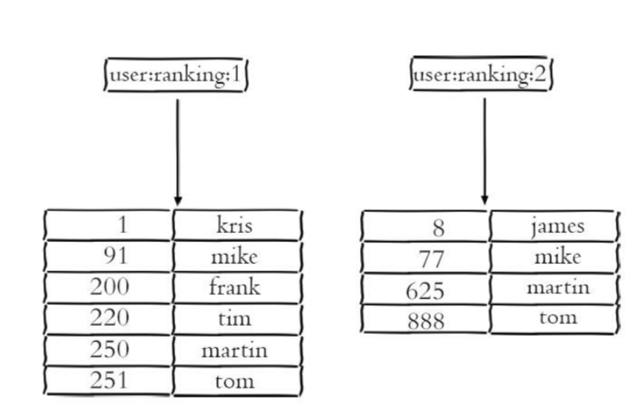

- 交集

```
/*
 * destination： 交集计算结果保存到这个 键
 * numkeys:      需要做交集计算键的个数
 * key[key ...]  需要做交集计算的键
 * weights weight [weight ...] 每个键的权重。在做交集计算时，每个键中每个member都会将自己分数乘以这个权重，每个键的权重默认是1
 * aggregate sum|min|max： 计算成员交集之后，分值可以按照 sum(和) min max 做汇总，默认是sum
 */
zinterstore destination numkeys key [key ...] [weights weight [weight ...]] [aggregate sum|min|max]
```

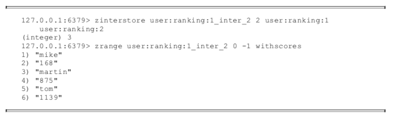

更改 user:ranking:2 的权重为 0.5, 并且使用 max 进行聚合

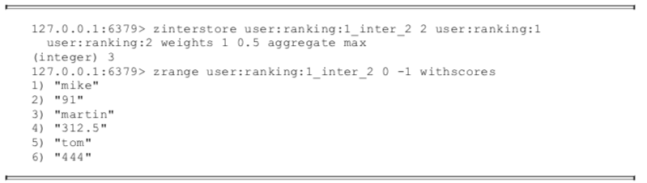

- 并集

  对于并集，使用 zunionstore ，其余与 交集一致

### 9. 键管理

#### 1. 重命名key

如果 rename 之前，已经存在一个 newkey 的键，那么该键的值会被覆盖

```
rename key newkey
```

为了防止被强行 rename, 可以使用 renamenx, 确保只有 newkey不存在的时候才被覆盖

#### 2. 随机返回一个 key

```
randomkey
```

#### 3. key 过期

#### 4. 迁移键

用来将部分数据从 一个 Redis 迁移到 另外一个 Redis （比如从生产环境到测试环境)

- move

  ```
  move key db
  ```

  mover 用于在 Redis内部进行数据的迁移。Redis的内部可以有多个数据库(彼此在数据上是隔离的)

  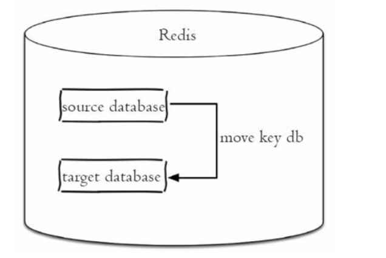

- dump + restore

  用于在不同的 Redis实例之间进行数据迁移的功能，迁移步骤如下:

  - 在源Redis上，dump 命令会将 键值进行序列化，格式 采用 RDB 格式
  - 在目标Redis上，restore命令将上面 序列化的值进行复原，其中 ttl 代表 过期时间， 如果ttl=0标识没有过期时间

  ```
  dump key
  restore key ttl value
  ```

  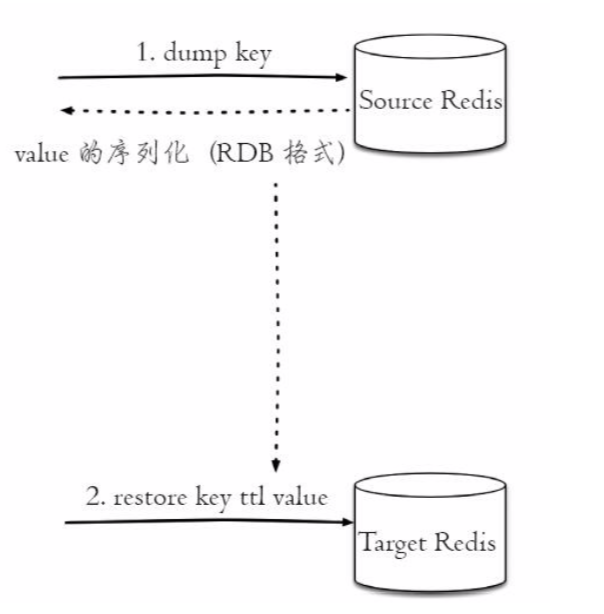

  注意: 迁移过程是分两步进行的

  - 整个迁移过程并非原子性的，而是通过客户端分步完成的
  - 迁移是开启了两个客户端连接，所以 dump的结果 不是在 源Redis 和 目标Redis之间进行传输

- migrate

  ```
  /*
   * host: 目标Redis的IP地址
   * port: 目标Redis的端口哦
   * key: 如果需要迁移多个键，使用  ""
   * destion-db: 目标Redis的数据库索引
   * timeout: 迁移的超时时间（单位 毫秒）
   * [copy]: 标识 迁移后，并不删除源键
   * [replace]: 迁移时，对目标Redis中key进行数据覆盖
   * [keys key[key...]]: 迁移多个键,比如 "keys key1 key2 key4"
   */
  migrate host port key|"" destination-db timeout [copy] [replace] [keys key]
  ```
  
  用于在Redis的实例之间进行数据的迁移，并且具有原子性
  
  1. 整个过程是原子执行的，不需要在多个 Redis实例上开启客户端，只需要在源 Redis上执行migrate命令
  2. migrate命令的数据传输直接在 源Redis 和 目标Redis上完成
  3. 目标Redis 完成 restore 之后会发送 OK 给源 Redis，然后 源Redis 在根据配置决定是否删除对应的键
  
  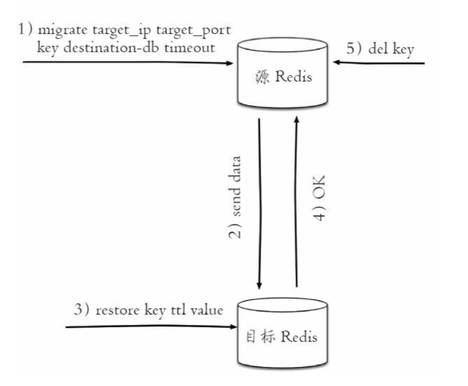
  
  
  
  

### 10. 遍历键

- 全量遍历

  ```
  /*
   * keys 是支持 pattern 匹配的
   *  * 代表匹配任意字符
   *  . 代表匹配一个字符
   *  [] 代表匹配部分字符
   *  \x 用来做转移
   */
  keys pattern
  ```

- 渐进式遍历

  有效解决 keys 命令存在的问题，采用渐进式遍历的方式来解决 keys命令可能带来的阻塞问题。每次 scan命令的时间复杂度是 O(1), 但是真正实现keys的功能，需要多次执行scan

  ```
  /*
   *	cursor: 是一个游标，第一次遍历从0开始，每次scan遍历完，都会返回当前游标的值，直到为0，标识遍历结束
   * [match pattern]: 用来做 模式的匹配
   * [count number]: 每次要遍历的键个数，默认是10，只可以适当的增大
   */
  scan cursor [match pattern] [count number]
  ```

  ##### 存在问题:

  ​	如果在scan的过程中有键的变化（增加，删除，修改），则新增的键可能没有遍历到，或者出现遍历出了重复的键

- 哈希，集合，有序集合的渐进式遍历

  hscan, sscan, zscan

### 11. 数据库管理

#### 1. 切换数据库

Redis 默认配置中有 16个数据库， 默认进入的是 0号数据库

```
select dbIndex
```

但是，Redis的分布式实现Redis Cluster 只允许使用 0号数据库，只是为了向下兼容，该功能没有被完全废弃

如果需要使用多个数据库的功能呢

> 可以在一台机器部署多个Redis实例，彼此使用端口来区分

#### 2. flushdb/flushall

如果当前数据库键值比较多，存在阻塞Redis的可能

```
flushdb: 清除当前数据库
flushall: 清除所有数据库
```

## 三. 其他功能

### 1. 慢查询分析

#### 1. 慢查询日志

> 系统在命令执行前后计算每条命令的执行时间，当超过预设阈值后，将这个命令的相关信息（发生时间，耗时，命令详细信息）等进行记录

#### 2. 命令生命周期

1. 发送命令
2. 命令排队
3. 命令执行
4. 返回结果

Redis中 慢查询只是统计了 步骤3 的结果 ==> 如果日志中没有慢查询记录，也并不代表客户端没有超时的问题

#### 3. 配置参数

- 预设阈值

  ```
  slowlog-log-slower-than  单位是微妙，默认是10000
  如果 = 0： 标识记录所有的命令；
  如果 < 0; 标识不记录任何命令
  
  ==》 如果命令执行时间在 1毫秒以上，那么Redis的并发 不到 1000，因此对于高 OPS的场景，锦衣设置为 1毫秒
  ```

- 慢查询记录的存放

  ```
  slowlog-max-len: 指定慢查询日志最多存储多少条
  ==> Redis 使用 一个列表来存储 慢查询日志，该参数指定的就是 列表的最大长度
  线上使用时，建议设置在 1000以上。
  ```

#### 4.慢查询日志的访问管理

虽然 日志存储在 Redis的列表中，但是 Redis 没有暴露这些key，而是提供了一组命令进行访问和管理

- 获取慢查询日志

```
slowlog get [n]
```

- 获取当前长度

```
slowlog len
```

- 重置(清理操作)

```
slowlog reset
```

### 2. Redis-cli

使用 redis-cli-help 命令查询帮助

#### 1. -r

-r (repeat)：代表命令执行多次

```
redis-cli -r 3 ping
```

#### 2. -i

-i (interval): 标识每隔几秒执行一次命令。单位是秒

注意：

​	-r 要与 -i 一起使用


#### 3. --slave

将当前客户端模拟仓当前Reids节点的从节点

### 3. Pipeline

#### 1. 概念

Redis客户端执行一条命令有4个过程，其中 发送命令 + 返回结果 = Round Trip Time（RTT 往返时间)

Reids 提供了批量处理操作，可以有效节约 RTT，但大部分的命令是不支持批量操作的，比如执行n次hgetall命令，则需要 n 次RTT

假定 Redis 客户端和 服务端部署在不同的地方 ，相距1300公里，那么 

```
/*
 *	光在真空中传输速度为 30万公里/秒，假定光纤速度为光速的 2/3
 */
1次RTT=1300*2/(300000 *2/3) = 13 毫秒
=> 客户端1秒内只能执行 80次左右命令
```

- Pipeline 机制

> 将一组 Redis命令进行组装，通过一次 RTT传输给 Redis

#### 2. 批量命令与Pipeline对比

- 原生批量命令是原子性的，pipeline是非原子性的
- 原生批量命令是 Redis服务端实现的，pipeline需要服务端和客户端的共同实现

### 4. 事务

Redis提供了简单的事务功能，将一组需要一起执行的命令放到 multi和 exec两个命令之间，multi代表事务开始，exec代表事务结束，中间命令是原子顺序执行的

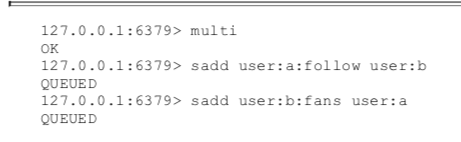

QUEUED 代表命令没有真正执行，而是暂时保存在 Redis中

- 停止事务

  使用 discard 命令替代 exec 命令

#### 1. 命令错误

对于将命令输入错误，属于语法错误，会造成整个事务无法执行，结果未发生变化

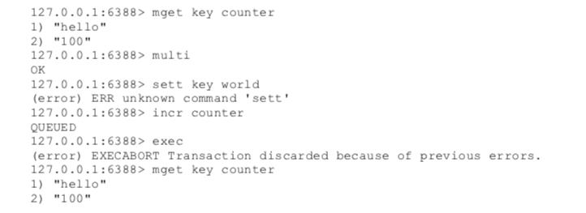

#### 2. 运行时错误

比如将  sadd 命令写为了 zadd命令，这是是运行时命令，语法正确，可以正确执行

对于此类，Redis不支持回滚功能，需要手动修复

#### 3. 事务乐观锁

场景：确保事务中的key没有被其他客户端修改过，才可以执行事务，否则不执行

Redis提供了 watch命令来解决这类问题

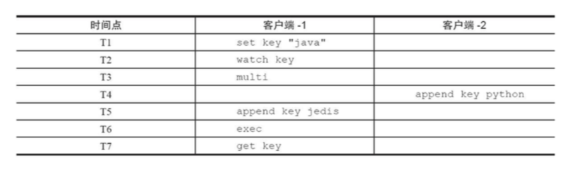

### 5. Bitmaps

Redis提供Bitmaps这个“数据结构”，用来对位进行操作。

- BItmaps 本身不是一种数据结构，其本质上是 字符串，只是可以对 字符串的位进行操作
- 可以吧 Bitmaps想象为一个以位为单位的数组，数组的每个单元只能存储0和1，数组的下标在Bitmaps中叫做 偏移量

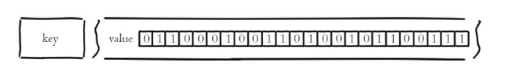

案例: 将每个用户是否访问过  网站，存放在 Bitmaps中，访问过的用户记1，未访问的记0