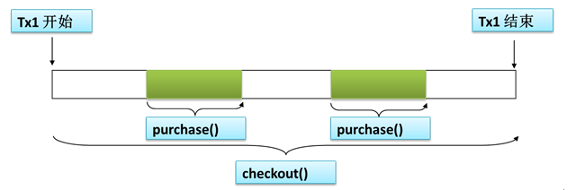
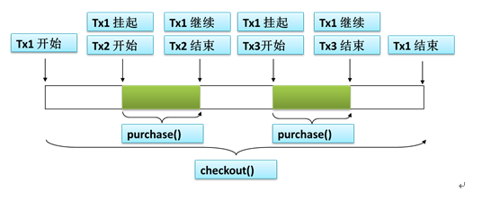

> Spring 的使用

<!-- more-->

## 一. IOC 

### 1. 内部bean 与 外部bean

```xml
<beans>
    <!-- 外部bean， 即 直接在  beans 下的  (相当于全局变量，都可以用) -->
    <bean  class="com.day.Book"></bean>
    
    <bean class="com.day.Person">
        <property name="book">
            <!-- 内部bean， 即为其他bean 的属性，内部使用的
		1> 不能被外部获取（即 使用 getBean 通过id获取不到，相当于局部变量)
            -->
            <bean id="innerBook" class="com.day.Book"></bean>
        </property>
    </bean>
</beans>
```

### 2. null 类型值

对于复杂类型，都是使用此种方式进行赋值

直接使用 value = , 赋的值是一个 string，即使 value="null", 值是一个 "null" 的字符串

```xml
<beans>
    <bean class="com.day.Person">
        <property name="book">
            <!-- 即给 book 属性 赋值为 null -->
            <null></null>
        </property>
    </bean>
</beans>
```

### 3. list 类型赋值

使用 <list> 标签，进行赋值操作

```xml
<beans>
    <bean class="com.day.Person">
        <property name="book">
            <list>
                <ref bean="book1"></ref>
            </list>
        </property>
    </bean>
</beans>
```

### 4. map 类型赋值

使用 maps + entry

```xml
<beans>
    <bean class="com.day.Person">
        <property name="book">
            <maps>
                <!-- entry 表示一个 键值对 -->
                <entry key="k1" value="1"></entry>
                <entry key="k2" value-ref="book1"></entry>
                <entry key="k3" >
                    <bean class="com.day.Book"></bean>
                </entry>
            </maps>
        </property>
    </bean>
</beans>
```

### 5. properties 类型赋值

使用 props + prop 进行赋值

```xml
<beans>
    <bean class="com.day.Person">
        <props>
            <!-- 相当于 prps = new Properties(), 所有的k v 都是 String，所以值可以直接 写在 标签体中-->
            <prop key="pwd">111</prop>
        </props>
    </bean>
</beans>
```

### 6. 可被外部引用的集合

上面创建的 map，list，set，properties等等，都是内部的，不能被外部进行引用

比如一个map，如果需要被多个bean引用，如果每个都写一遍，比较麻烦，==》util:map, 定义了一个可被引用的 map

```xml
<beans>
    <!--
 	1. 使用util:map 创建了一个可以被外部引用的map， 由于是可被引用的，因此 id 字段必须指定（这样外面才知道引用谁啊)
	2. utils:map 相当于 原来的 map, 因此继续指定 entry 即可
 	-->
    <util:map id="mymap">
        <entry key="k1" value="v1"></entry>
    </util:map>
</beans>
```

### 7. 级连属性

可以通过 属性.属性，进行修改值

```xml
<beans>
    <bean class="com.day.Person">
        <property name="car" ref="car1"></property>
        <property name="car.price" value="111"></property>
    </bean>
</beans>
```

### 8.bean 属性继承

对于同一个类型，如果创建多个bean，某些同样的属性，可能要被配置多次

使用 parent 属性，只是继承 其  property 信息，并不是 父子关系

```xml
<beans>
    <bean id="car1" class="com.day.Car">
        <property name="name" value="aaa"></property>
        <property name="price" value="222"></property>
    </bean>
    
    <!--  继承  car1 的 property 属性，并不是父子关系 
	由于是继承，class 属性都可以省略
     -->
    <bean id="car2" class="com.day.Car" parent="car1">
        <!--  此处写的属性 会覆盖 继承的属性，如果没写，直接继承-->
        <property name="price" value="33"></property>
    </bean>
</beans>
```

### 9. 抽象bean

指定 **abstract = true**，表示该**bean 只是用来 被继承，不能创建实例**！！！

```xml
<beans>
    <bean id="car1" class="com.day.Car" abstract="true">
        <property name="name" value="aaa"></property>
        <property name="price" value="222"></property>
    </bean>
</beans>
```

### 10. bean 依赖

对于XML 而言，bean 的创建顺序是按照 xml中书写顺序

但是，如果指定了 depends-on 属性，则表示该 bean 依赖于其他bean，则其他bean 会优先于该 bean进行创建

```xml
<beans>
    <bean id="car1" class="com.day.Car" depends-on="person, book">
        <property name="name" value="aaa"></property>
        <property name="price" value="222"></property>
    </bean>
</beans>
```

### 11. bean 的作用域

作用域：指bean是否是单实例，默认的都是单实例的

通过 scope 属性指定

```
prototype: 多实例
	1.  容器启动，默认不会去创建
	2.  getBean 获取的时候，创建实例
	3. 每次获取，都会创建一个新的实例
singleton:  单实例 (默认值)
	1. 在容器启动完成之前，就已经创建好对象了
request:     web环境下，同一次请求创建一个 bean实例（没用)
session:      web环境下,   同一次会话创建一个 bean 实例 (没用)
```

### 12. 工厂对象

对于普通的bean，都是通过class 指定全类名之后，直接通过反射来创建对象的；

但是有一些 对象，是使用 一个工厂方法创建的（创建比较麻烦) ==> spring 直接调用工厂方法，创建对象并放入到 容器中

#### 静态工厂

工厂对象不创建对象，通过工厂类的静态方法，来创建对象

```java
public class AirPlaneStaticFactory {
    public static AirPlane getPlane(String parm1, String parm2) {
        return new AirPlane();
    }
}
```

创建方式:

	1. class 指定的是工厂对象的全类名 
 	2. 需要使用 **factory-method** 来表示，需要调用 静态方法 来创建bean （==>告诉spring，我要的不是 class 指定的对象，你调用这个静态方法来创建对象)
 	3. constructor-arg 指定的是 getPlane 这个静态方法所需要的参数

```xml
<beans>
    <bean id="plan1" class="com.day.AirPlaneStaticFactory" factory-method="getPlane">
        <constructor-arg name="parm1" value="11"></constructor-arg>
        <constructor-arg name="parm2" value="11"></constructor-arg>
    </bean>
</beans>
```

#### 动态工厂

工厂对象来创建工厂

 	1. 创建工厂对象
 	2. 调用工厂对象的方法，创建实例

```java
public class AirPlaneStaticFactory {
    public  AirPlane getPlane() {
        return new AirPlane();
    }
}
```

步骤:

	1. 先创建一个工厂对象
 	2. 创建需要的bean的时候，指定这个 bean 是通过  哪个 工厂对象(factory-bean) 的 哪个工厂方法(factory-method)

```xml
<beans>
    <bean id="facotry1" class="com.day.AirPlaneStaticFactory"></bean>
    
    <bean id="plan1" class="com.day.AirPlane" factory-bean="factory1" factory-method="getPlane">
    </bean>
</beans>


```

#### FactoryBean

==> 用来简化书写吧

只要是实现了该接口的类，Spring都认为其是一个 工厂类

Spring 会自动的调用方法，创建对象

**特点:**

​	每次获取的时候，才会创建对象（不管是 单实例、多实例)

```xml
<beans>
    <!--  如果 -com.day.AirFactoryBean 已经实现了 FactoryBean 对象；
	由于Spring 能够自动识别，并认定该类是一个工厂配置类 ==> SPring 会创建该工厂对应的对象，而不是该工厂对象-->
    <bean id="air1" class="com.day.AirFactoryBean"></bean>
</beans>
```

### 13. 带有什么周期的方法

Spring 会在 创建、销毁bean的时候，调用对应的方法

destory-method: 指定销毁时调用的方法

init-method：指定创建时调用的方法

```xml
<beans>
    <bean id="a1" class="com.day.Book" destory-method="destory1" init-method="init1"></bean>
</beans>
```

### 14. bean的后置处理器

**BeanPostProcessor**

	1. 在 bean 的初始化方法(init-method) 前后进行运行
 	2. 即使 bean 没有配置 初始化方法，也会运行

#### 步骤:

1. 创建一个类，实现 BeanPostProcessor 接口
2. 将该类配置到 bean 中（只有配置到容器中，才能起作用。并且是对所有的 bean 起作用）

- 创建一个 BeanPostProcessor 接口 的实现类

```java
public class MyBeanPostProcessor implements BeanPostProcessor {

    /* 初始化执行方法运行之前执行
    * beanName： 就是xml这种配置的bean的id
    * */
    public Object postProcessBeforeInitialization(Object bean, String beanName) throws BeansException {
        System.out.println("Bean: " + beanName + "  Before PostProcess 执行了...");
        return bean;
    }

    /* 初始化方法执行之后执行 */
    public Object postProcessAfterInitialization(Object bean, String beanName) throws BeansException {
        System.out.println("Bean: " + beanName + "  After PostProcess 执行了...");
        return bean;
    }
}
```

- 类添加 初始化方法和销毁方法

```java
public class Bean {
    private String name;

    public String getName() {
        return name;
    }

    public Bean() {
        System.out.println("Bean 的 构造方法");
    }

    public void MyInit() {
        System.out.println("Bean 的自定义 初始化方法 ");
    }

    public void MyDestory() {
        System.out.println("Bean 的自定义 销毁方法 ");
    }

    public void setName(String name) {
        this.name = name;
    }

    @Override
    public String toString() {
        return "Bean{" +
                "name='" + name + '\'' +
                '}';
    }
}

```

- xml 

```xml
<?xml version="1.0" encoding="UTF-8"?>
<beans xmlns="http://www.springframework.org/schema/beans"
       xmlns:xsi="http://www.w3.org/2001/XMLSchema-instance"
       xsi:schemaLocation="http://www.springframework.org/schema/beans http://www.springframework.org/schema/beans/spring-beans.xsd">

    <bean id="s1" class="com.day.Bean" init-method="MyInit" destroy-method="MyDestory">
        <property name="name" value="11"/>
    </bean>

    <bean class="com.day.MyBeanPostProcessor"/>
</beans>
```

- test

```java
public class TestBean {
    @Test
    public void testBean() {
        ApplicationContext ap = new ClassPathXmlApplicationContext("beanconf.xml");
        Bean s1 = ap.getBean("s1", Bean.class);
        System.out.println(s1);
    }
}

```

- 执行结果

```
Bean 的 构造方法
Bean: s1  Before PostProcess 执行了...
Bean 的自定义 初始化方法 
Bean: s1  After PostProcess 执行了...
Bean{name='11'}
```

### 15. 引用外部属性文件

#### 使用Bean 配置数据库连接池

```xml
<bean id="dataSource" class="com.mchange.v2.c3p0.ComboPooledDataSource">
        <property name="user" value="root"/>
        <property name="password" value="123456"/>
        <property name="jdbcUrl" value="jdbc:mysql:/127.0.0.1:3306/vblog"/>
        <property name="driverClass" value="com.mysql.jdbc.Driver"/>
    </bean>
```

- 获取 连接池对象

```java
@Test
    public void testBean() {
        ApplicationContext ap = new ClassPathXmlApplicationContext("beanconf.xml");

        /* 方式1. 通过 bean id 获取 bean */
        DataSource ds1 = (DataSource) ap.getBean("dataSource");
        /* 方式2. 通过 bean 类型 获取bean (直接使用 DataSource 这个父类类型即可) */
        DataSource ds2 = ap.getBean(DataSource.class);
    }
```

#### 从 properties 文件中，取出 连接池信息

- properties 文件

使用自定义前缀 jdbc ，是为了防止 定义的key 重复（与默认的字段名重名，比如username)

```properties
jdbc.user=root
jdbc.passwd=123456
jdbc.driver=com.mysql.jdbc.Driver
jdbc.url=jdbc:mysql:/127.0.0.1:3306/vblog
```

- xml 中引入配置文件

```xml
<context:property-placeholder location="classpath:db.properties"/>
```

- xml 中使用配置值

"${jdbc.user}" 的方式

```xml
<bean id="dataSource" class="com.mchange.v2.c3p0.ComboPooledDataSource">
        <property name="user" value="${jdbc.user}"/>
        <property name="password" value="${jdbc.passwd}"/>
        <property name="jdbcUrl" value="${jdbc.url}"/>
        <property name="driverClass" value="${jdbc.driver}"/>
    </bean>
```

### 16. 自动装配

比如给定的 Person 类中，有一个 Book book 属性，上面在 创建 Person bean 的时候，假定想要 book 有值，就需要 使用 property, constructor-arg 等方式，给其手动传值

能否自动的赋值呢？

​	==> 自动装配

```
在 bean 中，使用 autowire 属性:
	byName: 根据 属性的名称作为id，去查找 bean
	byType: 根据 属性的 类型作为id，去查找bean；如果没找到，装配null；如果找到多个，返回错误
	constructor: 使用构造器进行赋值
		1. 先按照 构造器的类型，查找bean；如果没找到，返回null
		2. 如果找到多个，使用 参数名称 作为 id 进行 匹配，如果找到，就装配；否则 返回null
		==》 不管找到，找不到，找到多个等等 都不会报错
	default: 不进行自动装配
	no: 不进行自动装配
```

#### 集合类型

加入 Person 类中有一个 List<Book> book; 属性， 并且 容器中有多个 Book类型的bean

那么，在使用 autowire=byType 进行自动装配时，会将容器中所有的 Book类型的bean 都添加到 book 属性中(毕竟是List，所以所有的都加入进去了)

### 17. SPEL表达式

1. 可以计算字面量的值
2. 可以引用其他bean的属性值
3. 可以引用其他bean
4. 可以调用 静态方法
5. 可以调用 非静态方法

```xml
<bean id="car" class="com.day.Car"/>

    <bean id="person" class="com.day.User">
        <!-- 字面量值的方式 -->
        <property name="money" value="#{12.12 * 12}"/>
        <!-- 引用其他bean的属性值 -->
        <property name="name" value="#{car.name}"/>
        <!-- 类似 ref，引用其他bean -->
        <property name="car" value="#{car}"/>
        <!--调用静态方法
            比如，想要调用 UUID.randomUUID().toString()方法
            规则:
                #{T(静态对象的名称).方法名(方法的参数)}
        -->
        <property name="uuid" value="#{T(java.util.UUID).randomUUID().toString()}"/>
        
        <!-- 调用非静态方法 -->
        <property name="name" value="#{car.getName()}"/>
    </bean>
```

### 18. IOC容器类注解

#### 0. 导入AOP包

#### 1. 对类上添加注解

```
@Controller: 控制器层
@Service: 业务逻辑层
@Repository: 数据库交互的 Dao层
@Component: 不属于上面3类的，（比如工具类)
```

1. 上面注解可以随便加，作区分主要是 各个层更加明确

#### 2. xml配置注解扫描

会将 base-package 指定的包下，所有 上面4种类型 注解 注释的类，扫描并添加到容器中

```xml
<context:component-scan base-package="com.day"/>
```

#### 3. 从容器中获取

1. 包扫描添加到容器中时，默认使用的 id 是 类名首字母小写

#### 4. 更改默认的bean id

```
@Controller("book")  // 添加的时候，使用的 bean id 就是 book
```

#### 5. 修改 作用域

默认时，是单实例的

可以使用 ``` @Scope ``` 来更换作用域范围

#### 6. xml注解扫描（限定)

- 只扫描 某些

本来 base-package 指定的是 com.day, 那么会扫描该 package 下 所有被注解标注的类，并将对应的添加到容器中

但是，可以使用  context:include-filter 来限定 只需要 这个 package 下某些 包/ 某些注解注释的类

```xml
<context:component-scan base-package="com.day" use-default-filters="false">
        <!-- 指定  只要 哪些
            1. 首先需要禁用默认的过滤规则
         -->
        <!-- 只扫描 特定注解标注的类 -->
        <context:include-filter type="annotation" expression="注解的全类名"/>
        <!-- 只扫描 特定类 -->
        <context:include-filter type="assignable" expression="全类名"/>
    </context:component-scan>
```

- 排除某些

```xml
<context:component-scan base-package="com.day">
        <!-- 指定不用的类 -->
        <!-- 按照注解的方式进行排除，指定注解的不进行扫描 -->
        <context:exclude-filter type="annotation" expression="注解的全类名"/>
        <!-- 按照类的方式进行排除，不扫描指定的类 -->
        <context:exclude-filter type="assignable" expression="全类名"/>
 </context:component-scan>
```

### 19. @Autowired 注解

自动装配的前提: 类要添加到 容器中，才能使用 容器提供的自动装配功能

#### 1. 添加在 属性上

为类的属性，进行自动注入值(值的来源是 容器中)

注入规则:

 1. 按照类型去容器查找，

    ​	如果找到一个，自动装配；

    ​	如果未找到，报错

 2. 如果找到多个，使用 属性名作为id进行继续匹配，

    ​	如果找到，自动装配；

    ​	如果没有匹配，报错

```java
@Data
/*
 * 该类首先要放到 容器中，才能对其属性进行自动注入
 */
@Component
public class User {
    private String name;
    private Double money;
    @Autowired
    private Car car;
    private String uuid;
}
```

#### 2. 添加在方法上

> 该方法的所有参数，都会被注入到 IOC容器中（仅仅对于自定义对象类型)
>
> 该方法也会在创建该bean 的时候被调用（这样才能注入参数呀)

#### @Qualifier

- 属性上

指定一个 名称作为 id 去查找。一般与 @Autowired 组合使用

- 方法参数上

在@Autowried添加在方法上的时候，由于所有参数都会被 自动装配

​	==> 可以在参数上使用 @Autowired 来指定该参数的 bean id

#### @Autowried(required=false)

使用 required=false, 可以在未找到的时候，装配null，防止报错

### 20. @Resource注解

也是自动装配注解(JAVA的标准)

与@Autowired 比较

	1. @Resource 由于是 JAVA 的标准，因此 扩展性比较强
 	2. @Autowired 是Spring的标准，只能支持 Spring

21. @Inject

自动装配注解

## 二. IOC 纯注解

### 1. xml + 注解方式

步骤:

```
1. 定义一个 xml 文件
2. xml 中 通过 component-scan 配置 需要扫描的包
3. 使用 xml 创建 容器对象
```

### 2. 纯注解方式

```
1. 需要 一个 替代 xml 文件
	@Comfiguration 
2. 需要 一个 替代  xml 中 component-scan
	@ComponentScan
2. 需要 一种新的方式创建容器
	AnnotationApplicationContext(有@Configuration 注解的类.class)
```

### @Configuration

```
用于指定当前类是一个 spring 配置类， 当创建容器时会从该类上加载注解
===> 替代 整个 xml 文件的
```

### @ComponentScan

```
用于指定 spring 在初始化容器时要扫描的包
==> 替代  <context:component-scan base-package="com.itheima"/> 的
```

### @Bean

```
该注解只能写在方法上，表明使用此方法创建一个对象，并且放入 spring 容器
==》 替代 <bean>
```

### @PropertySource

```
用于加载.properties 文件中的配置。例如我们配置数据源时，可以把连接数据库的信息写到
properties 配置文件中，就可以使用此注解指定 properties 配置文件的位置
```

```java
@Data
@PropertySource("classpath:db.properties")
public class JdbcConfig {
    @Value("${jdbc.driver}")
    private String driver;
    @Value("${jdbc.url}")
    private String url;
    @Value("${jdbc.username}")
    private String username;
    @Value("${jdbc.password}")
    private String password;
}
```

### @Import

```
用来导入其他的配置类 (此时其他类可以不写 @Configuration注解)
```

## 三. Spring 整合 Junit

在使用 Junit 测试的时候，每次都需要经过以下步骤

1. 根据 xml / 注解类，创建 容器
2. 从容器中，获取 bean

能否使用 自动装配的特性，并且容器由Spring自动创建?

==> 由于容器是由Spring创建的，因此仅仅使用 Junit是不够的，需要Spring+Junit来实现

### 1. 导入jar包依赖

```
1. IOC 模块
2. test 模块
3. aop 模块
```

### 2. 替换运行器

```
@RunWith(SpringJUnit4ClassRunner.class)
```

### 3. 指定配置文件/配置类

由于想要Spring自动创建容器，那么就需要告诉Spring 配置文件的位置

```
@ContextConfiguration(locations= {"classpath:bean.xml"})
或者
@ContextConfiguration(classes= {配置类})
```

### 4. 自动注入使用

```java
@RunWith(SpringJUnit4ClassRunner.class)
@ContextConfiguration(locations= {"classpath:bean.xml"})
public class AccountServiceTest {
	@Autowired
	private IAccountService as ;
}
```


## 四. AOP

### 1. 术语

#### Aspect(切面)

> 提供通知的类

#### Joinpoint(连接点)

>可以被拦截的方法

#### Pointcout(切入点)

> 需要对哪些方法进行 拦截（切入)

#### Advice(通知/增强)

> 拦截到 方法之后，做的处理
>
> 通知的类型:
>
> ​	前置通知/后置通知/异常通知/最终通知/环绕通知

### 2.  通知

```
try {
	// before ==> 前置通知
	被拦截方法执行;
	// after-returning ==> 后置通知
} catch (Exception e) {
	// after-throwing ==> 异常通知
} finally {
	// after ==> 最终通知
}
```

### 3. 切入点表达式

#### 语法:

```
execution([访问修饰符] 返回值类型 包名.类名.方法名(参数))
1. 访问修饰符可以省略，但是不能使用 *
2. 可以使用 .. 表示匹配多个 参数；
	或者匹配 任意多层路径
3. 可以使用 * 表示匹配任意多个字符; 
	（但只能表示一级包路径); 
	可以表示任意 返回值类型；
	可以表示任意 方法名
```

#### 全匹配:

```
public void com.itheima.service.impl.AccountServiceImpl.saveAccount(com.itheima.domain.Account)
```

#### 全通配

```
* *..*.*(..) 
	返回值 任意包.任意函数名(任意参数)
```

#### 只切入 业务层

```
execution(* com.itheima.service.impl.*.*(..))
```

#### 4. 环绕通知

```java
/**
* 环绕通知
* @param pjp
* spring 框架为我们提供了一个接口： ProceedingJoinPoint，它可以作为环绕通知的方法参数。
* 在环绕通知执行时， spring 框架会为我们提供该接口的实现类对象，我们直接使用就行。
* @return
*/
public Object transactionAround(ProceedingJoinPoint pjp) {
    //定义返回值
    Object rtValue = null;
    try {
        //获取方法执行所需的参数
        Object[] args = pjp.getArgs();
        //前置通知：开启事务
        beginTransaction();
        //执行方法
        rtValue = pjp.proceed(args);
        //后置通知：提交事务
        commit();
    }catch(Throwable e) {
        //异常通知：回滚事务
        rollback();
        e.printStackTrace();
    }finally {
        //最终通知：释放资源
        release();
    }
    return rtValue;
}
```

### 5. XML 方式

#### 1. 定义切面类

```java
/**
 * 用于记录日志的工具类，它里面提供了公共的代码
 */
public class Logger {

    /**
     * 用于打印日志：计划让其在切入点方法执行之前执行（切入点方法就是业务层方法）
     */
    public  void printLog(){
        System.out.println("Logger类中的pringLog方法开始记录日志了。。。");
    }
}
```

#### 2. xml 配置

```xml
<!-- 1. 将service 实现类添加到 IOC 中 -->
<bean id="accountService" class="com.itheima.service.impl.AccountServiceImpl"></bean>

<!-- 2. 将切面类，添加到 bean 中 -->
<bean id="logger" class="com.itheima.utils.Logger"></bean>

<!-- 3. 配置AOP 
	1> aop:config  => 声明开始 aop 的配置
	2> aop:aspect  => 用于配置切面
	3> aop:pointcut => 定义一个 切入点 表达式 （此处是定义，可以被多个地方使用 pointcut-ref 属性使用)
	4> aop:before => 配置前置通知
		pointcut: 指定 切入点表达式
		pointcut-ref: 指定切入点表达式的引用 （3中设置的 aop:pointcut)
	5> aop:after-returning => 配置后置通知 （被拦截的方法执行完毕之后, return 意味着 被拦截的方法执行完成)
	6> aop:after-throwing => 配置异常通知
	7> aop:after 配置最终通知，肯定会执行
	8> aop:around => 配置环绕通知
-->
<aop:config>
    <!--配置切面 -->
    <aop:aspect id="logAdvice" ref="logger">
        <!-- 配置通知的类型，并且建立通知方法和切入点方法的关联-->
        <aop:before method="printLog" pointcut="execution(* com.itheima.service.impl.*.*(..))"></aop:before>
    </aop:aspect>
</aop:config>
```

### 6. 基于注解

#### 1. 切面类

```
1. 使用 @Aspect ==> 表明当前类是一个切面类
2. 使用 @Component ==> 添加到 容器中
```

#### 2. 通知方法

@Before 表示 前置通知注解

```
@Before("execution(* com.itheima.service.impl.*.*(..))")
```

#### 3. 开启Spring 对注解 AOP 支持

- xml 方式

```xml
<aop:aspectj-autoproxy/>
```

- 配置类方式

```
@EnableAspectJAutoProxy // 将此注解，添加到 配置类上即可
```


### 7.  引用 切入点表达式

- 配置一个切入点表达式

```java
@Pointcut("execution(* com.itheima.service.impl.*.*(..))")
private void pt1() {}
```

- 引用

```java
@Around("pt1()")
```

### 8. 环绕通知

```xml
<!--配置AOP-->
    <aop:config>
        <!-- 配置切入点表达式 id属性用于指定表达式的唯一标识。expression属性用于指定表达式内容
              此标签写在aop:aspect标签内部只能当前切面使用。
              它还可以写在aop:aspect外面，此时就变成了所有切面可用
          -->
        <aop:pointcut id="pt1" expression="execution(* com.itheima.service.impl.*.*(..))"></aop:pointcut>
        <!--配置切面 -->
        <aop:aspect id="logAdvice" ref="logger">
            <!-- 配置前置通知：在切入点方法执行之前执行
            <aop:before method="beforePrintLog" pointcut-ref="pt1" ></aop:before>-->

            <!-- 配置后置通知：在切入点方法正常执行之后值。它和异常通知永远只能执行一个
            <aop:after-returning method="afterReturningPrintLog" pointcut-ref="pt1"></aop:after-returning>-->

            <!-- 配置异常通知：在切入点方法执行产生异常之后执行。它和后置通知永远只能执行一个
            <aop:after-throwing method="afterThrowingPrintLog" pointcut-ref="pt1"></aop:after-throwing>-->

            <!-- 配置最终通知：无论切入点方法是否正常执行它都会在其后面执行
            <aop:after method="afterPrintLog" pointcut-ref="pt1"></aop:after>-->

            <!-- 配置环绕通知 详细的注释请看Logger类中-->
            <aop:around method="aroundPringLog" pointcut-ref="pt1"></aop:around>
        </aop:aspect>
    </aop:config>
```

## 五. AOP事务(xml demo)

### utils

#### 连接与线程绑定

```java
package com.itheima.utils;

import javax.sql.DataSource;
import java.sql.Connection;

/**
 * 连接的工具类，它用于从数据源中获取一个连接，并且实现和线程的绑定
 */
public class ConnectionUtils {

    private ThreadLocal<Connection> tl = new ThreadLocal<Connection>();

    private DataSource dataSource;

    public void setDataSource(DataSource dataSource) {
        this.dataSource = dataSource;
    }

    /**
     * 获取当前线程上的连接
     * @return
     */
    public Connection getThreadConnection() {
        try{
            //1.先从ThreadLocal上获取
            Connection conn = tl.get();
            //2.判断当前线程上是否有连接
            if (conn == null) {
                //3.从数据源中获取一个连接，并且存入ThreadLocal中
                conn = dataSource.getConnection();
                tl.set(conn);
            }
            //4.返回当前线程上的连接
            return conn;
        }catch (Exception e){
            throw new RuntimeException(e);
        }
    }

    /**
     * 把连接和线程解绑
     */
    public void removeConnection(){
        tl.remove();
    }
}

```

#### 事务切面类

```java
package com.itheima.utils;

/**
 * 和事务管理相关的工具类，它包含了，开启事务，提交事务，回滚事务和释放连接
 */
public class TransactionManager {

    private ConnectionUtils connectionUtils;

    public void setConnectionUtils(ConnectionUtils connectionUtils) {
        this.connectionUtils = connectionUtils;
    }

    /**
     * 开启事务
     */
    public  void beginTransaction(){
        try {
            connectionUtils.getThreadConnection().setAutoCommit(false);
        }catch (Exception e){
            e.printStackTrace();
        }
    }

    /**
     * 提交事务
     */
    public  void commit(){
        try {
            connectionUtils.getThreadConnection().commit();
        }catch (Exception e){
            e.printStackTrace();
        }
    }

    /**
     * 回滚事务
     */
    public  void rollback(){
        try {
            connectionUtils.getThreadConnection().rollback();
        }catch (Exception e){
            e.printStackTrace();
        }
    }


    /**
     * 释放连接
     */
    public  void release(){
        try {
            connectionUtils.getThreadConnection().close();//还回连接池中
            connectionUtils.removeConnection();
        }catch (Exception e){
            e.printStackTrace();
        }
    }
}

```

### dao

```java
package com.itheima.dao.impl;

import com.itheima.dao.IAccountDao;
import com.itheima.domain.Account;
import com.itheima.utils.ConnectionUtils;
import org.apache.commons.dbutils.QueryRunner;
import org.apache.commons.dbutils.handlers.BeanHandler;
import org.apache.commons.dbutils.handlers.BeanListHandler;

import java.util.List;

/**
 * 账户的持久层实现类
 */
public class AccountDaoImpl implements IAccountDao {

    private QueryRunner runner;
    private ConnectionUtils connectionUtils;

    public void setRunner(QueryRunner runner) {
        this.runner = runner;
    }

    public void setConnectionUtils(ConnectionUtils connectionUtils) {
        this.connectionUtils = connectionUtils;
    }

    @Override
    public List<Account> findAllAccount() {
        try{
            return runner.query(connectionUtils.getThreadConnection(),"select * from account",new BeanListHandler<Account>(Account.class));
        }catch (Exception e) {
            throw new RuntimeException(e);
        }
    }

    @Override
    public Account findAccountById(Integer accountId) {
        try{
            return runner.query(connectionUtils.getThreadConnection(),"select * from account where id = ? ",new BeanHandler<Account>(Account.class),accountId);
        }catch (Exception e) {
            throw new RuntimeException(e);
        }
    }

    @Override
    public void saveAccount(Account account) {
        try{
            runner.update(connectionUtils.getThreadConnection(),"insert into account(name,money)values(?,?)",account.getName(),account.getMoney());
        }catch (Exception e) {
            throw new RuntimeException(e);
        }
    }

    @Override
    public void updateAccount(Account account) {
        try{
            runner.update(connectionUtils.getThreadConnection(),"update account set name=?,money=? where id=?",account.getName(),account.getMoney(),account.getId());
        }catch (Exception e) {
            throw new RuntimeException(e);
        }
    }

    @Override
    public void deleteAccount(Integer accountId) {
        try{
            runner.update(connectionUtils.getThreadConnection(),"delete from account where id=?",accountId);
        }catch (Exception e) {
            throw new RuntimeException(e);
        }
    }

    @Override
    public Account findAccountByName(String accountName) {
        try{
            List<Account> accounts = runner.query(connectionUtils.getThreadConnection(),"select * from account where name = ? ",new BeanListHandler<Account>(Account.class),accountName);
            if(accounts == null || accounts.size() == 0){
                return null;
            }
            if(accounts.size() > 1){
                throw new RuntimeException("结果集不唯一，数据有问题");
            }
            return accounts.get(0);
        }catch (Exception e) {
            throw new RuntimeException(e);
        }
    }
}

```

### service

```java
public class AccountServiceImpl implements IAccountService{

    private IAccountDao accountDao;

    public void setAccountDao(IAccountDao accountDao) {
        this.accountDao = accountDao;
    }

    @Override
    public List<Account> findAllAccount() {
       return accountDao.findAllAccount();
    }

    @Override
    public Account findAccountById(Integer accountId) {
        return accountDao.findAccountById(accountId);

    }

    @Override
    public void saveAccount(Account account) {
        accountDao.saveAccount(account);
    }

    @Override
    public void updateAccount(Account account) {
        accountDao.updateAccount(account);
    }

    @Override
    public void deleteAccount(Integer acccountId) {
        accountDao.deleteAccount(acccountId);
    }

    @Override
    public void transfer(String sourceName, String targetName, Float money) {
        //2.1根据名称查询转出账户
        Account source = accountDao.findAccountByName(sourceName);
        //2.2根据名称查询转入账户
        Account target = accountDao.findAccountByName(targetName);
        //2.3转出账户减钱
        source.setMoney(source.getMoney()-money);
        //2.4转入账户加钱
        target.setMoney(target.getMoney()+money);
        //2.5更新转出账户
        accountDao.updateAccount(source);
        //2.6更新转入账户
        accountDao.updateAccount(target);
    }
}

```

- xml 配置

```xml
<?xml version="1.0" encoding="UTF-8"?>
<beans xmlns="http://www.springframework.org/schema/beans"
       xmlns:xsi="http://www.w3.org/2001/XMLSchema-instance"
       xmlns:aop="http://www.springframework.org/schema/aop"
       xsi:schemaLocation="http://www.springframework.org/schema/beans
        http://www.springframework.org/schema/beans/spring-beans.xsd
        http://www.springframework.org/schema/aop
        http://www.springframework.org/schema/aop/spring-aop.xsd">

     <!-- 配置Service -->
    <bean id="accountService" class="com.itheima.service.impl.AccountServiceImpl">
        <!-- 注入dao -->
        <property name="accountDao" ref="accountDao"></property>
    </bean>

    <!--配置Dao对象-->
    <bean id="accountDao" class="com.itheima.dao.impl.AccountDaoImpl">
        <!-- 注入QueryRunner -->
        <property name="runner" ref="runner"></property>
        <!-- 注入ConnectionUtils -->
        <property name="connectionUtils" ref="connectionUtils"></property>
    </bean>

    <!--配置QueryRunner-->
    <bean id="runner" class="org.apache.commons.dbutils.QueryRunner" scope="prototype"></bean>

    <!-- 配置数据源 -->
    <bean id="dataSource" class="com.mchange.v2.c3p0.ComboPooledDataSource">
        <!--连接数据库的必备信息-->
        <property name="driverClass" value="com.mysql.jdbc.Driver"></property>
        <property name="jdbcUrl" value="jdbc:mysql://localhost:3306/eesy"></property>
        <property name="user" value="root"></property>
        <property name="password" value="1234"></property>
    </bean>

    <!-- 配置Connection的工具类 ConnectionUtils -->
    <bean id="connectionUtils" class="com.itheima.utils.ConnectionUtils">
        <!-- 注入数据源-->
        <property name="dataSource" ref="dataSource"></property>
    </bean>

    <!-- 配置事务管理器-->
    <bean id="txManager" class="com.itheima.utils.TransactionManager">
        <!-- 注入ConnectionUtils -->
        <property name="connectionUtils" ref="connectionUtils"></property>
    </bean>

    <!--配置aop-->
    <aop:config>
        <!--配置通用切入点表达式-->
        <aop:pointcut id="pt1" expression="execution(* com.itheima.service.impl.*.*(..))"></aop:pointcut>
        <aop:aspect id="txAdvice" ref="txManager">
            <!--配置前置通知：开启事务-->
            <aop:before method="beginTransaction" pointcut-ref="pt1"></aop:before>
            <!--配置后置通知：提交事务-->
            <aop:after-returning method="commit" pointcut-ref="pt1"></aop:after-returning>
            <!--配置异常通知：回滚事务-->
            <aop:after-throwing method="rollback" pointcut-ref="pt1"></aop:after-throwing>
            <!--配置最终通知：释放连接-->
            <aop:after method="release" pointcut-ref="pt1"></aop:after>
        </aop:aspect>
    </aop:config>
</beans>
```

### test

```java
package com.itheima.test;

import com.itheima.service.IAccountService;
import org.junit.Test;
import org.junit.runner.RunWith;
import org.springframework.beans.factory.annotation.Autowired;
import org.springframework.test.context.ContextConfiguration;
import org.springframework.test.context.junit4.SpringJUnit4ClassRunner;

/**
 * 使用Junit单元测试：测试我们的配置
 */
@RunWith(SpringJUnit4ClassRunner.class)
@ContextConfiguration(locations = "classpath:bean.xml")
public class AccountServiceTest {

    @Autowired
    private  IAccountService as;

    @Test
    public  void testTransfer(){
        as.transfer("aaa","bbb",100f);

    }

}

```

## 六 Spring 事务

上面实现的事务，是使用 AOP 手动实现的，Spring提供了 事务控制接口

### 1. 事务接口 PlatformTransactionManager

- 方法

```java
public interface PlatformTransactionManager {
	// 获取事务状态信息
    TransactionStatus getTransaction(@Nullable TransactionDefinition var1) throws TransactionException;
	// 提交事务
    void commit(TransactionStatus var1) throws TransactionException;
	// 回滚事务
    void rollback(TransactionStatus var1) throws TransactionException;
}
```

- 主要实现

```
DataSourceTransactionManager:
	JDBCTemplate方式
HibernateTransactionManager:
	Hibernate框架读取数据库
JpaTransactionManager:
	Spirng JPA方式
```

### 2. 事务并发问题

数据库事务并发问题，假定当前有两个事务 Transaction01和Transaction02并发执行

#### 1. 脏读

一个事务读到另一个事务未提交的数据

```
[1]Transaction01将某条记录的AGE值从20修改为30。
[2]Transaction02读取了Transaction01更新后的值：30。
[3]Transaction01回滚，AGE值恢复到了20。
[4]Transaction02读取到的30就是一个无效的值。
```

#### 2. 不可重复读

在一个事务执行期间，对同一字段多次读取到的值不一致

```
[1]Transaction01读取了AGE值为20。
[2]Transaction02将AGE值修改为30。
[3]Transaction01再次读取AGE值为30，和第一次读取不一致。
```

#### 3. 幻读

一个事务执行期间，对同一字段多次读取到的数据个数不一致

```
[1]Transaction01读取了STUDENT表中的一部分数据。
[2]Transaction02向STUDENT表中插入了新的行。
[3]Transaction01读取了STUDENT表时，多出了一些行。
```

### 3. 隔离级别

数据库系统必须具有隔离并发运行各个事务的能力，使它们不会相互影响，避免各种并发问题。

**一个事务与其他事务隔离的程度称为隔离级别**,隔离级别越高，数据一致性越好，但是并发性就会越弱

Mysql默认隔离级别为 **可重复读**

#### 1. 读未提交(READ UNCOMMITTED)

​	一个事务 可以读取到另一个事务 未提交的数据 （对应 脏读)

#### 2. 读已提交(READ COMMITTED)

​	一个事务可以读取到另一个事务已经提交的数据 （对应不可重复读和 幻读)

#### 3. 可重复度(REPEATABLE READ)

​	一个事务可以从一个字段多次读取到相同的值，即使另外一个事务同时对其进行更新

#### 4. 串行化(SERIALIZABLE)

​	一个事务执行期间，禁止其他事务对这个表进行 添加/更新/删除等操作，可以避免任何的并发问题，但是性能非常低下

### 4. 事务传播行为

指的是当一个 事务方法，被另外一个 事务方法调用时，事务的传播行为（一个事务回滚，是否影响另外一个事务)

#### REQUIRED

​	如果已有事务在运行，就在该事务中执行；否则，新启动一个事务



```java
// REQUIRED
func A() {
    // REQUIRED
    B() 
}
==> A,B 在同一个事务中运行，不管A,B中哪个地方出现事务，都会回滚
```

#### REQUIRED_NEW

​	当前事务必须在一个新的事务中运行, 如果已有事务在运行，将其挂起



```
// REQUIRED
func A() {
    // REQUIRED_NEW
    B() 
    int a =10/0
}
==> A,B 分为两个 事务进行执行
10/0 异常，只会使得 A 进行回滚，B中不会回滚
```

#### SUPPORTS

​	如果有事务在运行，就在该事务运行；否则，可以不使用事务进行执行

#### NOT_SUPPORTED

​	该方法不应该在事务中执行，如果有事务在运行，将其挂起

#### MANDATORY

​	该方法必须在事务中运行，如果没有正在运行的事务，抛出异常

#### NEVER

​	该方法不应该在事务中执行，如果有运行中的事务，抛出异常

#### NESTED

​	如果有事务在运行，那么当前方法就应该在这个事务的嵌套事务内执行，否则，启动一个新的事务执行

### 5. 事务回滚

#### 1. 默认

​	事务默认在捕捉到 运行时异常时，进行回滚，而编译时异常，不进行回滚

### 6. 使用

#### 1. 配置事务管理器

1. 使用 DataSourceTransactionManager
2. 需要控制住 数据源 （由于事务本质上就是在连接上做的， 1> 设置连接为不自动提交 2> 处理 3> rollback 或者提交)

```xml
<bean id="transactionManager"  	class="org.springframework.jdbc.datasource.DataSourceTransactionManager">
	<property name="dataSource" ref="dataSource"></property>
</bean>
```

#### 2. 业务层使用 @Transactional 注解

由于Service 进行业务处理，可能会调用多个Dao的方法，组合成一个事务 ==》 因此 一般都是在 Service层使用 事务

@Transctional 注解使用:

```
1. 在 接口上使用:
	表示该接口的所有实现类都有事务的支持
2. 在类上使用:
	表示该类中的所有方法，都有事务的支持
3. 在方法上
	表示该方法有事务支持
==》根据精确性优先的原则: 方法>类>接口
```

#### 3. 开启spring 对注解的支持

其中 transactionManager 为 配置的事务管理器 bean 的id

```xml
<!-- 开启 spring 对注解事务的支持 -->
<tx:annotation-driven transaction-manager="transactionManager"/>
```

### 7. 易错点

```java
@Service
public class a {
	@Transctional(propagation= Propagation.REQUIRED_NEW)
	func vodi ma() {
	}
    @Transctional(propagation= Propagation.REQUIRED_NEW)
	func vodi mb() {
        异常
	}
    @Transctional(propagation= Propagation.REQUIRED)
	func vodi mc() {
        ma();
        mb();
	}
}
==》 假定 a 类 有 ma mb mc 3个方法，隔离级别如上所示，那么 加入在 mb 中发生异常，ma 是否 执行成功?
	答: ma, mb 都会回退
原因:
	1. @Transctional 是由 Spring AOP 实现的
	==》 在将 a 加入到 容器的时候: 
	proxy_a {
		...
		
		try{
			// 设置不自动提交
			mc();
			// commit
		} catch () {
			// rollback
		}
	}
	==> 即，@Transictional 转化成了 环绕通知，注意，try catch 的是  mc 整个方法，其使用的是同一个连接，因此，只要mc中由异常，就会 将这个连接上的全部 rollback
	
	
==》 如果想要实现 事务传播的效果，如下 
@Service
public class a {
	@Autowired
	Multi_tx multi_tx;

    @Transctional(propagation= Propagation.REQUIRED)
	func vodi mc() {
        multi_tx.ma();
        multi_tx.mb();
	}
}

@Service
public class Multi_tx {
	@Transctional(propagation= Propagation.REQUIRED_NEW)
	func vodi ma() {
	}
    @Transctional(propagation= Propagation.REQUIRED_NEW)
	func vodi mb() {
        异常
	}
}

此时 mc()方法就会有事务传播的效果, 
	==> 由于 Multi_tx.ma()方法外面也被 环绕通知包裹，最终效果如下
proxy_a {
		...
		
		try{
			// 设置不自动提交
			mc(); ==> {
						try{
							// 设置不自动提交
							ma();
							// commit
							} catch () {
							// rollback
							}
					  	}
			
						try{
							// 设置不自动提交
							ma();
							// commit
						} catch () {
							// rollback
							}
					  	}
			// commit
		} catch () {
			// rollback
		}
	}
```

## 七. 纯注解方式

### 1. 配置类

#### 1. JDBC

```java
package config;

import org.springframework.beans.factory.annotation.Value;
import org.springframework.context.annotation.Bean;
import org.springframework.jdbc.core.JdbcTemplate;
import org.springframework.jdbc.datasource.DriverManagerDataSource;

import javax.sql.DataSource;

/**
 * 和连接数据库相关的配置类
 */
public class JdbcConfig {

    @Value("${jdbc.driver}")
    private String driver;

    @Value("${jdbc.url}")
    private String url;

    @Value("${jdbc.username}")
    private String username;

    @Value("${jdbc.password}")
    private String password;

    /**
     * 创建JdbcTemplate
     * @param dataSource
     * @return
     */
    @Bean(name="jdbcTemplate")
    public JdbcTemplate createJdbcTemplate(DataSource dataSource){
        return new JdbcTemplate(dataSource);
    }

    /**
     * 创建数据源对象
     * @return
     */
    @Bean(name="dataSource")
    public DataSource createDataSource(){
        DriverManagerDataSource ds = new DriverManagerDataSource();
        ds.setDriverClassName(driver);
        ds.setUrl(url);
        ds.setUsername(username);
        ds.setPassword(password);
        return ds;
    }
}

```

#### 2. 事务配置类

```java
package config;

import org.springframework.context.annotation.Bean;
import org.springframework.jdbc.datasource.DataSourceTransactionManager;
import org.springframework.transaction.PlatformTransactionManager;

import javax.sql.DataSource;

/**
 * 和事务相关的配置类
 */
public class TransactionConfig {

    /**
     * 用于创建事务管理器对象
     * @param dataSource
     * @return
     */
    @Bean(name="transactionManager")
    public PlatformTransactionManager createTransactionManager(DataSource dataSource){
        return new DataSourceTransactionManager(dataSource);
    }
}

```

#### 3. Spring 配置类

```java
package config;

import org.springframework.context.annotation.ComponentScan;
import org.springframework.context.annotation.Configuration;
import org.springframework.context.annotation.Import;
import org.springframework.context.annotation.PropertySource;
import org.springframework.transaction.annotation.EnableTransactionManagement;

/**
 * spring的配置类，相当于bean.xml
 */
@Configuration
@ComponentScan("com.itheima")
@Import({JdbcConfig.class,TransactionConfig.class})
@PropertySource("jdbcConfig.properties")
@EnableTransactionManagement // 开启事务配置
public class SpringConfiguration {
}

```

### 2. 业务类

```java
package com.itheima.service.impl;

import com.itheima.dao.IAccountDao;
import com.itheima.domain.Account;
import com.itheima.service.IAccountService;
import org.springframework.beans.factory.annotation.Autowired;
import org.springframework.stereotype.Service;
import org.springframework.transaction.annotation.Propagation;
import org.springframework.transaction.annotation.Transactional;

/**
 * 账户的业务层实现类
 *
 * 事务控制应该都是在业务层
 */
@Service("accountService")
@Transactional(propagation= Propagation.SUPPORTS,readOnly=true)//只读型事务的配置
public class AccountServiceImpl implements IAccountService{

    @Autowired
    private IAccountDao accountDao;
    @Override
    public Account findAccountById(Integer accountId) {
        return accountDao.findAccountById(accountId);

    }
    //需要的是读写型事务配置
    @Transactional(propagation= Propagation.REQUIRED,readOnly=false)
    @Override
    public void transfer(String sourceName, String targetName, Float money) {
        //2.1根据名称查询转出账户
        Account source = accountDao.findAccountByName(sourceName);
        //2.2根据名称查询转入账户
        Account target = accountDao.findAccountByName(targetName);
        //2.3转出账户减钱
        source.setMoney(source.getMoney()-money);
        //2.4转入账户加钱
        target.setMoney(target.getMoney()+money);
        //2.5更新转出账户
        accountDao.updateAccount(source);
        //2.6更新转入账户
        accountDao.updateAccount(target);
    }
}

```

### 3. 测试

```java
/**
 * 使用Junit单元测试：测试我们的配置
 */
@RunWith(SpringJUnit4ClassRunner.class)
@ContextConfiguration(classes= SpringConfiguration.class)
public class AccountServiceTest {

    @Autowired
    private  IAccountService as;

    @Test
    public  void testTransfer(){
        as.transfer("aaa","bbb",100f);
    }
}
```

