> SpringBoot 的使用

<!-- more-->

# 一. SpringBoot 2.0

## 1. 特性

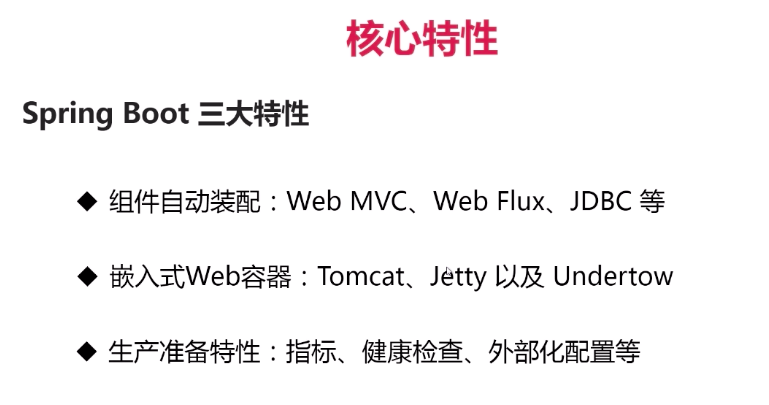

## 2. 组件自动装配

```
1. 激活: @EnableAutoConfiguration
2. 配置: /META-INFO/Spring.factories
3. 实现: XXXAutoConfiguration
```

## 3. Web应用

###  1. 传统Servlet应用

```

```


## 一. 入门Helloworld

### 1. Spring initlize 方式

1. 创建一个 Spring initlize 工程
2. 在**Application.java的同级 包下，创建一个 controller

```java
package com.day.SpringBoot.controller;

import org.springframework.stereotype.Controller;
import org.springframework.web.bind.annotation.RequestMapping;
import org.springframework.web.bind.annotation.ResponseBody;

@Controller
public class HelloController {

    @ResponseBody
    @RequestMapping("/hello")
    public String hello() {
        return "hello world";
    }
}

```

3. 测试运行

   直接点击 Main 方法进行运行即可

4. 部署

   在 pom 文件中，引入打包 plugin 配置（自动打包成 jar 包)

   ```xml
   <build>
           <plugins>
               <plugin>
                   <groupId>org.springframework.boot</groupId>
                   <artifactId>spring-boot-maven-plugin</artifactId>
               </plugin>
           </plugins>
       </build>
   
   ```

   

   在右侧边栏 Maven=>Lifecycle=>package ，即可打包(在 target 文件夹下，有一个 **.jar)

   在命令行，执行 java -jar **.jar 即可运行

### 2. 原理

#### 1. POM中 导入 父项目(版本仲裁)

```xml
<parent>
        <groupId>org.springframework.boot</groupId>
        <artifactId>spring-boot-starter-parent</artifactId>
        <version>2.1.9.RELEASE</version>
        <relativePath/> <!-- lookup parent from repository -->
    </parent>
```

由于导入了 spring-boot-starter-parent， 而其父项目pom文件中，定义了 很多相关包的 版本号 （为了于该 springboot版本兼容吧）

==》 因此，在引入一些包的时候，不需要指定版本号了

#### 2. 启动器

```xml
<dependency>
            <groupId>org.springframework.boot</groupId>
            <artifactId>spring-boot-starter-web</artifactId>
            <version>RELEASE</version>
            <scope>compile</scope>
        </dependency>
```

紧接着，在 pom中 导入了 spring-boot-starter-web，其内容如下

```xml
<dependencies>
    <dependency>
      <groupId>org.springframework.boot</groupId>
      <artifactId>spring-boot-starter</artifactId>
      <version>2.1.9.RELEASE</version>
      <scope>compile</scope>
    </dependency>
    <dependency>
      <groupId>org.springframework.boot</groupId>
      <artifactId>spring-boot-starter-json</artifactId>
      <version>2.1.9.RELEASE</version>
      <scope>compile</scope>
    </dependency>
    <dependency>
      <groupId>org.springframework.boot</groupId>
      <artifactId>spring-boot-starter-tomcat</artifactId>
      <version>2.1.9.RELEASE</version>
      <scope>compile</scope>
    </dependency>
    <dependency>
      <groupId>org.hibernate.validator</groupId>
      <artifactId>hibernate-validator</artifactId>
      <version>6.0.17.Final</version>
      <scope>compile</scope>
    </dependency>
    <dependency>
      <groupId>org.springframework</groupId>
      <artifactId>spring-web</artifactId>
      <version>5.1.10.RELEASE</version>
      <scope>compile</scope>
    </dependency>
    <dependency>
      <groupId>org.springframework</groupId>
      <artifactId>spring-webmvc</artifactId>
      <version>5.1.10.RELEASE</version>
      <scope>compile</scope>
    </dependency>
  </dependencies>
```

发现，spring-boot-starter-web 就是将 web 开发环境所需要的 jar包依赖 都已经定义好了

==> spring-boot-starter-* 系列pom，已经定义好了 要实现该块功能需要的 jar 依赖，直接导入 这个就可以了

#### 3. 主程序

@SpringBootApplication 用来标注在某各类上，说明该类是 springboot的 主配置类

==》 springboot 应该允许该类的 main方法，来启动springboot 应用

```java
package com.day.SpringBoot;

import org.springframework.boot.SpringApplication;
import org.springframework.boot.autoconfigure.SpringBootApplication;

@SpringBootApplication
public class SpringBoot01Application {

    public static void main(String[] args) {
        
        SpringApplication.run(SpringBoot01Application.class, args);
    }
}
```

原理:

1. 自动配置功能

```
	@SpringBootApplication 

​		=> @SpringBootConfiguration 

​			=> @Configuration
```

​	==> 即 其底层还是使用的   @Configuration 注解

2. 自动扫描哪些包

   ```
   	@EnableAutoConfiguration
   
   ​		=>@AutoConfigurationPackage
   
   ​			=>@Import({Registrar.class})
   
   ​				=> Registrar 的registerBeanDefinitions 方法中，获取到了 @SpringBootApplication 注解类所在的包，
   ```

​	==> 将@SpringBootApplication 注解类所在的包 及下面所有子包的所有组件，扫描到容器 中

3. 导入组件

   ```
   @Import({AutoConfigurationImportSelector.class})
   会给容器中，导入非常多的 自定义配置类 (**AutoConfiguration)
   	==> 即给容器中导入 这个场景所需要的所有组件，并配置好这些组件
   ```

   SpringBoot 在启动的时候，会从 类路径下的 META-INFO/spring.factories 中 获取 EnableAutoConfiguration 指定的值，并将这些值 作为 自动配置类，导入 容器中，自动配置类就会生效

   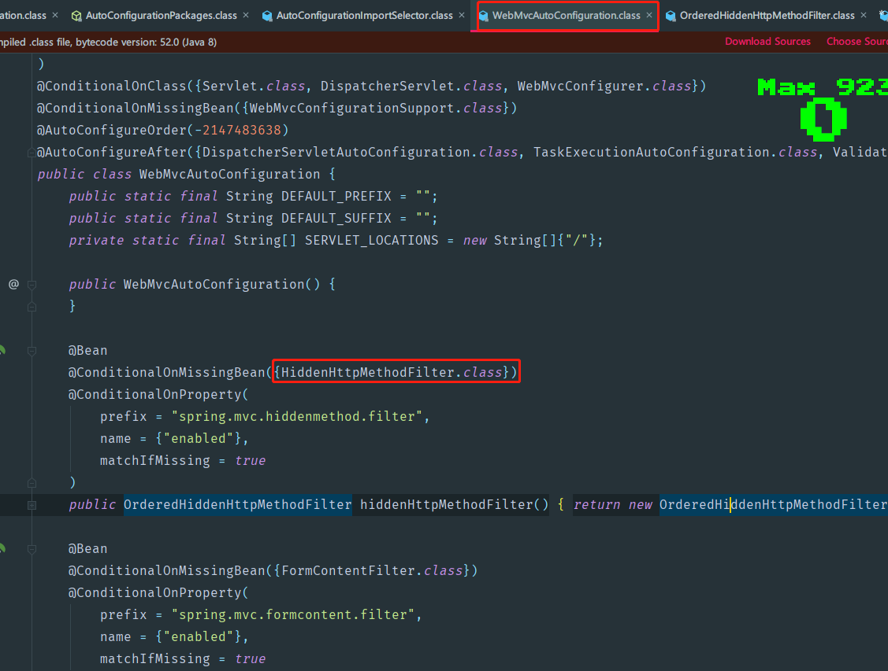

==> 原来在 xml 中配置的配置项，现在 AutoConfiguration 已经做了，因此就不需要配置文件了

## 二. resources 目录结构

```
resources
	- static: 保存所有的静态资源 js css images
	- templates: 保存所有的模板页面(Spring Boot 默认jar包使用 默认的Tomcat，不支持JSP页面)，因此可以使用模板引擎(freemarker，thymeleaf等等)
	- application.properties: SpringBoot 应用的配置文件，可以修改一些默认的配置
```

## 三. 配置文件

### 1. 默认配置文件

SpringBoot 使用一个全局的配置文件，配置文件名是固定的

```
application.properties
application.yml
```

### 2. 读取配置文件的值，赋值给类的属性

#### 编写 application.yml 文件

```yaml
person: 
  lastName: hello
  age: 10
  boss: false
  birth: 2017/11/11
  maps: {k1: v1, k2: 12}
  lists:
    - lisi
    - wangwu
  dog:
    name: fg
    age: 3
```

#### 编写实体类

使用 @ConfigurationProperties 注解，即可关联到配置文件中的值

```java
package com.day.SpringBoot.bean;

import org.springframework.boot.context.properties.ConfigurationProperties;
import org.springframework.stereotype.Component;

import java.io.Serializable;
import java.util.Date;
import java.util.List;
import java.util.Map;

/*
 * 将配置文件中的值，映射到这个组件中
 * prefix: 将 person 下的所有字段，配置到该类
 * Component: 只有这个组件是容器中的组件，才能使用 ConfigurationProperties 宫嗯那个
 * */
@Component
@ConfigurationProperties(prefix = "person")
public class Person implements Serializable {
    private String lastName;
    private Integer age;
    private Boolean boss;
    private Date birth;
    private Map<String, String> maps;
    private List<String> lists;
    private Dog dog;
	// 忽略 getter setter toString 方法
}

```

```java
package com.day.SpringBoot.bean;

import java.io.Serializable;
import java.security.PrivateKey;

public class Dog implements Serializable {
    private String name;
    private Integer age;
	// 忽略 getter setter toString 方法
}

```

#### 测试

```java
package com.day.SpringBoot;

import com.day.SpringBoot.bean.Person;
import org.junit.Test;
import org.junit.runner.RunWith;
import org.springframework.beans.factory.annotation.Autowired;
import org.springframework.boot.test.context.SpringBootTest;
import org.springframework.test.context.junit4.SpringRunner;

/**
 * SpringBoot 的 单元测试
 * 在测试期间，可以很方便的自动注入
 */
@RunWith(SpringRunner.class)
@SpringBootTest
public class SpringBoot01ApplicationTests {

    @Autowired
    private Person person;

    @Test
    public void contextLoads() {
        System.out.println(person);
    }
}

// 打印结果
Person{lastName='hello', age=10, boss=false, birth=Sat Nov 11 00:00:00 CST 2017, maps={k1=v1, k2=12}, lists=[lisi, wangwu], dog=Dog{name='fg', age=3}}
```

#### 使用 properties方式

```
server.port=8081

person.last-name=aa
person.age=12
```

对于 properties 中中文乱码问题解决:

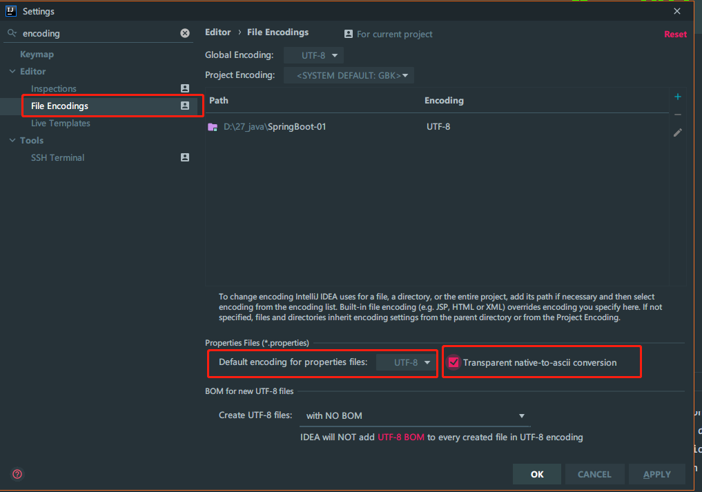

### 3. @value 与 @ConfigurationProperties 比较

- 松散绑定

  加入 类中属性为 lastName, 则在 配置文件中使用  last-name, last_name, lastName 都可以进行匹配

|                      | @ConfigurationProperties    | @Value           |
| -------------------- | --------------------------- | ---------------- |
| 功能                 | 批量的注入 配置文件中的属性 | 一个个的进行指定 |
| 松散绑定             | 支持                        | 不支持           |
| SPEL表达式           | 不支持                      | 支持             |
| JSR303数据校验       | 支持                        | 不支持           |
| 复杂数据类型(map 等) | 支持                        | 不支持           |

### 4. 使用自定义的 properties配置文件

#### 1. @PropertySource

上面使用 @ConfigurationProperties 注解 为 Person 加载配置文件值时，person 配置信息是存放在 application.properties, 能否将其放在 单独的配置文件中呢?

==> 可以，但是在加载的时候，需要多使用一个 @PropertySource(value={"classpath:文件在类路径下位置"}) 注解，标识 应当读取哪一个配置文件

### 5. 为容器添加组件

#### 1. @ImportResource （不推荐)

如果需要向 bean 容器中，添加一个 组件, 我们可以 创建一个 xml文件，在文件里配置bean

```xml
<?xml version="1.0" encoding="UTF-8"?>
<beans xmlns="http://www.springframework.org/schema/beans"
       xmlns:xsi="http://www.w3.org/2001/XMLSchema-instance"
       xsi:schemaLocation="http://www.springframework.org/schema/beans http://www.springframework.org/schema/beans/spring-beans.xsd">

    <bean id="dog" class="com.day.SpringBoot.bean.Dog"/>
</beans>
```

但是，如何将该 xml 文件 在 springBoot 中进行加载呢？

> 使用 @ImportResource(value = {"classpath:spring.xml"})注解，导入自定义的 xml 配置文件

```java
@ImportResource(value = {"classpath:spring.xml"})
@SpringBootApplication
public class SpringBoot01Application {

    public static void main(String[] args) {

        SpringApplication.run(SpringBoot01Application.class, args);
    }
}
```

#### 2. 使用配置类方式

SPringBoot 推荐全注解的方式进行使用

> 使用 配置类的方式  @Configuration +  @Bean

```java
/*
* 标识这是一个配置类
* */
@Configuration
public class MyConf {

    /*
     * 将方法的返回值，放入到容器中
     * bean 对应 id 为 方法名
     * */
    @Bean
    public Dog dog() {
        return new Dog();
    }
}
```

### 6. 配置文件占位符

1. 随机数(random)

2. 使用前面配置的值

```yml
person:
  lastName: hello${random.value}
  age: 10
  boss: false
  birth: 2017/11/11
  maps: {k1: v1, k2: 12}
  lists:
    - lisi
    - wangwu
  dog:
    name: fg
    // 使用前面配置的值，如果没找到，使用默认值10
    age: ${person.age:10}
```

### 7. Profile

是Spirng 对 不同的环境(dev，test，deployment等等)，使用不同的配置文件提供的支持

#### 1. 多profile 文件的方式

```
1。为每种环境，创建一个配置文件
    application.propertis  (默认的配置文件)
    application-dev.propertis (dev 环境下 配置文件)
    application-test.propertis (test 环境下 配置文件)
    ....
2. 在 默认的配置文件中， 激活profile (嘉定激活 dev 环境)
	spring.profiles.active=dev 
```

#### 2. yml多文档块方式

1. 使用  --- 后，变成多个文档快，每部分是 一个文档快
2. 在每个文档快内，配置属性（该属性属于该文档快), 并未该文档库配置 profile属性
3. 激活

```yaml
person:
  lastName: hello${random.value}
  age: 10
  boss: false
  birth: 2017/11/11
  maps: {k1: v1, k2: 12}
  lists:
    - lisi
    - wangwu
  dog:
    name: fg
    age: ${person.age}
    
---
spring:
  profiles:
    active: dev

---
server:
  port: 8000
spring:
  profiles: dev

---
server:
  port: 7000
spring:
  profiles: test
```

### 8. 配置文件加载位置

SpringBoot 在启动时，会扫描一下位置的 application.properties 或者 application.yml 作为默认的配置文件

```
1. file:./config/
2. file:./
3. classpath:/config/
4. classpath:/
其中 file 表示  当前项目路径
以上排序是从优先级从高到底进行排序的， 并且所有位置的配置文件都会被加载 ===> 高优先级配置内容会覆盖低优先级的
```

也可以使用 spring.config.location 来改变默认的配置文件位置

​	==》 原来的配置也在，跟当前的是 互补配置

## 四. 自定配置的原理

当前分析的 版本 SpringBoot 1.5.10.RELEASE

自动配置使用的注解

```
- @SpringBootApplication
	- @EnableAutoConfiguration
		- @Import({EnableAutoConfigurationImportSelector.class})

/* 
  关键: EnableAutoConfigurationImportSelector.class
  其父类: AutoConfigurationImportSelector
  	调用 selectImports方法
  		调用 getCandidateConfigurations
  			调用 loadFactoryNames
 */
```

##### loadFactoryNames 

获取需要加载的自动配置类名称

```java
    public static List<String> loadFactoryNames(Class<?> factoryClass, ClassLoader classLoader) {
        /*
         *	EnableAutoConfiguration.class
         */
        String factoryClassName = factoryClass.getName();

        try {
            /**
             *	加载每个类下面的 META-INF/spring.factories 文件
             */
            Enumeration<URL> urls = classLoader != null ? classLoader.getResources("META-INF/spring.factories") : ClassLoader.getSystemResources("META-INF/spring.factories");
            ArrayList result = new ArrayList();
			
            /**
             * 将这个 文件中的 元素放在一起，拼接成  properties 文件
             */
            while(urls.hasMoreElements()) {
                URL url = (URL)urls.nextElement();
                Properties properties = PropertiesLoaderUtils.loadProperties(new UrlResource(url));
                /*
                 * 获取 properties 文件中的， EnableAutoConfiguration.class 名称对应的属性的值
                 */
                String factoryClassNames = properties.getProperty(factoryClassName);
               /* 将这些值变为数组*/
               result.addAll(Arrays.asList(StringUtils.commaDelimitedListToStringArray(factoryClassNames)));
            }

            return result;
        } catch (IOException var8) {
            throw new IllegalArgumentException("Unable to load [" + factoryClass.getName() + "] factories from location [" + "META-INF/spring.factories" + "]", var8);
        }
    }
```

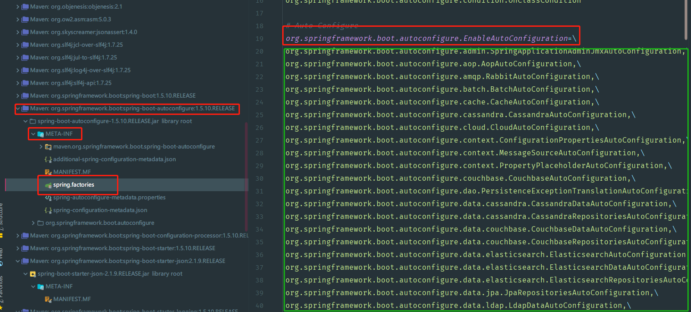

分析 HttpEncodingAutoConfiguration 自动配置类实现

```java
/*
 *	@Configuration: 表明该类是一个配置类，作用等同于 一个 xml 文件
 */
@Configuration
/*
 * 启用类的 ConfigurationProperties 功能；
 * 将 HttpEncodingProperties.class 添加到 容器中
 */
@EnableConfigurationProperties({HttpEncodingProperties.class})
/*
 *	底层使用 @Conditional 注解
 * 表示 只有在 该类是 web 应用时，才生效
 */
@ConditionalOnWebApplication
/*
 *	表示只有在 有 CharacterEncodingFilter 类的时候，才生效
 */
@ConditionalOnClass({CharacterEncodingFilter.class})
/*
 *	表示只有在 spring.http.encoding.enabled = true 时，才生效
 *  matchIfMissing = true： 如果配置文件中没有配置，则默认时 ture
 */
@ConditionalOnProperty(
    prefix = "spring.http.encoding",
    value = {"enabled"},
    matchIfMissing = true
)
public class HttpEncodingAutoConfiguration {
    /*
     * HttpEncodingProperties: 该类有一些配置项，会从 SpringBoot 的配置文件中读取配置信息
     */
    private final HttpEncodingProperties properties;
	
    /*
     *	只有一个有参构造器，则会从 容器中加载
     */
    public HttpEncodingAutoConfiguration(HttpEncodingProperties properties) {
        this.properties = properties;
    }
	
    /*
     *	@Bean: 将返回值 CharacterEncodingFilter 添加到 容器中(原来时在xml 中，使用 <bean> 手动配置)
     * @ConditionalOnMissingBean： 只有在容器中没有该类时，才进行新增
     */
    @Bean
    @ConditionalOnMissingBean({CharacterEncodingFilter.class})
    public CharacterEncodingFilter characterEncodingFilter() {
        CharacterEncodingFilter filter = new OrderedCharacterEncodingFilter();
        /*
         * this.properties.getCharset().name()： 获取 HttpEncodingProperties 中的值，而该值是从配置文件中读取出来的
         */
        filter.setEncoding(this.properties.getCharset().name());
        filter.setForceRequestEncoding(this.properties.shouldForce(Type.REQUEST));
        filter.setForceResponseEncoding(this.properties.shouldForce(Type.RESPONSE));
        return filter;
    }

    @Bean
    public HttpEncodingAutoConfiguration.LocaleCharsetMappingsCustomizer localeCharsetMappingsCustomizer() {
        return new HttpEncodingAutoConfiguration.LocaleCharsetMappingsCustomizer(this.properties);
    }

    private static class LocaleCharsetMappingsCustomizer implements EmbeddedServletContainerCustomizer, Ordered {
        private final HttpEncodingProperties properties;

        LocaleCharsetMappingsCustomizer(HttpEncodingProperties properties) {
            this.properties = properties;
        }

        public void customize(ConfigurableEmbeddedServletContainer container) {
            if (this.properties.getMapping() != null) {
                container.setLocaleCharsetMappings(this.properties.getMapping());
            }

        }

        public int getOrder() {
            return 0;
        }
    }
}

```

##### HttpEncodingProperties

```java
/*
 * @ConfigurationProperties：表示从 SpringBoot 的配置文件的 spring.http.encoding 段中映射数据到该类
 */
@ConfigurationProperties(
    prefix = "spring.http.encoding"
)
public class HttpEncodingProperties {
    public static final Charset DEFAULT_CHARSET = Charset.forName("UTF-8");
    private Charset charset;  // 编码类型
    private Boolean force;    // 是否强制编码所有请求
    private Boolean forceRequest;
    private Boolean forceResponse;
    private Map<Locale, Charset> mapping;

    public HttpEncodingProperties() {
        this.charset = DEFAULT_CHARSET;
    }

    public Charset getCharset() {
        return this.charset;
    }

    public void setCharset(Charset charset) {
        this.charset = charset;
    }

    public boolean isForce() {
        return Boolean.TRUE.equals(this.force);
    }

    public void setForce(boolean force) {
        this.force = force;
    }

    public boolean isForceRequest() {
        return Boolean.TRUE.equals(this.forceRequest);
    }

    public void setForceRequest(boolean forceRequest) {
        this.forceRequest = forceRequest;
    }

    public boolean isForceResponse() {
        return Boolean.TRUE.equals(this.forceResponse);
    }

    public void setForceResponse(boolean forceResponse) {
        this.forceResponse = forceResponse;
    }

    public Map<Locale, Charset> getMapping() {
        return this.mapping;
    }

    public void setMapping(Map<Locale, Charset> mapping) {
        this.mapping = mapping;
    }

    boolean shouldForce(HttpEncodingProperties.Type type) {
        Boolean force = type == HttpEncodingProperties.Type.REQUEST ? this.forceRequest : this.forceResponse;
        if (force == null) {
            force = this.force;
        }

        if (force == null) {
            force = type == HttpEncodingProperties.Type.REQUEST;
        }

        return force;
    }

    static enum Type {
        REQUEST,
        RESPONSE;

        private Type() {
        }
    }
}
```

总结:

	1. SpringBoot 在启动的时候，会加载大量的 自动配置类
 	2. 自动配置类的名称规则:  ***AutoConfiguration.class
 	3. 每个自动配置类都会关联一个 ***Properties.class, 用来与配置文件关联，获取配置文件中配置的值
 	4. 如果程序中需要某些功能，首先看 SpringBoot 有无 写好的自动配置类； 如果有，查看这个自动配置类中 都有哪些组件； 查看 该自动配置类对一个的 Properties 文件，查看可以在配置文件中 配置哪些属性

## 五. 日志

### 1. 日志框架

| 日志门面(日志的抽象层)                |
| ------------------------------------- |
| JCL(jakarta commons loggint)          |
| SLF4J(Simple Logging Facade for Java) |
| jboss-logging                         |

| 日志实现               |
| ---------------------- |
| Log4j                  |
| Log4j2                 |
| Logback                |
| JUL(java.util.logging) |

最终使用:

​	日志门面: SJL4j

​	日志实现: Logback

### 2. 如何使用 SLF4j

##### 注意:

开发的时候，在调用日志的时候，应该调用 日志门面的方法，而不是 日志实现的

每个日志的实现框架都会有自己的配置文件，在使用 SLF4J之后，配置文件还是使用日志实现框架自己本身的配置文件

##### SLF4J与其他日志实现框架结合


#### 1. 统一日志框架

SpringBoot 选择的是 slf4j+logback, 但如果该程序中使用了 其他日志框架，比如 Spring(commons-logging), Hibernate(jboss-logging) 等等，那么在程序使用中就需要配置多个日志框架，比较麻烦，如何统一日志框架呢？

1. 将系统中其他日志框架先排除
2. 用中间包进行替换原有的日志框架
3. 导入SLF4J的其他实现


##### SpringBoot中依赖

在pom.xml 文件，右键 show dependes

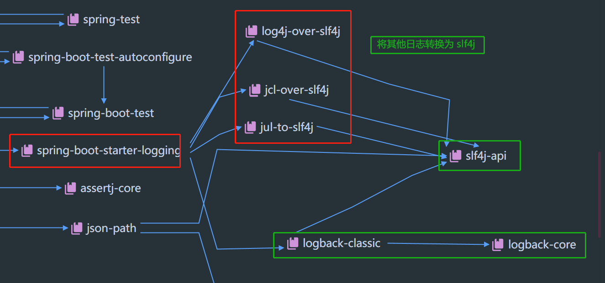

jcl-over-slf4j的实现

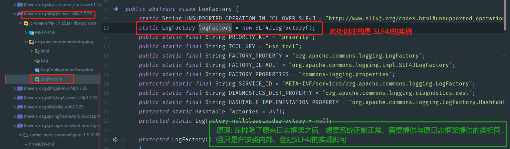

##### 排除原框架依赖

```xml
<dependency>
    <groupId>org.springframework</groupId>
    <artifactId>spring-core</artifactId>
    <exclusions>
        <exclusion>
            <groupId>commons-logging</groupId>
            <artifactId>commons-logging</artifactId>
        </exclusion>
    </exclusions>
</dependency>
```

### 3. 日志使用

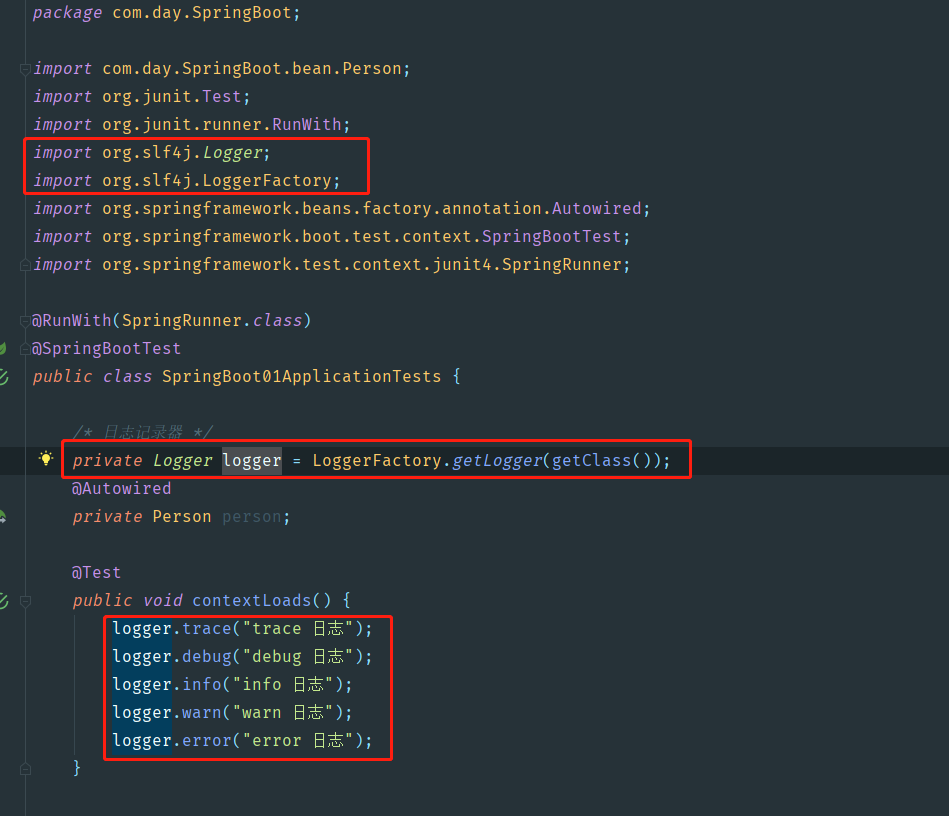

配置

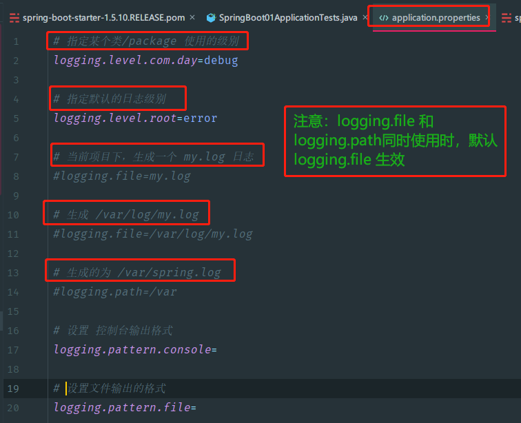

自定义配置文件

> 在类路径下，放 logback.xml 文件 或者 logback-spring.xml 即可

logback.xml 与 logback-spring.xml 区别:

​	logback.xml ： 直接被 日志框架识别

​	logback-spring.xml:  被 springboot 识别加载，springboot 在加载的时候，提供了一个特性，如果指定了 profile，则标识 该块配置，只在对应的环境下生效

```
<springProfile name="test">
	自定义的配置
</springProfile>
```

### 4. 日志框架切换

#### 1. 方式一: 

按照上面方式，排除包 + 引入新的包即可  （排除包 可以在 Pom.xml 右键 show dependence 中，选择依赖删除即可)

#### 2. 方式二:

当前使用的都是  spring-boot-starter-logging, 可以将其替换为 spring-boot-starter-*** (对应的日志实现) 即可

## 六.Web开发

### 1. 使用步骤

1. 创建项目，选中需要的模块 （springboot会将这些场景配置完毕)
2. 在配置文件中，指定少量配置
3. 编写业务代码

### 2. 静态资源映射规则

分析类: WebMvcAutoConfiguration.class

#### 1. /webjars/** 映射到 classpath:/META-INF/resources/webjars/

```java
public void addResourceHandlers(ResourceHandlerRegistry registry) {
            if (!this.resourceProperties.isAddMappings()) {
                logger.debug("Default resource handling disabled");
            } else {
                Integer cachePeriod = this.resourceProperties.getCachePeriod();
                if (!registry.hasMappingForPattern("/webjars/**")) {
                    this.customizeResourceHandlerRegistration(registry.addResourceHandler(new String[]{"/webjars/**"}).addResourceLocations(new String[]{"classpath:/META-INF/resources/webjars/"}).setCachePeriod(cachePeriod));
                }

                String staticPathPattern = this.mvcProperties.getStaticPathPattern();
                if (!registry.hasMappingForPattern(staticPathPattern)) {
                    this.customizeResourceHandlerRegistration(registry.addResourceHandler(new String[]{staticPathPattern}).addResourceLocations(this.resourceProperties.getStaticLocations()).setCachePeriod(cachePeriod));
                }

            }
        }
```

webjars: 以jar包的方式，引入静态资源

比如一些 jqury文件，会被封装成 jar包，使用时只需要进入jar包即可

localhost:8080/webjars/jquery/3.3.1/jquery.js 即可访问

#### 2. /** 映射到 "classpath:/META-INF/resources/", "classpath:/resources/", "classpath:/static/", "classpath:/public/"，"/"

```
静态资源文件夹
classpath:/META-INF/resources/
classpath:/resources/
classpath:/static/
classpath:/public/
/
```


访问当前项目的静态资源时，会被映射到这些目录

#### 3. / 映射到 静态资源文件夹下 index.html

默认时，访问 localhost:8080/ 时，返回的是一个错误界面；如果在静态资源文件夹下添加了 index.html, 则会进入该界面

### 3. 模板引擎（thymeleaf)

### 4. 扩展SpringMVC

在使用 SpringMVC时，可以直接配置 url 转到 界面，如下

```xml
<mvc:view-controller path="/hello" view-name="success"/>
```

那么，在SpringBoot中，如何实现这个功能呢？

SpringBoot中，推荐使用配置类的方式，通过 继承  WebMvcConfigurerAdapter 类，并使用 @Configuration 注解即可。

需要扩展什么功能，实现 该类的 方法即可

```java
@Configuration
public class MyConfig extends WebMvcConfigurerAdapter {
    @Override

    /**
     * 原来在 xml 中配置 访问 /hello 这个url，直接跳转到 success 界面
     * <mvc:view-controller path="/hello" view-name="success"/>
     * 在SpringBoot中，推荐使用 配置类的方式，如下
     */
    public void addViewControllers(ViewControllerRegistry registry) {
//        super.addViewControllers(registry);
        registry.addViewController("/hello").setViewName("success");
    }
}
```

### 5. 错误处理

SpringMVC 会在出错的时候，自动跳转到一个默认出错界面（浏览器），而对于其他比如postman等，会返回json数据

#### 定值错误界面:

##### 1. 定制错误的html界面

如果使用了模板引擎

> 1. 将错误界面命名为 错误码.html, 放置路径为 templates/error/错误码.html 
> 2. 也可以使用  templates/error/4xx.html  templates/error/5xx.html 来处理出粗界面
> 3. 在 错误码.html 和 4xx.html 5xx.html 都配置的情况下，精确匹配优先

如果没有使用模板引擎

​	在静态资源文件夹下，查找 错误码对应的界面

界面中，可获取的信息有, 由于在model中，可以使用 ${}直接获取

```
timestamp
status
error
exception
message
path
```

##### 2. 定制错误的json数据

方式一:

```java
@ControllerAdvice
public class MyExceptionHandler {

    @ResponseBody
    @ExceptionHandler(UserNotExist.class)
    public Map<String, Object> handleException(Exception e) {
        Map<String, Object> map = new HashMap<>();
        map.put("code", "1");
        map.put("msg", e.getMessage());
        return map;
    }
}
```

但这种方式，浏览器和客户端返回的都是json数据，并没有自适应

方式二:

出现错误之后，转发到 /error

```java
@ControllerAdvice
public class MyExceptionHandler {

    @ExceptionHandler(UserNotExist.class)
    public String handleException(Exception e, HttpServletRequest request) {
        Map<String, Object> map = new HashMap<>();
        map.put("code", "1");
        map.put("msg", e.getMessage());
        /*
         * 需要设置状态码，否则 /error 解析到的状态码为 200
         */
        request.setAttribute("javax.servlet.error.status_code", 400);
        return "forward:/error";
    }
}
```

但是此时，虽然能够跳转到 错误界面，但是 却不能将 map 数据传递过去

错误信息等，是使用 DefaultErrorAttributes 的 getErrorAttributes 获取的；并且 DefaultErrorAttributes  也是用户没有自定义的情况下，才会被加入到容器的

​	那么，重写 DefaultErrorAttributes 类，在 getErrorAttributes  添加上我们自定义的返回数据即可

```java
/*
    添加到 容器中
 */
@Component
public class MyErrorAttributes extends DefaultErrorAttributes {
    @Override
    public Map<String, Object> getErrorAttributes(RequestAttributes requestAttributes, boolean includeStackTrace) {
        /**
         * 首先，调用父类的方法，在map中添加原来的错误信息
         */
        Map<String, Object> map = super.getErrorAttributes(requestAttributes, includeStackTrace);
        /**
         * 从 request 域中，取出我们自定义的错误信息，放入map中即可
         */
        Map<String, Object> myerrinfo = (Map<String, Object>) requestAttributes.getAttribute("myerrinfo", 0);
        map.put("err", myerrinfo);
        return map;
    }
}
```


#### 1. 原理

```
// 错误处理的 自动配置类
ErrorMvcAutoConfiguration
```

##### ErrorPageCustomizer组件

系统一旦出现4xx 5xx 之类错误，ErrorPageCustomizer就会生效

作用: 系统出现错误之后，会调用 /error 请求

```java
private static class ErrorPageCustomizer implements ErrorPageRegistrar, Ordered {
        private final ServerProperties properties;

        protected ErrorPageCustomizer(ServerProperties properties) {
            this.properties = properties;
        }

        public void registerErrorPages(ErrorPageRegistry errorPageRegistry) {
            // /error
            ErrorPage errorPage = new ErrorPage(this.properties.getServletPrefix() + this.properties.getError().getPath());
            errorPageRegistry.addErrorPages(new ErrorPage[]{errorPage});
        }

        public int getOrder() {
            return 0;
        }
    }
```

##### BasicErrorController组件

```java
/*
 *	1. 用来处理 /error 请求
 */

@Controller
@RequestMapping({"${server.error.path:${error.path:/error}}"})
public class BasicErrorController extends AbstractErrorController {
    private final ErrorProperties errorProperties;

    public BasicErrorController(ErrorAttributes errorAttributes, ErrorProperties errorProperties) {
        this(errorAttributes, errorProperties, Collections.emptyList());
    }

    public BasicErrorController(ErrorAttributes errorAttributes, ErrorProperties errorProperties, List<ErrorViewResolver> errorViewResolvers) {
        super(errorAttributes, errorViewResolvers);
        Assert.notNull(errorProperties, "ErrorProperties must not be null");
        this.errorProperties = errorProperties;
    }

    public String getErrorPath() {
        return this.errorProperties.getPath();
    }

    /*
     *	返回 html 界面 
     *  根据 produces = {"text/html"} 区分
     */
    @RequestMapping(
        produces = {"text/html"}
    )
    public ModelAndView errorHtml(HttpServletRequest request, HttpServletResponse response) {
        HttpStatus status = this.getStatus(request);
        /*
         * 获取 model 数据 调用的时 DefaultErrorAttributes 的getErrorAttributes方法获取model
         */
        Map<String, Object> model = Collections.unmodifiableMap(this.getErrorAttributes(request, this.isIncludeStackTrace(request, MediaType.TEXT_HTML)));
        response.setStatus(status.value());
        /*
         * 解析要跳转到的界面，和数据 （ModelAndView)
         */
        ModelAndView modelAndView = this.resolveErrorView(request, response, status, model);
        return modelAndView == null ? new ModelAndView("error", model) : modelAndView;
    }

    /*
     *	返回 json 数据
     */
    @RequestMapping
    @ResponseBody
    public ResponseEntity<Map<String, Object>> error(HttpServletRequest request) {
        Map<String, Object> body = this.getErrorAttributes(request, this.isIncludeStackTrace(request, MediaType.ALL));
        HttpStatus status = this.getStatus(request);
        return new ResponseEntity(body, status);
    }
```

```java
protected ModelAndView resolveErrorView(HttpServletRequest request, HttpServletResponse response, HttpStatus status, Map<String, Object> model) {
    	/*
    	 *	遍历所有的  errorViewResolvers，解析错误
    	 */
        Iterator var5 = this.errorViewResolvers.iterator();

        ModelAndView modelAndView;
        do {
            if (!var5.hasNext()) {
                return null;
            }

            ErrorViewResolver resolver = (ErrorViewResolver)var5.next();
            modelAndView = resolver.resolveErrorView(request, status, model);
        } while(modelAndView == null);

        return modelAndView;
    }
```

##### DefaultErrorViewResolver组件

该组件是一个默认的 errorViewResolvers

```java
/*
 * 解析错误 界面
 */ 
public ModelAndView resolveErrorView(HttpServletRequest request, HttpStatus status, Map<String, Object> model) {
        ModelAndView modelAndView = this.resolve(String.valueOf(status), model);
    	/*
    	 * SERIES_VIEWS 中定义了 4xx 和  5xx 错误
    	 * 如果 status 对应的 界面未找到，判断 错误
    	 	如果为客户端错误，查找 4xx 对应的界面;
    	 	如果为服务器端错误，查找 5xx 对应的界面
    	 * ==》 为了方便，毕竟每种状态吗都有一个界面比较麻烦，可以在 提供 error/4xx.html error/5xx.html两个界面，来处理所有的 4xx 和 5xx 错误请求	
    	 */
        if (modelAndView == null && SERIES_VIEWS.containsKey(status.series())) {
            modelAndView = this.resolve((String)SERIES_VIEWS.get(status.series()), model);
        }

        return modelAndView;
    }
/*
 * viewName： 错误码
 */
private ModelAndView resolve(String viewName, Map<String, Object> model) {
    /*
     *	错误View名称为:  error/错误码
     */
    String errorViewName = "error/" + viewName;
    /*
     *	判断该名称的view，在 模板引擎下 能否找到
     */
    TemplateAvailabilityProvider provider = this.templateAvailabilityProviders.getProvider(errorViewName, this.applicationContext);
    /*
     *	如果能找到，即  templates/error/错误码.html
     *  如果找不到，遍历静态资源文件夹，看能否找到
     */
    return provider != null ? new ModelAndView(errorViewName, model) : this.resolveResource(errorViewName, model);
}

private ModelAndView resolveResource(String viewName, Map<String, Object> model) {
    String[] var3 = this.resourceProperties.getStaticLocations();
    int var4 = var3.length;

    for(int var5 = 0; var5 < var4; ++var5) {
        String location = var3[var5];
		/*
		 * 遍历所有的静态资源文件夹，查找 viewName 对应的 html
		 */
        try {
            Resource resource = this.applicationContext.getResource(location);
            resource = resource.createRelative(viewName + ".html");
            if (resource.exists()) {
                return new ModelAndView(new DefaultErrorViewResolver.HtmlResourceView(resource), model);
            }
        } catch (Exception var8) {
        }
    }

    return null;
}
static {
        Map<Series, String> views = new HashMap();
        views.put(Series.CLIENT_ERROR, "4xx");
        views.put(Series.SERVER_ERROR, "5xx");
        SERIES_VIEWS = Collections.unmodifiableMap(views);
    }

```

##### DefaultErrorAttributes组件

```java
/*
 * 将出错信息，封装成model，返回
 * model中，返回的数据信息有:
 	timestamp
 	status
 	error
 	exception
 	message
 	path
 */
public Map<String, Object> getErrorAttributes(RequestAttributes requestAttributes, boolean includeStackTrace) {
        Map<String, Object> errorAttributes = new LinkedHashMap();
        errorAttributes.put("timestamp", new Date());
        this.addStatus(errorAttributes, requestAttributes);
        this.addErrorDetails(errorAttributes, requestAttributes, includeStackTrace);
        this.addPath(errorAttributes, requestAttributes);
        return errorAttributes;
    }
```


### 6. 配置嵌入式 Servlet 容器

SpringBoot 默认使用的是 嵌入式的 Servlet (Tomcat)

#### 1. 定制修改 Servlet 容器的相关配置

##### 方式一

在配置文件中，修改 server相关的配置（ServerProperties)

##### 方式二

```java
@Configuration
public class MyConfig extends WebMvcConfigurerAdapter {
    @Bean
    public EmbeddedServletContainerCustomizer embeddedServletContainerCustomizer() {
        return new EmbeddedServletContainerCustomizer() {
            @Override
            public void customize(ConfigurableEmbeddedServletContainer container) {
                container.setPort(8081);
            }
        };
    }
```

#### 2. 注册 Servlet, Filter, Listener

在SpringMVC中，注册 Servlet，Filter，Listener 等，都是在 web.xml 中进行配置的。

但是 SpringBoot 使用的是 嵌入式的 Servlet，并没有 web.xml 配置文件

SpringBoot 中，注册三大组件方式

>ServletRegistrationBean
>
>FilterRegistrationBean
>
>ServletlistenerRegistrationBean

```java
@Bean
public ServletRegistrationBean myServlet() {
    /*
     * 使用我们写的 servlet，创建一个 ServletRegistrationBean，并将其放入到容器中
     */
    ServletRegistrationBean bean = new ServletRegistrationBean(new Myservlet(), "/myservlet");
    return bean;
}
```

#### 3. 使用其他的Servlet容器

Jetty(支持长连接)

Undertow(不支持jsp，但高性能，高并发)

##### 切换：

1. 去除tomcat依赖

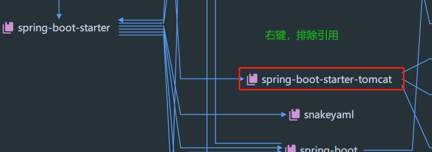

2. 添加 jetty

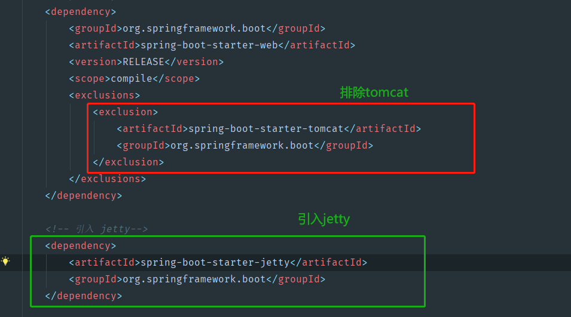

#### 4. 嵌入式Servlet 容器自动配置原理

1. 根据 导入的依赖包(tomcat, jety, Undertow等)，容器中就会有对应的类，选择创建对应的 ***EmbeddedServletContainerFactory

```java
/*
 *	EmbeddedServletContainerAutoConfiguration
 */

@Configuration
    @ConditionalOnClass({Servlet.class, Undertow.class, SslClientAuthMode.class})
    @ConditionalOnMissingBean(
        value = {EmbeddedServletContainerFactory.class},
        search = SearchStrategy.CURRENT
    )
    public static class EmbeddedUndertow {
        public EmbeddedUndertow() {
        }

        @Bean
        public UndertowEmbeddedServletContainerFactory undertowEmbeddedServletContainerFactory() {
            return new UndertowEmbeddedServletContainerFactory();
        }
    }

    @Configuration
    @ConditionalOnClass({Servlet.class, Server.class, Loader.class, WebAppContext.class})
    @ConditionalOnMissingBean(
        value = {EmbeddedServletContainerFactory.class},
        search = SearchStrategy.CURRENT
    )
    public static class EmbeddedJetty {
        public EmbeddedJetty() {
        }

        @Bean
        public JettyEmbeddedServletContainerFactory jettyEmbeddedServletContainerFactory() {
            return new JettyEmbeddedServletContainerFactory();
        }
    }
	
	/*
	 * @ConditionalOnClass({Servlet.class, Tomcat.class}): 当导入了 tomcat 的依赖之后，容器中才会有 Tomcat.class, 这个条件才能判断正确 ==> 才会创建 TomcatEmbeddedServletContainerFactory
	 */
    @Configuration
    @ConditionalOnClass({Servlet.class, Tomcat.class})
    @ConditionalOnMissingBean(
        value = {EmbeddedServletContainerFactory.class},
        search = SearchStrategy.CURRENT
    )
    public static class EmbeddedTomcat {
        public EmbeddedTomcat() {
        }

        @Bean
        public TomcatEmbeddedServletContainerFactory tomcatEmbeddedServletContainerFactory() {
            return new TomcatEmbeddedServletContainerFactory();
        }
    }
```

2. 根据 ***EmbeddedServletContainerFactory, 创建 ***EmbeddedServletContainer

```java
/*
 *	TomcatEmbeddedServletContainerFactory 类的方法 为例
 */
public EmbeddedServletContainer getEmbeddedServletContainer(ServletContextInitializer... initializers) {
    	/*
    	 *	创建了 Tomcat
    	 */
        Tomcat tomcat = new Tomcat();
        File baseDir = this.baseDirectory != null ? this.baseDirectory : this.createTempDir("tomcat");
        tomcat.setBaseDir(baseDir.getAbsolutePath());
        Connector connector = new Connector(this.protocol);
        tomcat.getService().addConnector(connector);
        this.customizeConnector(connector);
        tomcat.setConnector(connector);
        tomcat.getHost().setAutoDeploy(false);
        this.configureEngine(tomcat.getEngine());
        Iterator var5 = this.additionalTomcatConnectors.iterator();

        while(var5.hasNext()) {
            Connector additionalConnector = (Connector)var5.next();
            tomcat.getService().addConnector(additionalConnector);
        }

        this.prepareContext(tomcat.getHost(), initializers);
    	/*
    	 *	传入 tomcat，得到 EmbeddedServletContainer
    	 *  并会 启动该 tomcat 容器
    	 */
        return this.getTomcatEmbeddedServletContainer(tomcat);
    }
```

3. 如何从配置文件/配置类中读取到的 tomcat 等配置参数，并设置的？

我们在修改 tomcat 配置时，使用的是

```
1. 配置文件修改属性的方式
	底层是使用 ServerProperties，而 ServerProperties 是继承 EmbeddedServletContainerCustomizer的
	public class ServerProperties implements EmbeddedServletContainerCustomizer, EnvironmentAware, Ordered 
2. 使用 EmbeddedServletContainerCustomizer，并重写他的 customize 方法
```

```java

/*
 *	EmbeddedServletContainerAutoConfiguration
 */
@AutoConfigureOrder(-2147483648)
@Configuration
@ConditionalOnWebApplication
/*
 *	该注解导入了embeddedServletContainerCustomizerBeanPostProcessor（后置处理器，用来在 bean初始化前后，还未赋值的时候，进行调用)
 */
@Import({EmbeddedServletContainerAutoConfiguration.BeanPostProcessorsRegistrar.class})
public class EmbeddedServletContainerAutoConfiguration {
    public EmbeddedServletContainerAutoConfiguration() {
    }
```

EmbeddedServletContainerFactory 在创建对象时，会触发 EmbeddedServletContainerCustomizerBeanPostProcessor 

后置处理器，该后置处理器会拿到 EmbeddedServletContainerCustomizer 类型的配置对象，调用该对象的 customize 方法，配置 创建的EmbeddedServletContainer对象

```java
/*
 * EmbeddedServletContainerCustomizerBeanPostProcessor
 * 在 初始化之前调用
 */
public Object postProcessBeforeInitialization(Object bean, String beanName) throws BeansException {
    /*
     * 判断 bean 是否是 ConfigurableEmbeddedServletContainer 类型的对象
     */
    if (bean instanceof ConfigurableEmbeddedServletContainer) {
        this.postProcessBeforeInitialization((ConfigurableEmbeddedServletContainer)bean);
    }

    return bean;
}


private void postProcessBeforeInitialization(ConfigurableEmbeddedServletContainer bean) {
    /*
     * 	获取所有的 EmbeddedServletContainerCustomizer 对象
     */
    Iterator var2 = this.getCustomizers().iterator();

    while(var2.hasNext()) {
        EmbeddedServletContainerCustomizer customizer = (EmbeddedServletContainerCustomizer)var2.next();
        /*
         *	调用 customize 方法，为 bean 赋值
         * ==》 对应着 我们在修改 tomcat 配置时，重写的 EmbeddedServletContainerCustomizer类的customize 方法
         */
        customizer.customize(bean);
    }

}

/*
 *  获取容器中，所有的  EmbeddedServletContainerCustomizer 对象
 */
private Collection<EmbeddedServletContainerCustomizer> getCustomizers() {
    if (this.customizers == null) {
        this.customizers = new ArrayList(this.beanFactory.getBeansOfType(EmbeddedServletContainerCustomizer.class, false, false).values());
        Collections.sort(this.customizers, AnnotationAwareOrderComparator.INSTANCE);
        this.customizers = Collections.unmodifiableList(this.customizers);
    }

    return this.customizers;
}
```

#### 5. 嵌入式Servlet启动原理

在 EmbeddedServletContainerAutoConfiguration类中 返回 TomcatEmbeddedServletContainerFactory 对象的地方，添加断点，debug 方式查看调用栈

#### 6. 使用外置的 Servlet 容器

嵌入式Servlet:

	1. 使用方便
 	2. 但是默认不支持JSP

外置的Servlet容器

​	1. 使用外面按照的Tomcat，以war包的方式打包

## 七.SpringData

### 1. 概念&特点

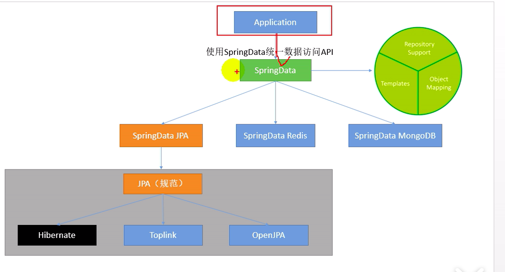

#### 1. 概念

​	SpringData为我们提供统一的API来对数据访问层进行操作，主要是 Spring Data Commons 项目来实现的。

​	Spring Data Commons 让我们在使用 关系型 或者 非关系型数据库访问技术时，都基于Spring 提供统一的标准（包含了 CRUD，排序，分页等相关操作)	

>  Spring Data 想用一套API，简化所有的操作。（开发人员不关系底层细节，直接与 SpringData进行交互)

#### 2. 提供了统一的 Repository 接口

1. 基本的 CRUD 操作
2. 乐观锁 操作
3. 分页操作

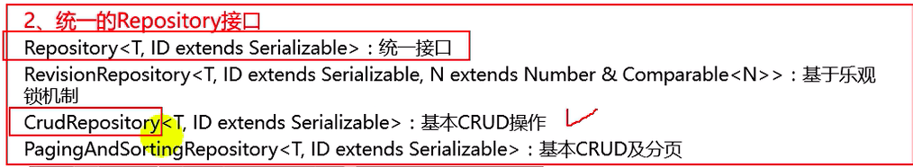

#### 3. 提供了数据访问模板类 XXXXTemplate

比如 MongoTemplate, RedisTemplate

### 2. JDBC

##### 1. 导入依赖

```xml
<dependency>
    <groupId>org.springframework.boot</groupId>
    <artifactId>spring-boot-starter-jdbc</artifactId>
</dependency>

<dependency>
    <groupId>mysql</groupId>
    <artifactId>mysql-connector-java</artifactId>
</dependency>
```

##### 2. 配置数据源

```properties
/*
 *	application.properties 文件
 *  注意：使用的高版本（6.x.x以上）Mysql数据库会与系统时区有差异造成异常，因此可以在 jdbc 后面添加 serverTimezone=GMT%2B8
 *   
 */
spring.datasource.username=root
spring.datasource.password=123456
spring.datasource.driver-class-name=com.mysql.jdbc.Driver
spring.datasource.url=jdbc:mysql://localhost:3306/chongyin?serverTimezone=GMT%2B8
```

##### 3. 编写测试

```java
@RunWith(SpringRunner.class)
@SpringBootTest
public class SpringbootApplicationTests {
	
    /*
     *	1. DataSource 已经加入到了 容器中，可以直接自动装配
     */
    @Autowired
    private DataSource datasource;
    @Test
    public void contextLoads() throws SQLException {
        Connection connection = datasource.getConnection();
        /*
         *	打印数据源类型和连接类型
         */
        System.out.println(datasource.getClass());
        System.out.println(connection);
    }
}

/*
 *	打印结果
 class com.zaxxer.hikari.HikariDataSource                  ==> 数据源类型
 HikariProxyConnection@1869544015 wrapping com.mysql.cj.jdbc.ConnectionImpl@4451f60c
 */
```

##### 4. 原理

###### 1. JDBC包下的类

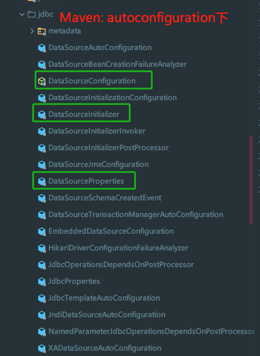

###### 2. 可以在配置文件中配置的属性

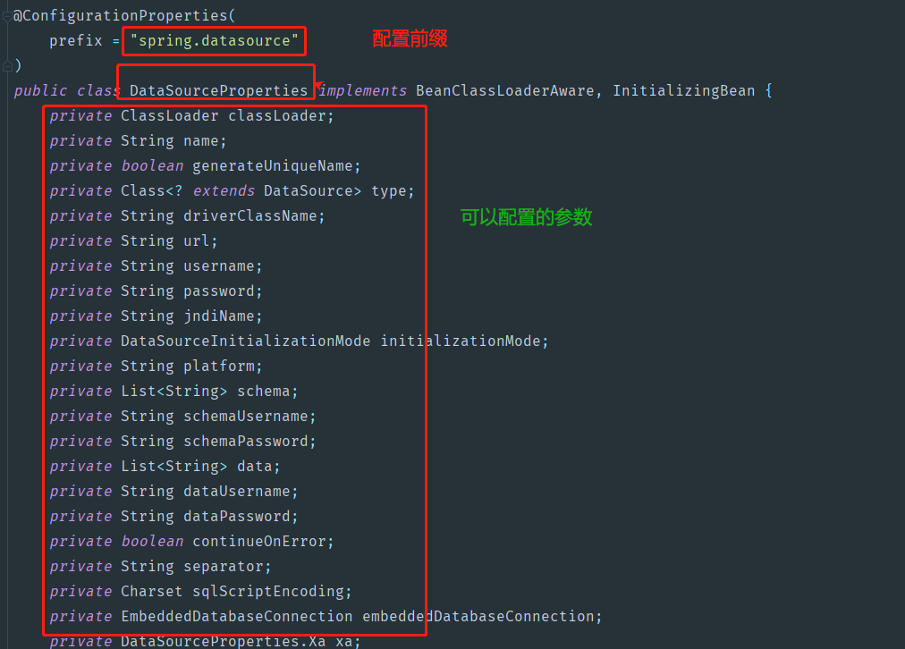

###### 3. DataSource 类型选择

在 DataSourceConfiguration 中，根据 spring.datasource.type 属性的值，选择创建对应类型的 Datasource

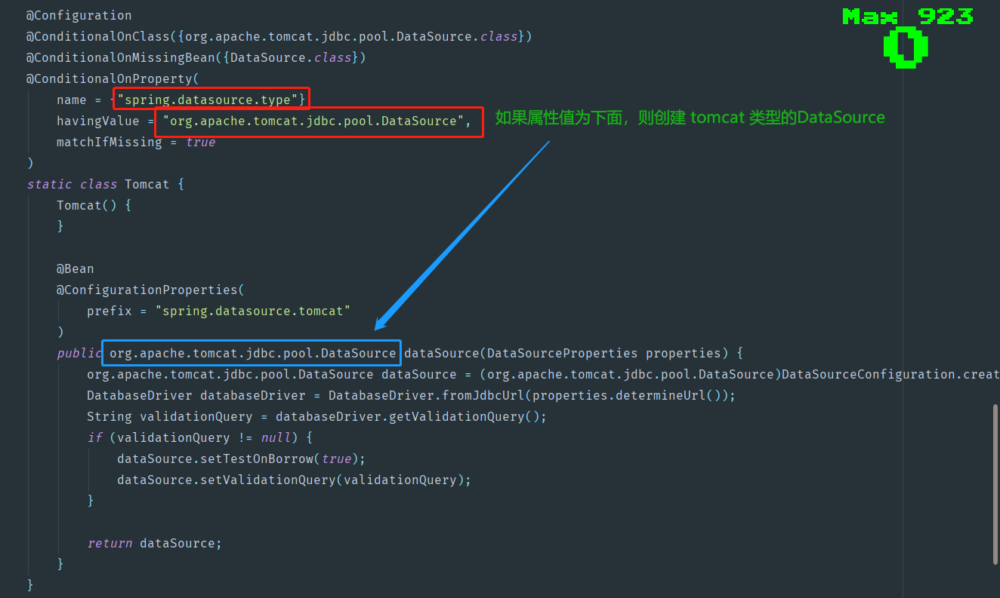

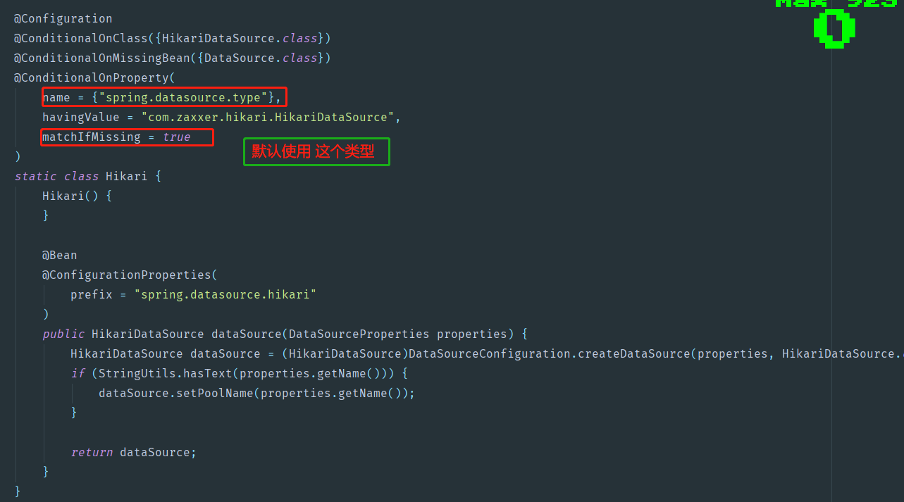

###### 4. 启动时执行建表sql和插入数据sql

> DataSourceInitializer

注意: 每次启动时都会执行！！！创建完成之后，最好删除表

```java
public boolean createSchema() {
    /*
     *	获取建表语句 路径
     * 1. 可以在配置文件中，通过 spring.datasource.schema 字段指定
     * 2. 默认使用 类路径下 schema.sql 或者 schema_平台类型.sql
     */
    List<Resource> scripts = this.getScripts("spring.datasource.schema", this.properties.getSchema(), "schema");
    if (!scripts.isEmpty()) {
        if (!this.isEnabled()) {
            logger.debug("Initialization disabled (not running DDL scripts)");
            return false;
        }

        String username = this.properties.getSchemaUsername();
        String password = this.properties.getSchemaPassword();
        this.runScripts(scripts, username, password);
    }

    return !scripts.isEmpty();
}

private List<Resource> getScripts(String propertyName, List<String> resources, String fallback) {
    if (resources != null) {
        return this.getResources(propertyName, resources, true);
    } else {
        /*
             *	默认在 classpath下进行查找，schema.sql 或者 schema_平台类型.sql
             */
        String platform = this.properties.getPlatform();
        List<String> fallbackResources = new ArrayList();
        fallbackResources.add("classpath*:" + fallback + "-" + platform + ".sql");
        fallbackResources.add("classpath*:" + fallback + ".sql");
        return this.getResources(propertyName, fallbackResources, false);
    }
}

/*
 *	获取数据初始化 sql 路径
 *  1. 可以通过 spring.datasource.data 指定
 #* 2. 默认使用 类路径下 data.sql 或者 data_平台类型.sql
 */
public void initSchema() {
    List<Resource> scripts = this.getScripts("spring.datasource.data", this.properties.getData(), "data");
    if (!scripts.isEmpty()) {
        if (!this.isEnabled()) {
            logger.debug("Initialization disabled (not running data scripts)");
            return;
        }

        String username = this.properties.getDataUsername();
        String password = this.properties.getDataPassword();
        this.runScripts(scripts, username, password);
    }

}
```

###### 5. JdbcTemplate

容器中已经自动导入了 JdbcTemplate， 直接使用 @AutoWired 注解使用即可

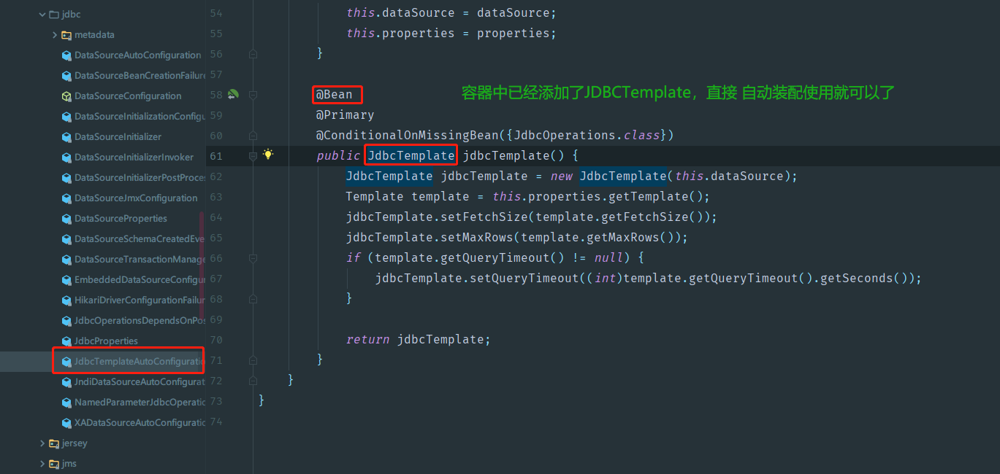

### 3. 整合 Druid 数据源

#### 1. 导入Druid 依赖

```xml
<dependency>
    <groupId>com.alibaba</groupId>
    <artifactId>druid</artifactId>
    <version>1.1.20</version>
</dependency>
```

#### 2. 修改配置文件，使用 Druid 数据源

```properties
# 表示使用 Druid 类型的数据源
spring.datasource.type=com.alibaba.druid.pool.DruidDataSource
```

#### 3. 测试数据源是否正确

```java
@RunWith(SpringRunner.class)
@SpringBootTest
public class SpringbootApplicationTests {

    @Autowired
    private DataSource datasource;
    @Test
    public void contextLoads() throws SQLException {
        Connection connection = datasource.getConnection();
        System.out.println(datasource.getClass());
        System.out.println(connection);
    }
}

/*
 *	结果:
 	class com.alibaba.druid.pool.DruidDataSource
	com.mysql.cj.jdbc.ConnectionImpl@566f1852
 */
```

#### 4. 自定义 Druid属性配置

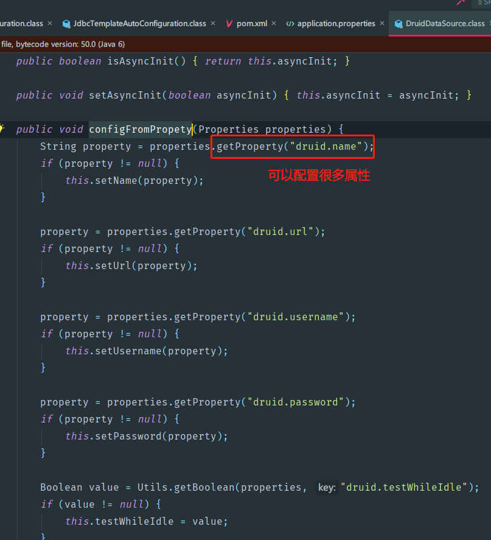

在使用JDBC 默认连接池的时候，我们将 属性配置在 application.properties, 能够生效的原因是 DataSource会读取该配置文件，解析这几个字段的值，

但是，如果使用 Druid的时候，如果仅仅在 application.properties 中配置一些属性，默认是不会被读入的

```properties
spring.datasource.initialsize=5
spring.datasource.maxActive=20
```

自定义一个配置类，将 DruidDataSource 放在容器中，并且配置要读取的字段

```java
package com.day.springboot.config;

import com.alibaba.druid.pool.DruidDataSource;
import org.springframework.boot.context.properties.ConfigurationProperties;
import org.springframework.context.annotation.Bean;
import org.springframework.context.annotation.Configuration;

@Configuration
public class DruidConfig {
    @Bean
    /*
     *	使用我们自己的 DruidDataSource，才能将配置文件中自定义的字段，读入到这个对象中
     */
    @ConfigurationProperties("spring.datasource")
    public DruidDataSource druidDataSource() {
        return new DruidDataSource();
    }
}

```

测试:

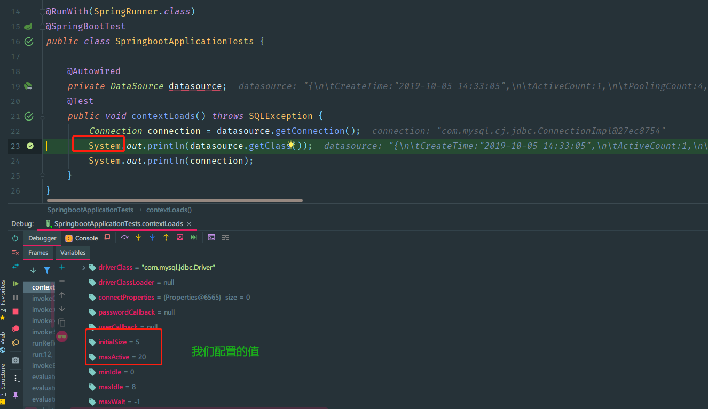

#### 6. 添加Druid 监控配置

Druid 监控主要是要添加一个 Servlet 和 Filter

```java
@Configuration
public class DruidConfig {
    @Bean
    @ConfigurationProperties("spring.datasource")
    public DruidDataSource druidDataSource() {
        return new DruidDataSource();
    }

    /* Druid 监控配置
    * 1. WEB 监控的Servlet 配置
    * */
    @Bean
    public ServletRegistrationBean druidServlet() {
        ServletRegistrationBean servletRegistrationBean = new ServletRegistrationBean(new StatViewServlet(), "/druid/*");
        /* 允许所有 IP 请求 */
        servletRegistrationBean.addInitParameter("allow", "");
        /* 设置 登陆 用户名和密码 */
        servletRegistrationBean.addInitParameter("loginUsername", "admin");
        servletRegistrationBean.addInitParameter("loginPassword", "123456");
        return servletRegistrationBean;
    }

    /**
     * Druid Filter 配置
     */
    @Bean
    public FilterRegistrationBean druidFilter() {
        FilterRegistrationBean filterRegistrationBean = new FilterRegistrationBean();
        /* 监控所有的请求 */
        filterRegistrationBean.setFilter(new WebStatFilter());
        /* 需要忽略的 请求 */
        filterRegistrationBean.addInitParameter("exclusions", "*.js,*.gif,*.jpg,*.css,/druid/*");
        return filterRegistrationBean;
    }

}
```

效果:

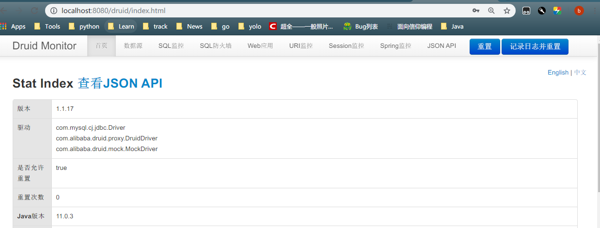

### 4. 整合 Mybatis

#### 1. 创建项目

使用Spring initilize 创建项目，选择 Spirng Web + Mysql API + JDBC API + Mybatis Framework 这些组件

然后引入Druid数据源依赖

生成的 pom文件如下

```xml
<?xml version="1.0" encoding="UTF-8"?>
<project xmlns="http://maven.apache.org/POM/4.0.0" xmlns:xsi="http://www.w3.org/2001/XMLSchema-instance"
         xsi:schemaLocation="http://maven.apache.org/POM/4.0.0 https://maven.apache.org/xsd/maven-4.0.0.xsd">
    <modelVersion>4.0.0</modelVersion>
    <parent>
        <groupId>org.springframework.boot</groupId>
        <artifactId>spring-boot-starter-parent</artifactId>
        <version>2.1.9.RELEASE</version>
        <relativePath/> <!-- lookup parent from repository -->
    </parent>
    <groupId>com.day</groupId>
    <artifactId>springbootmybatis</artifactId>
    <version>0.0.1-SNAPSHOT</version>
    <name>springbootmybatis</name>
    <description>Demo project for Spring Boot</description>

    <properties>
        <java.version>1.8</java.version>
    </properties>

    <dependencies>
        <dependency>
            <groupId>org.springframework.boot</groupId>
            <artifactId>spring-boot-starter-jdbc</artifactId>
        </dependency>
        <dependency>
            <groupId>org.springframework.boot</groupId>
            <artifactId>spring-boot-starter-web</artifactId>
        </dependency>
        <dependency>
            <groupId>org.mybatis.spring.boot</groupId>
            <artifactId>mybatis-spring-boot-starter</artifactId>
            <version>2.1.0</version>
        </dependency>

        <dependency>
            <groupId>com.alibaba</groupId>
            <artifactId>druid</artifactId>
            <version>1.1.20</version>
        </dependency>

        <dependency>
            <groupId>mysql</groupId>
            <artifactId>mysql-connector-java</artifactId>
            <scope>runtime</scope>
        </dependency>
        <dependency>
            <groupId>org.springframework.boot</groupId>
            <artifactId>spring-boot-starter-test</artifactId>
            <scope>test</scope>
        </dependency>
    </dependencies>

    <build>
        <plugins>
            <plugin>
                <groupId>org.springframework.boot</groupId>
                <artifactId>spring-boot-maven-plugin</artifactId>
            </plugin>
        </plugins>
    </build>

</project>


```

注意：需要开启 maven 的 auto import 功能，否则即使 已经 加入了 依赖，但是没有自动引入的话，一直未找到相关的类，无提示

#### 2. 配置 Druid DataSource

- 添加配置

```properties
spring.datasource.type=com.alibaba.druid.pool.DruidDataSource
spring.datasource.password=123456
spring.datasource.username=root
spring.datasource.driver-class-name=com.mysql.jdbc.Driver
spring.datasource.url=jdbc:mysql://localhost:3306/chongyin?serverTimezone=GMT%2B8
```

- 配置类

```java
@Configuration
public class DataSourceConfig {
    /*
     *	使用我们自己的 DruidDataSource，才能将配置文件中自定义的字段，读入到这个对象中
     */
    @Bean
    @ConfigurationProperties("spring.datasource")
    public DruidDataSource druidDataSource() {
        return new DruidDataSource();
    }
    
    // filter 和 servlet 省略

}
```

#### 3. 创建 mapper

```java
/*
 * @Mapper: 指定这是一个操作数据库的 mapper
 * 1. 可以在每个类上，都添加 @Mapper
 * 2. 类上可以不加，但是在 @SpringBootApplication 注释的类上，添加@MapperScan(value = "com.day.springbootmybatis.mapper")，会将整个包下面的所有，都加到里面去

 */
@Mapper
public interface UserMapper {

    @Select("select id, phone from user where id=#{id}")
    public User getUserById(Integer id);

    /*
     * useGeneratedKeys + keyProperty, 来封装完成之后的主键
     */
    @Options(useGeneratedKeys = true, keyProperty = "id")
    @Insert("insert into user (phone) values(phone)")
    public int insertUser(User user);
}
```

#### 4. 使用

```java
package com.day.springbootmybatis;

import com.day.springbootmybatis.bean.User;
import com.day.springbootmybatis.mapper.UserMapper;
import org.junit.Test;
import org.junit.runner.RunWith;
import org.springframework.beans.factory.annotation.Autowired;
import org.springframework.boot.test.context.SpringBootTest;
import org.springframework.test.context.junit4.SpringRunner;

@RunWith(SpringRunner.class)
@SpringBootTest
public class SpringbootmybatisApplicationTests {

    /*
     *	自动导入mapper 即可
     */
    @Autowired
    private UserMapper userMapper;

    @Test
    public void contextLoads() {
        User user = userMapper.getUserById(19335);
        System.out.println(user);
    }

}

```

#### 5. 实现 下划线与 驼峰命名映射

```java
package com.day.springbootmybatis.config;

import org.apache.ibatis.session.Configuration;
import org.mybatis.spring.boot.autoconfigure.ConfigurationCustomizer;
import org.springframework.context.annotation.Bean;

@org.springframework.context.annotation.Configuration
public class MybatisConfig {

    @Bean
    public ConfigurationCustomizer configurationCustomizer() {
        return new ConfigurationCustomizer() {
            @Override
            public void customize(Configuration configuration) {
                /* 设置数据库使用 下划线，映射到 java bean 的驼峰命名法 */
                configuration.setMapUnderscoreToCamelCase(true);
            }
        };
    }
}

```

#### 6. 使用 配置文件方式

- 配置全局配置文件

```xml
<?xml version="1.0" encoding="UTF-8" ?>
<!DOCTYPE configuration
        PUBLIC "-//mybatis.org//DTD Config 3.0//EN"
        "http://mybatis.org/dtd/mybatis-3-config.dtd">
<configuration>
</configuration>
```

- 配置 mapper 文件

```xml
<?xml version="1.0" encoding="UTF-8" ?>
<!DOCTYPE mapper
        PUBLIC "-//mybatis.org//DTD Mapper 3.0//EN"
        "http://mybatis.org/dtd/mybatis-3-mapper.dtd">
<mapper namespace="com.day.springbootmybatis.mapper.UserMapper">
    <select id="getUserById" resultType="com.day.springbootmybatis.bean.User">
    select id, phone from user where id=#{id}
  </select>
</mapper>
```

- 将配置文件位置，告知 springboot

```properties
# 在 application.properties 中添加下面两行
mybatis.mapper-locations=classpath:mybatis/*.xml
mybatis.config-location=classpath:mybatis-config.xml
```

测试即可使用！！！

### 5. JPA

> JPA(Java persistence api) 是SpringData中，针对持久层操作的模块

#### 1. 入门使用

##### 1. 创建项目

选用  spring web + spring data jpa + jdbc api + mysql api

导入 Druid 依赖

##### 2. 编写配置文件

```yaml
spring:
  datasource:
    username: root
    password: 123456
    url: jdbc:mysql://localhost:3306/chongyin?serverTimezone=GMT%2B8
    driver-class-name: com.mysql.jdbc.Driver
    type: com.alibaba.druid.pool.DruidDataSource
  jpa:
    hibernate:
#       自动更新表结构，如果没有该表，会自动创建
      ddl-auto: update
#     显示 SQL
    show-sql: true
```

##### 3. 编写实体类

```java
package com.day.springjpa.entity;

import javax.persistence.*;

/*
 * @Entity: 表示这是一个 与 数据表 进行映射的 javabean
 * @Table(name="MyUser"): 指定表名称为 MyUser, 如果未指定名称，默认使用 类名 首字母小写
 */
@Entity
@Table(name="MyUser")
public class User {
    /**
     * @Id: 表明该列是主键列
     *  @GeneratedValue: 表明该列自增，并指定了自增策略
     */
    @Id
    @GeneratedValue(strategy = GenerationType.IDENTITY)
    private Integer id;
    /*
    * @Column 指定该字段 与数据库对应
    * 如果不指定名称，默认使用 属性的名称*/
    @Column(name = "username")
    private String Username;
    @Column
    private String phone;

    public Integer getId() {
        return id;
    }

    public void setId(Integer id) {
        this.id = id;
    }

    public String getUsername() {
        return Username;
    }

    public void setUsername(String username) {
        Username = username;
    }

    public String getPhone() {
        return phone;
    }

    public void setPhone(String phone) {
        this.phone = phone;
    }

    @Override
    public String toString() {
        return "User{" +
                "id=" + id +
                ", Username='" + Username + '\'' +
                ", phone='" + phone + '\'' +
                '}';
    }
}

```

##### 4. 编写 Repository

```java
package com.day.springjpa.repository;

import com.day.springjpa.entity.User;
import org.springframework.data.jpa.repository.JpaRepository;
import org.springframework.stereotype.Repository;

/**
 * 我们操作的 接口，直接继承 JpaRepository 即可
 * JpaRepository<User, Integer>： Integer 是 主键的类型
 */
@Repository
public interface UserRepository extends JpaRepository<User, Integer> {
}

```

##### 5. 测试

```java
package com.day.springjpa;

import com.day.springjpa.entity.User;
import com.day.springjpa.repository.UserRepository;
import org.junit.Test;
import org.junit.runner.RunWith;
import org.springframework.beans.factory.annotation.Autowired;
import org.springframework.boot.test.context.SpringBootTest;
import org.springframework.test.context.junit4.SpringRunner;
import com.day.springjpa.entity.User;

import java.util.Optional;

@RunWith(SpringRunner.class)
@SpringBootTest
public class SpringjpaApplicationTests {

    @Autowired
    private UserRepository userRepository;
    @Test
    public void contextLoads() {
        User user = new User();
        user.setId(1);
        user.setPhone("123456");
        user.setUsername("test");
        userRepository.save(user);
        Optional<User> one = userRepository.findById(1);
        System.out.println(one);
    }
}

```

#### 2. 开发步骤

使用 Spring Data JpA 进行持久层的开发，大概需要下面几步

- 声明持久层的接口，该接口继承自 Repository 或者 Repository的子接口
- 在接口中声明需要的方法 (按照特定的策略进行声明)
- 在 Spring 配置文件中配置 SpringData, 让 Spring 为声明的接口创建代理对象

```
问: 使用jpa之后，只是什么了接口，继承了 Repository或者 其子接口，为何就能够使用呢?
答：配置之后，Spring 扫描 指定的包以及子目录，为继承 Repository 或者其 子接口的接口创建 代理对象
```

#### 3. Repository接口

- 是 Spring Data 中的一个核心的接口

- 该接口不提供任何的方法，

  ```
  问: 既然不提供任何的方法，那么该接口的作用是什么呢?
  答: 继承了 Repository 接口之后，Spring 扫描的时候，才会找到此接口，为其生成代理对象
  ```

- Spring Data 允许我们提供自定义的方法，但是方法要遵从策略，才能提供实现类

- 如果不想要继承 Repository接口，还可以在接口上使用 @RepositoryDefinition注解

  ```
  1. @RepositoryDefinition注解 的功能 与继承 Repository 的功能是一样的
  2. 其中 domainClass=T  idClass=主键类型
  ```

子接口:

```
1. CrudRepository
	继承自 Repository，实现了基本的 CRUD 方法
2. PagingAndSortingRepository
	继承自 CrudRepository, 实现了一组 分页 + 排序的方法
3. JpaRepository
	继承自 PagingAndSortingRepository, 实现了一组 jpa 规范的方法
```


##### 1. CrudRepository接口

​	CrudRepository接口提供了常用的 方法

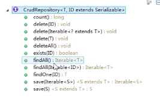

##### 2. PagingAndSortingRepository接口

​	在常用的方法基础之上，提供了 分页 & 排序 的功能

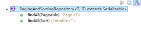

```
 看到 findAll(pageable) 这种方法使用的思路:
 1. 根据pageable参数 => 联想其类是 Pageable => 创建该类对象
 2. 由于 Pageable 是接口，因此，查看其实现类，new 实现类来创建真正的对象 (左侧写接口，右侧写实现)
```

##### 3. JpaRepository接口 

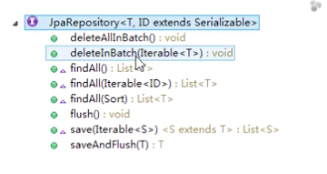

#### 4. 查询关键字

##### 1. 简单条件查询

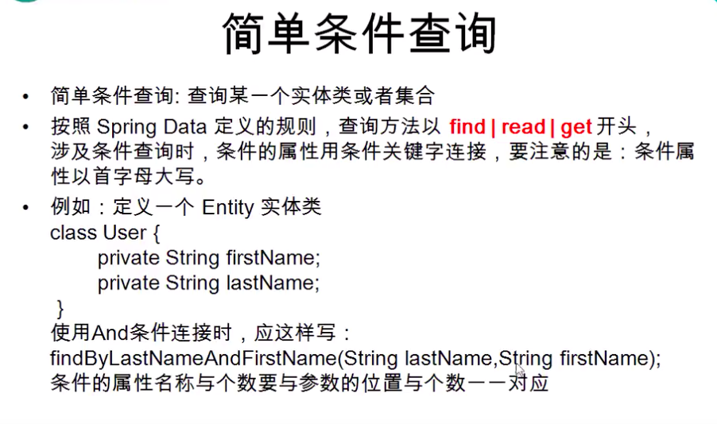

##### 2. 查询方法解析流程

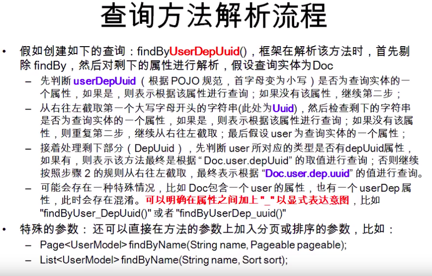


##### 3. 自定义查询

简单查询虽然好用，但是同样会带来一个问题, 如果查询时，使用的方法特别多，那么拼接出来的方法名称就会特别的长，有没有更加简单的方法呢?

答: 使用自定义的方法，在方法上使用 @Query 注解，博鳌是使用自定义的sql方法。其中 nativeQuery 标识使用 当前原sql进行查询

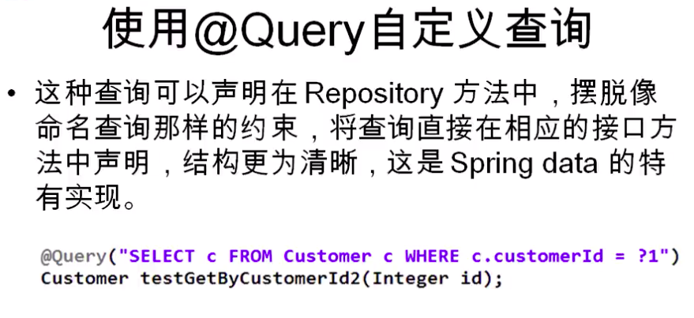

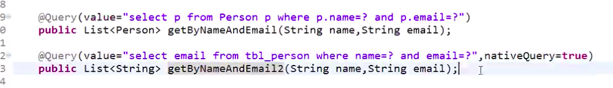

##### 4. 更新操作

问: 查看 Repository等接口提供的接口发现，并没有 update方法，那么如何实现 update 操作呢?

```
方式一:  使用 save方法，在save的时候，设置上 id 字段，就会更新。
	注意点: 在使用 save 方法时，必须写上所有字段，不然没写的字段会被设置成 null。==> 如果想要使用 save 进行update 操作，那么首先需要 findOne， 然后更新字段，在save

方式二: 使用 @Query 的方式，自定义 UPDATE 语句，进行执行
	注意点:
		1. 由于 使用了 UPDATE 语句，则需要 @Modifying 注解支持
		2. 在使用 UPDATE 语句时，需要 在调用的地方添加事务，没有事务的话，不能进行正常的执行
		3. 方法的返回值是 int， 标识更新语句所影响的行数
```

- Dao 层

```java
//Dao层，原生SQL实现更新方法接口
@Query(value = "update Studnet set name=?1 where id=?2 ", nativeQuery = true)  
@Modifying  
public void updateOne(String name,int id); 
```

- Service层

事务的管理都要在 Service 层

```java
//service层，在这个方法中调用上面的接口
@Transactional
public String updateOne(@RequestParam("name") String name, @RequestParam("id") Integer id) {
        stuRepository.updateOne(name,id);
        return "更新成功";
    }
```

#### 5. 自定义方法

根据上面知道，PersonRepository 在继承了 Repository 接口之后，所添加的自定义方法需要满足策略，否则不能添加默认实现。那么，如果既想要 继承Repository，又想要 能够添加自定义的方法，如何实现呢?

```
1. 自定义一个 PersonDao 接口，该接口中 添加 自定义的方法
2. 想要使用 Repository 的默认实现，肯定需要继承 Repository接口，又要自定义的方法，那么也要继承 PersonDao接口
3. PersonDao接口 的实现在哪呢？
	约定: 会去  xxxRepositoryImpl 中，去查找 自定义方法的接口实现
		==> 定义一个 PersonRepositoryImpl 实现类，继承自 PersonDao 接口，并对 自定义的方法进行实现
```


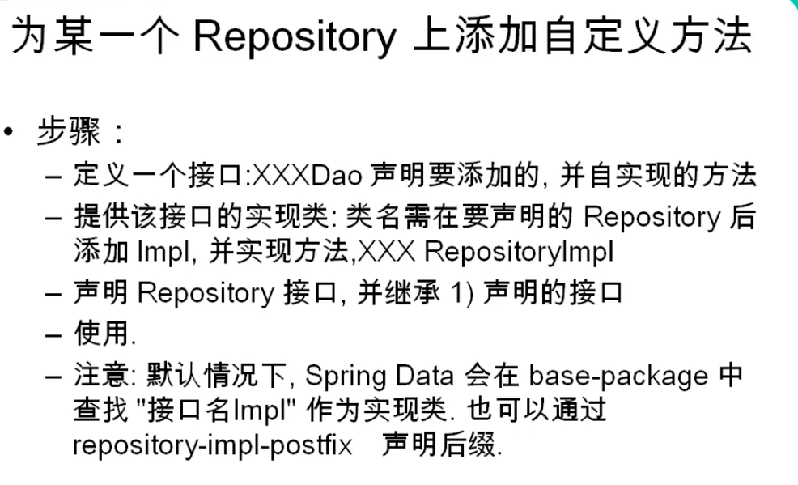

步骤:

```
1. 创建一个 PersonRepository, 继承自 JpaRepository 接口
	JPA 提供默认的方法
2. 创建一个 PersonDao 接口
	该接口中定义 用户自定义的查询方法
3. 实现 PersonDao 接口，创建一个 PersonRepositoryImpl 对象。并在实现类中 实现 PersonDao的接口
4. 修改 PersonRepository， 让其也继承自 PersonDao 接口

==> 在 Service 中，就可以使用 PersonRepository 对象调用 PersonDao中的接口方法，并且，在该方法会调用 PersonRepositoryImpl中的实现方法
```


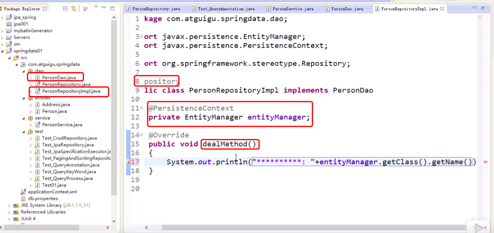

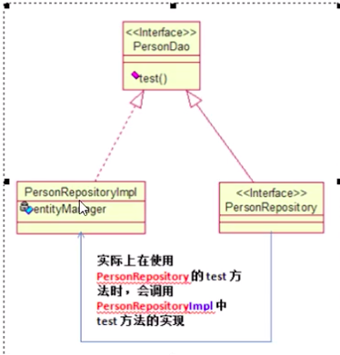

## 八. SpringBoot与缓存

### 1. JSR107规范

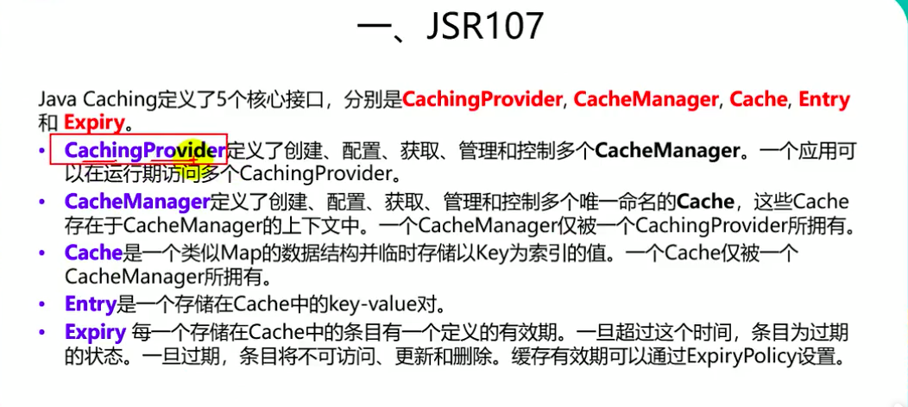

#### 应用交互流程

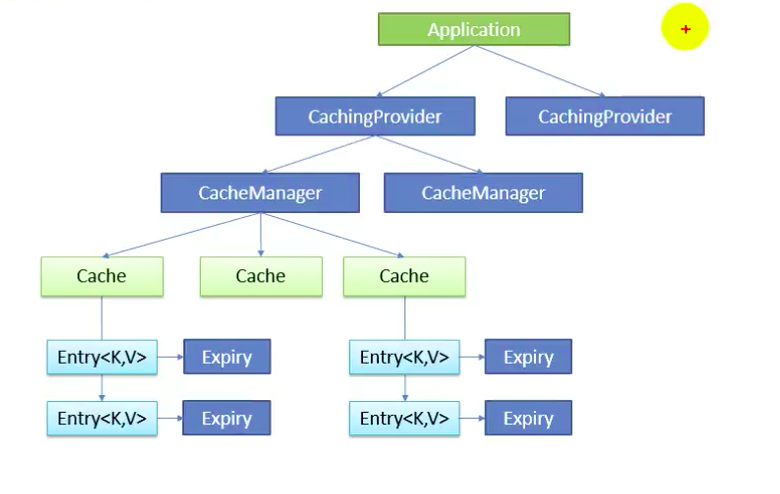

### 2. Spring缓存抽象

JSR107过于复杂，因此Spring提供了自己的缓存抽象，用于简化开发。

Spring 只是 使用了 Cache 和 CacheManager 两个概念。简化了开发

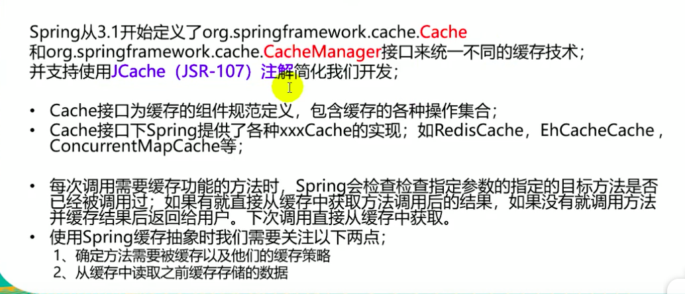

CacheManager与Cache的关系如下所示:

1. CacheManager 对应不同的缓存实现 (concurrentHashMap默认实现， Redis 实现等等)
2. Cache 为对应缓存的操作(缓存数据，读取数据)

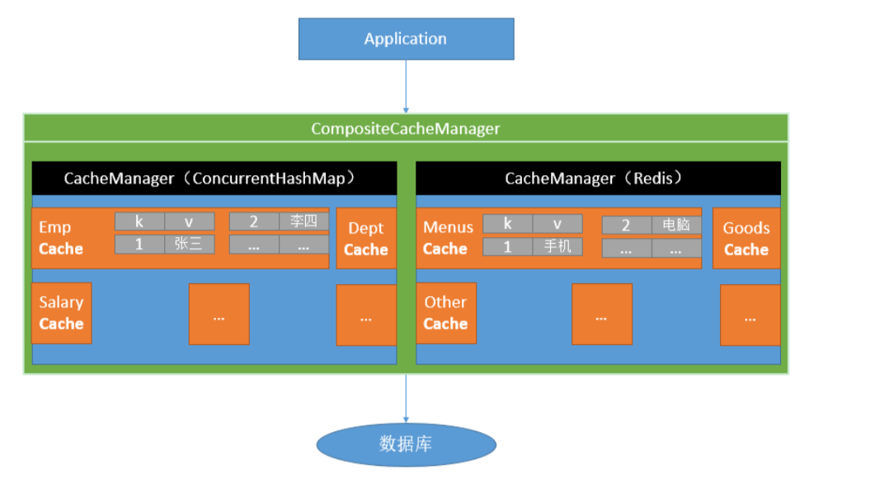

### 3. Spring缓存常用概念&注解

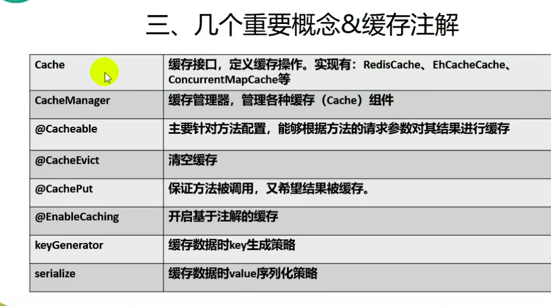

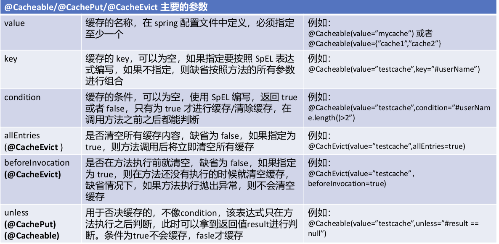

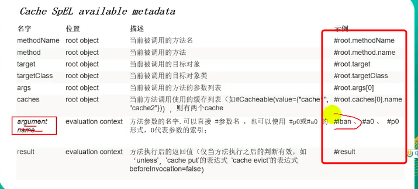

### 4. 使用

#### 1. 引入依赖

```xml
<dependency>
  <groupId>org.springframework.boot</groupId>
  <artifactId>spring-boot-starter-cache</artifactId>
</dependency>
```

#### 2. 开启基于注解的缓存

使用 @EnableCaching 注解

```java
/**
 * @EnableCaching 用来开启 Spring 的 注解驱动 缓存管理
 * 与 XML 中 <cache:*> 标签功能一致
 */
@SpringBootApplication
@EnableCaching
public class Springboot01CacheApplication {

	public static void main(String[] args) {
		SpringApplication.run(Springboot01CacheApplication.class, args);
	}
}
```

流程:

1. CacheAutoConfigruation 选择导入

```
@Import(CacheConfigurationImportSelector.class)
public class CacheAutoConfiguration {
}
```

2. CacheConfigurationImportSelector 选择应该导入哪些 CacheConfiguration

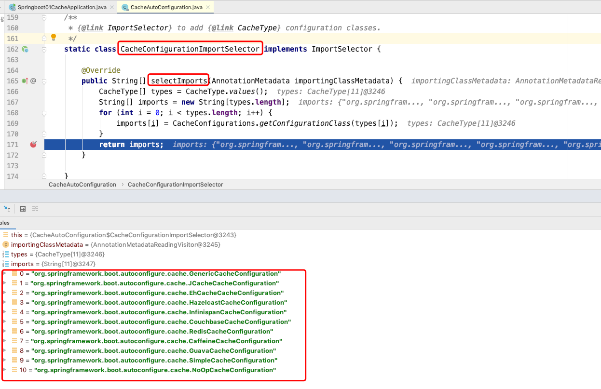

3. 按照顺序，遍历每一个 CacheConfiguration,直到找到合适，进行创建 CacheManager

   默认SimpleCacheConfiguration会匹配，会在 bean中新增一个  ConcurrentMapCacheManager

```java
@Configuration
@ConditionalOnMissingBean(CacheManager.class)
@Conditional(CacheCondition.class)
class SimpleCacheConfiguration {

	private final CacheProperties cacheProperties;

	private final CacheManagerCustomizers customizerInvoker;

	SimpleCacheConfiguration(CacheProperties cacheProperties,
			CacheManagerCustomizers customizerInvoker) {
		this.cacheProperties = cacheProperties;
		this.customizerInvoker = customizerInvoker;
	}

	@Bean
	public ConcurrentMapCacheManager cacheManager() {
		ConcurrentMapCacheManager cacheManager = new ConcurrentMapCacheManager();
		List<String> cacheNames = this.cacheProperties.getCacheNames();
		if (!cacheNames.isEmpty()) {
			cacheManager.setCacheNames(cacheNames);
		}
		return this.customizerInvoker.customize(cacheManager);
	}

}
```

4. 可以在配置文件中 配置, 开启debug信息

```properties
debug=true
```

查看日志，搜索 CacheConfiguration ==>  SimpleCacheConfiguration 匹配

```
SimpleCacheConfiguration matched:
      - Cache org.springframework.boot.autoconfigure.cache.SimpleCacheConfiguration automatic cache type (CacheCondition)
```


#### 2. 缓存注解使用

##### @Cacheable

```
将方法的运行结果进行缓存，以后再要相同的数据，直接从缓存中进行获取，不需要在调用方法
一个 CacheManager管理多个Cache组件。
Cache组件进行真正的 CRUD操作，每个缓存组件都已自己唯一的名字:
	cacheNames/values: 指定缓存组件的名称，是数组的方式，可以指定多个缓存名字
	key: 缓存数据使用的key，默认是 使用方法参数的值，可以使用 spel表达式
		比如: #id =>参数id的值
	keyGenerator: key的生成器，可以自己指定key的生成器 （与key进行二选一使用)
	cacheManager: 指定缓存管理器（即从哪个缓存管理器中取出 cache组件)，与cacheResolver进行二选一
	condition: 指定符合条件的条件下，才进行缓存操作
	sync: 缓存是否使用异步模式
	unless: 当unless指定条件为true，返回值不进行缓存, 可以在获取到结果之后，进行判断 （与condition相反)
```


```java
@Cacheable(value = {"emp"}/*,keyGenerator = "myKeyGenerator",condition = "#a0>1",unless = "#a0==2"*/)
public Employee getEmp(Integer id){
	System.out.println("查询"+id+"号员工");
	Employee emp = employeeMapper.getEmpById(id);
	return emp;
}
```

工作原理:

```
1. 缓存的自动配置类 (CacheAutoConfiguration)
2. 查看 CacheConfigurationImportSelector
3. 缓存的配置类
```

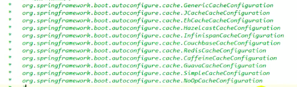

```
4. 上述有那么多的 缓存配置类，哪个缓存配置会生效?
	1> 在 application.properties 中，添加 debug=true 配置
	2> 程序启动后，查看日志
```

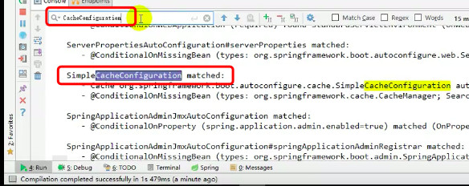

```
	3> 通过搜索 CacheConfiguration 日志，发现 SimpleCacheConfiguration 配置类生效了
	4> 查看 SimpleCacheConfiguration类，发现其在 容器中添加了一个 concurrentMapCacheManager
5. 配置类生效之后，就会在 容器中添加一个 CacheManager
```

运行流程(@Cacheable): 代码调试

```
1. 方法运行之前，首先 按照 cacheNames， 查找Cache 组件。对于第一次，如果没有缓存组件，先自动创建一个
2. 去Cache 组件中查找 key 指定的内容
	1> key 是按照某种策略进行生成的，默认是 keyGenerator 使用 SimpleKeyGenerator进行生成
3. 如果没有查询到缓存，就调用目标方法进行执行
4. 将目标方法返回的结果，放进缓存中
```

问题: 

```
1. 在哪个 CacheManger 进行查询 Cache组件
2. Cache 在方法前，方法后执行怎么实现的，aop吗
```

##### 自定义keyGenerator

1. 在 容器中 添加一个 自定义的 keyGenerator

```java
@Configuration
public class MyCacheConfig {

    @Bean("myKeyGenerator")
    public KeyGenerator keyGenerator(){
        return new KeyGenerator(){

            @Override
            public Object generate(Object target, Method method, Object... params) {
                return method.getName()+"["+ Arrays.asList(params).toString()+"]";
            }
        };
    }
}
```


2. 指定 keyGenerator 为 bean id

```java
@Cacheable(value = {"emp"},keyGenerator = "myKeyGenerator")
    public Employee getEmp(Integer id){
        System.out.println("查询"+id+"号员工");
        Employee emp = employeeMapper.getEmpById(id);
        return emp;
    }
```

##### @CachePut

```
既调用方法，又更新缓存数据
 => 用于 修改了 数据库的某个数据，同时将缓存进行更新
```

运行时机:

```
1. 执行目标方法
2. 将目标方法的结果进行缓存
```

```java
/**
     * @CachePut：既调用方法，又更新缓存数据；同步更新缓存
     * 修改了数据库的某个数据，同时更新缓存；
     * 运行时机：
     *  1、先调用目标方法
     *  2、将目标方法的结果缓存起来
     *
     * 测试步骤：
     *  1、查询1号员工；查到的结果会放在缓存中；
     *          key：1  value：lastName：张三
     *  2、以后查询还是之前的结果
     *  3、更新1号员工；【lastName:zhangsan；gender:0】
     *          将方法的返回值也放进缓存了；
     *          key：传入的employee对象  值：返回的employee对象；
     *  4、查询1号员工？
     *      应该是更新后的员工；
     *          key = "#employee.id":使用传入的参数的员工id；
     *          key = "#result.id"：使用返回后的id
     *             @Cacheable的key是不能用#result
     *      为什么是没更新前的？【1号员工没有在缓存中更新】
     *
     */
    @CachePut(/*value = "emp",*/key = "#result.id")
    public Employee updateEmp(Employee employee){
        System.out.println("updateEmp:"+employee);
        employeeMapper.updateEmp(employee);
        return employee;
    }
```

##### @CacheEvict

```
删除数据之后，同时将缓存中的数据删除
	allEntries: 是否删除这个Cache组件中的所有数据
	beforeInvocation: 缓存的清除，是否在方法执行之前进行执行。（默认是在方法执行之后进行执行)
		==> 作用，如果 方法中有 异常，beforeInvocation=false时，缓存就不会被清楚
					如果 beforeInvocation=true，不管是否有异常，缓存都会被清除
```

```java
/**
     * @CacheEvict：缓存清除
     *  key：指定要清除的数据
     *  allEntries = true：指定清除这个缓存中所有的数据
     *  beforeInvocation = false：缓存的清除是否在方法之前执行
     *      默认代表缓存清除操作是在方法执行之后执行;如果出现异常缓存就不会清除
     *
     *  beforeInvocation = true：
     *      代表清除缓存操作是在方法运行之前执行，无论方法是否出现异常，缓存都清除
     *
     *
     */
    @CacheEvict(value="emp",beforeInvocation = true/*key = "#id",*/)
    public void deleteEmp(Integer id){
        System.out.println("deleteEmp:"+id);
        //employeeMapper.deleteEmpById(id);
        int i = 10/0;
    }
```


##### @Cacheing

```
该注解是 Cacheable, CachePut, CacheEvict 3个注解的组合注解
用于 组合指定 复杂的规则
```

```java
@Target({ElementType.METHOD, ElementType.TYPE})
@Retention(RetentionPolicy.RUNTIME)
@Inherited
@Documented
public @interface Caching {

	Cacheable[] cacheable() default {};

	CachePut[] put() default {};

	CacheEvict[] evict() default {};

}
```

```java
 @Caching(
         cacheable = {
             @Cacheable(/*value="emp",*/key = "#lastName")
         },
         put = {
             @CachePut(/*value="emp",*/key = "#result.id"),
             @CachePut(/*value="emp",*/key = "#result.email")
         }
    )
    public Employee getEmpByLastName(String lastName){
        return employeeMapper.getEmpByLastName(lastName);
    }
```

##### @CacheConfig

```
标注在类上，用来指定当前类下所有方法 公用的 cacheName, keyGenerator 配置
```

```java
@CacheConfig(cacheNames="emp"/*,cacheManager = "employeeCacheManager"*/) //抽取缓存的公共配置
@Service
public class EmployeeService {
}
```

### 4. 集成Redis缓存 

默认使用的是 ConcurrentMapCacheManager,

1. 在导入了 redis 的starter 之后，容器中就会创建 RedisCacheManager
2. 注意: 缓存中配置类是有顺序的，Redis的配置类 在 Simple 之前，因此 如果Redis 匹配上了，那么容器中就会有 CacheManager, Simple 就不会再匹配
3. RedisCacheManager 会创建 RedisCache 来进行缓存操作


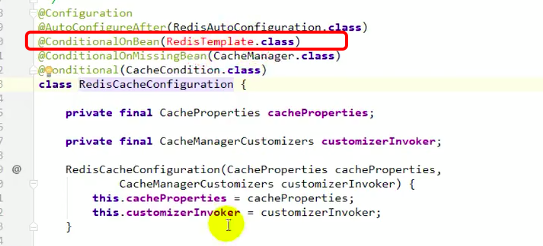

##### 1. 引入依赖

```
spring-boot-starter-data-redis
```

引入依赖之后，在 RedisAutoConfiguration中，自动在容器中加入了 redisTemplate 和 stringRedisTemplate

其中

```
stringRedisTemplate: 用来简化操作字符串的（key，value 都是 string)
redisTemplate: key和value都是 Object
```

##### 2. 修改默认序列化规则

默认时，使用 jdk 序列化机制，将序列化后的数据保存到redis中。但是此种方式，序列化出来的数据对用户不易懂。因此，需要修改redisTemplate，使用json序列化方式

==> 自己创建一个 redisTemplate 和 stringRedisTemplate

```java
@Configuration
public class MyRedisConfig {

    @Bean
    public RedisTemplate<Object, Employee> empRedisTemplate(
            RedisConnectionFactory redisConnectionFactory)
            throws UnknownHostException {
        RedisTemplate<Object, Employee> template = new RedisTemplate<Object, Employee>();
        template.setConnectionFactory(redisConnectionFactory);
        Jackson2JsonRedisSerializer<Employee> ser = new Jackson2JsonRedisSerializer<Employee>(Employee.class);
        template.setDefaultSerializer(ser);
        return template;
    }
    @Bean
    public RedisTemplate<Object, Department> deptRedisTemplate(
            RedisConnectionFactory redisConnectionFactory)
            throws UnknownHostException {
        RedisTemplate<Object, Department> template = new RedisTemplate<Object, Department>();
        template.setConnectionFactory(redisConnectionFactory);
        Jackson2JsonRedisSerializer<Department> ser = new Jackson2JsonRedisSerializer<Department>(Department.class);
        template.setDefaultSerializer(ser);
        return template;
    }


    //CacheManagerCustomizers可以来定制缓存的一些规则
    @Primary  //将某个缓存管理器作为默认的
    @Bean
    public RedisCacheManager employeeCacheManager(RedisTemplate<Object, Employee> empRedisTemplate){
        RedisCacheManager cacheManager = new RedisCacheManager(empRedisTemplate);
        //key多了一个前缀

        //使用前缀，默认会将CacheName作为key的前缀
        cacheManager.setUsePrefix(true);

        return cacheManager;
    }

    @Bean
    public RedisCacheManager deptCacheManager(RedisTemplate<Object, Department> deptRedisTemplate){
        RedisCacheManager cacheManager = new RedisCacheManager(deptRedisTemplate);
        //key多了一个前缀

        //使用前缀，默认会将CacheName作为key的前缀
        cacheManager.setUsePrefix(true);

        return cacheManager;
    }


}

```


## 九. SpringBoot 与消息

对于大多数的应用，都可以通过消息服务中间件的方式，来提升系统的异步通信，扩展解耦的能力

两个重要的概念:

	- 消息代理 (message broker)
	- 目的地 (destination)

当消息发送者发送消息之后，就由 消息代理进行接管， 消息代理保证将消息传递到指定的目的地

消息队列有两种形式的目的地

- 队列(queue): 点对点通信的方式
- 主题(topic): 发布/订阅方式的通信

JMS(Java Message Service): JAVA消息服务

​	基于JVM消息代理的规范。ActiveMQ 是 JMS的实现

AMQP(Advanced Message Queuing Protocol)

​	高级消息队列协议，也是一个消息代理的规范，兼容JMS

​	RabbitMQ 是 AMQP的实现

JMS 与 AMQP对比

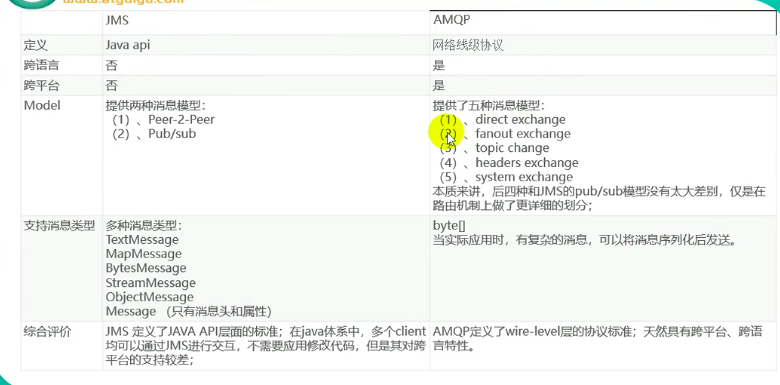

Spring的支持

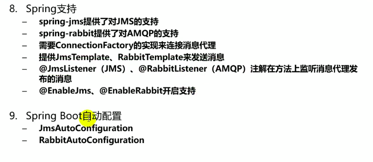

### 1. amqp

#### 1. 引入依赖

```
spring-boot-starter-amqp
```

自动配置类(RabbitAutoConfiguration)

```
1. 连接工厂 ConnectionFactory
2. RabbitProperties 封装了 RabbitMQ的配置
3. RabbitTemplate: 给 RabbitMQ进行发送/接收消息
4. AmqpAdmin: RabitMQ系统管理功能组件
```

#### 2. 简单使用

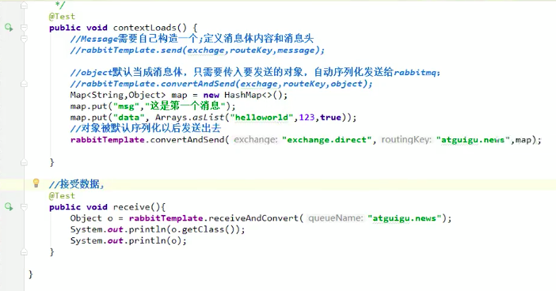

问题：

​	此种方式，消息的序列化使用的是 java自带序列化方式，如何使用 json的序列化方式呢?

 ```
RabbitTemplate 类中，MessageConverter 默认使用的是 SimpleMessageConverter
==> 自定义一个 MessageConverter ,放入到 容器中,
 ```

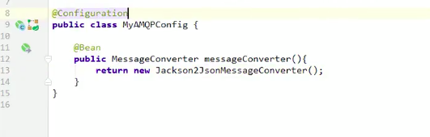

#### 3. 订阅发布方式

##### 1. 开启基于注解的 Rabbitmq

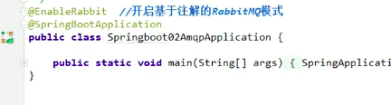

##### 2. 消息监听

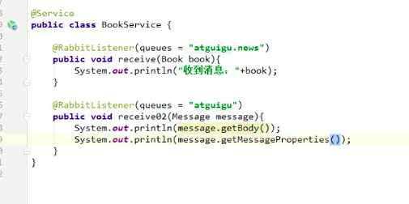

#### 4. 管理队列，exchange等

直接注入 AmqpAdmin， 然后调用其方法即可

## 十. SpringBoot 与 任务

### 1. 异步任务

1. 开启异步注解功能

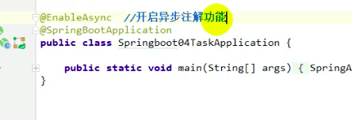

2. 在需要异步处理的方法上，添加 @Async 注解

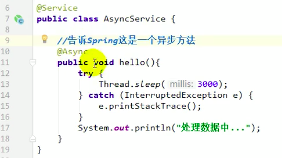

### 2. 定时任务

Cron表达式

```
1> 表达式总共6位
	秒,分,时,每月的多少号,月,周几
2> 每位之间，使用 空格 进行分割
	0 * * * * MON-FRI => 周一到周五的 每一分钟执行一次
	0 0/5 14,18 * * ?  => 每天 14点和18点整，每隔5分钟执行一次
	0 15 10 ? * 1-6    => 每周的 周一至周六 10:15执行一次
```


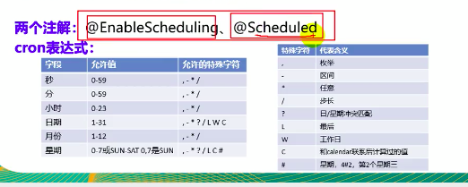

在需要定时执行的任务上，使用 @Scheduled 注解，并添加 Cron表达式（注意需要@EnableScheduling)

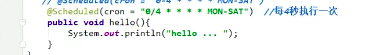

### 3. 邮件任务

1. 引入依赖

```

```

2. 邮件自动配置

```
MailSendAutoConfiguration
```

## 十一. SpringBoot 与安全

# Spring 注解驱动开发

## 一. 容器相关

### 1. @Bean

使用 @Configuration + @Bean 注解，替换原来的 xml + <bean> 方式

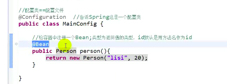

### 2. @ComponentScan

替代原来 xml 中 的 <context:component-scan >

==》 在配置类上，使用  @ComponentScan 注解

​	==》 为什么用在这个配置类上 ？ 由于 是使用该配置类，获取容器的 （该配置类就相当于原来的主配置文件,所以，在这个类上使用注解，肯定能被发现)