> SpringMVC 的使用

<!-- more-->

# SpringMVC

## 一. 是什么

- 基于 Java 的，实现了 MVC 设计模型的 轻量级 Web 框架
- 通过一个注解，让一个简单的 Java 类 称为 处理请求的 控制器，而无需实现任何接口
- 只是 Restful 编程风格

## 二.  MVC 中位置

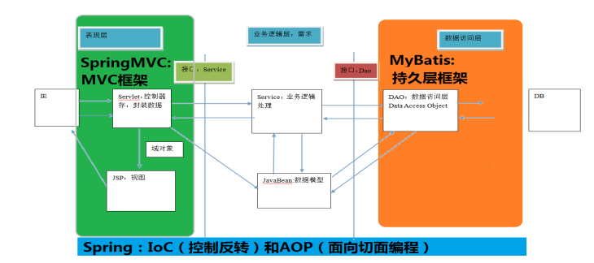

## 三. 优势

- 角色划分清晰
  - 前端控制器（DispatcherServlet）
  - 请求到处理器映射（HandlerMapping）
  - 处理器适配器（HandlerAdapter）
  - 视图解析器（ViewResolver）
  - 处理器或页面控制器（Controller）
  - 验证器（ Validator）
  - 命令对象（Command 请求参数绑定到的对象就叫命令对象）
  - 表单对象（Form Object 提供给表单展示和提交到的对象就叫表单对象） 
- 无缝对接 Spring
- 功能强大的数据验证、格式化、绑定机制 
- 本地化、主题的解析的支持，使我们更容易进行国际化和主题的切换 
- 强大的 JSP 标签库，使 JSP 编写更容易 
- 。。。

## 四. 入门案例

### 1. 创建 java web 项目

### 2. 导入 jar 包

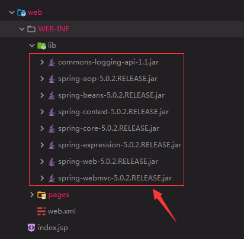

### 3.  配置前端控制器

- 配置 前端控制器
- 指定 springmvc 的 xml 配置文件
- 指定 前端控制器 管理端 路由

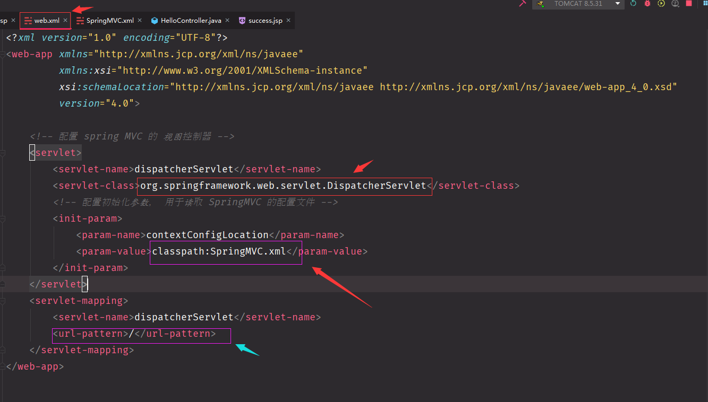

### 4. 配置 SpringMVC.xml

#### 注意错误

```
通配符的匹配很全面, 但无法找到元素 'context:component-scan' 的声明
```

- 原因:

```
1. spring启动是时候要通过相应的xsd文件来检验xml文件，找不到相应的xsd文件的时候就会报错
2. spring是默认从本地加载xsd文件的, 如果本地找不到 xsd，且没有配置xsd位置，找不到就会报错
```

- 解决

````
xsi:schemaLocation="http://www.springframework.org/schema/beans
        http://www.springframework.org/schema/beans/spring-beans.xsd
        http://www.springframework.org/schema/mvc
        http://www.springframework.org/schema/mvc/spring-mvc.xsd
        http://www.springframework.org/schema/context
        http://www.springframework.org/schema/context/spring-context.xsd"
````

- 配置 自动扫描 spring 容器的注解
- 配置 视图解析器

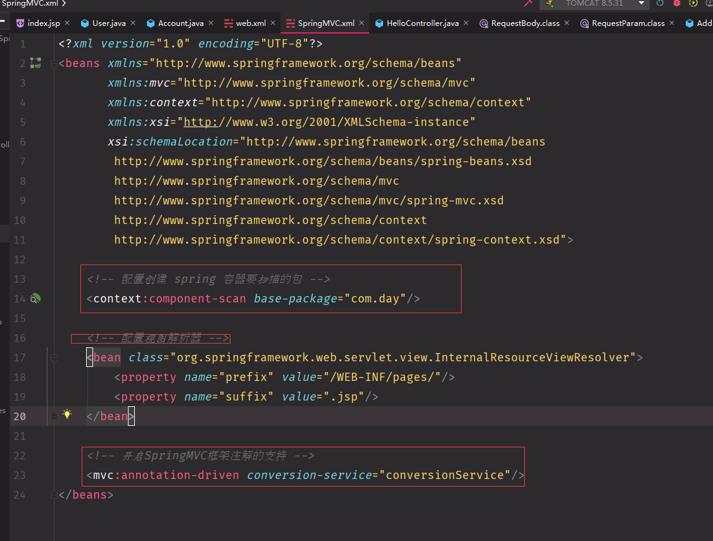

### 5. 创建 controller，处理请求

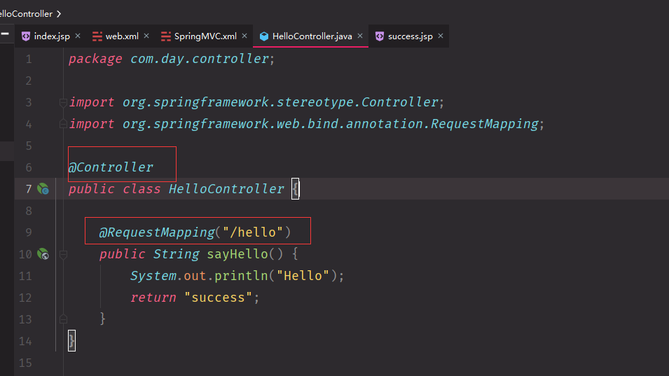

### 6. 创建 success.jsp

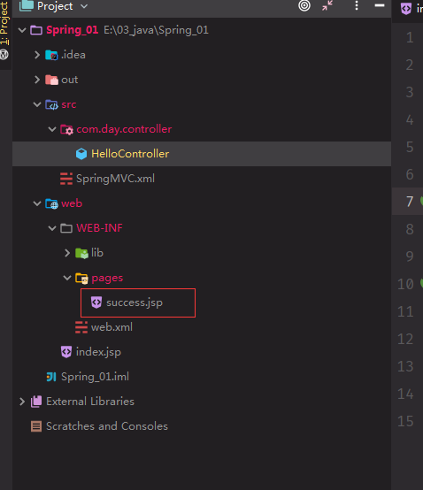

### 7. 执行结果

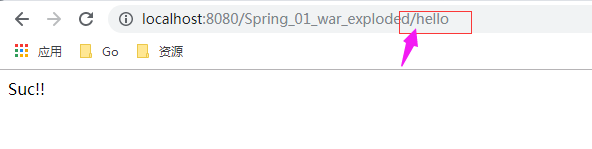

### 8. 执行逻辑

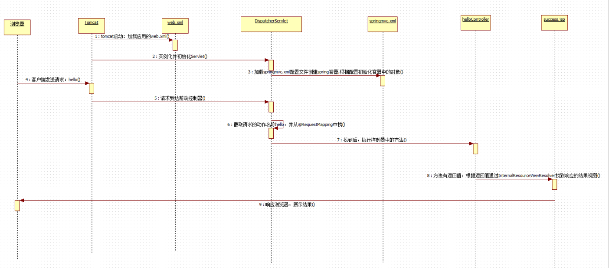

1. 服务器启动，应用被加载，读取 web.xml 中配置的 spring 容器，并初始化 容器中的对象
2. 浏览器发送请求，被 DispatcherServlet 捕获
3. DispatcherServlet  将请求 找到 匹配的 处理器进行处理 (根据@RequestMapping)
4. 匹配到之后，执行对应的方法，返回值 根据 InternalResourceViewResolver 提供前缀和后缀，得到 jsp 页面的路径
5. 根据 jsp 页面，渲染结果视图，响应浏览器

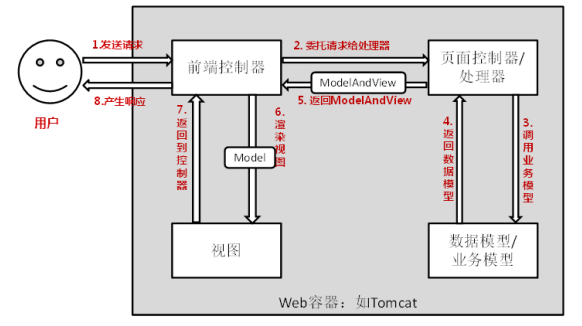

## 五. 注解及组件

### 1. RequestMapping

- 作用

  用于建立请求URL 和 处理请求方法之间的对应关系

#### 出现位置

- 类上

  用来 模块化管理

  设置请求的一级访问目录，如果不写相当于根目录。

  写的话需要以  / 开头 

  ```java
  // 此时，访问路径为  /group1/hello
  @RequestMapping("/group1")
  @Controller
  public class HelloController {
  
      @RequestMapping("/hello")
      public String sayHello() {
          System.out.println("Hello");
          return "success";
      }
  }
  ```

#### 参数

##### method

- 用来指定请求的方法，只有该请求才可以接受

- 可以指定多个请求方法

```java
@RequestMapping("/group1")
@Controller
public class HelloController {

    @RequestMapping(value="/hello", method = RequestMethod.POST)
    public String sayHello() {
        System.out.println("Hello");
        return "success";
    }
}
```

##### value

​	用来指定请求的 url

##### params

​	用于指定限制请求参数的条件

- 支持简单的表达式
- 要求请求参数的 key 和 value 必须与配置的一模一样

```java
@RequestMapping("/group1")
@Controller
public class HelloController {
	// 1. 请求 URL 中必须要有 username 和 password 参数，否则错误
    @RequestMapping(value="/hello", params = {"username", "password"})
    public String sayHello() {
        System.out.println("Hello");
        return "success";
    }
    
    // 请求url中 参数 money 的值不能是 100
    @RequestMapping(value="/hello1", params = {"money!100"})
    public String sayHello1() {
        System.out.println("Hello");
        return "success";
    }
}
```

#### 支持Ant 路径风格

##### 支持的匹配符

- ?

> 匹配文件名中的一个字符

- *

> 匹配文件名中的任意字符

- ** 

> 匹配多层路径

```
/user/*/createUser
匹配 /user/aaa/createUser、/user/bbb/createUser 等 URL
/user/**/createUser
匹配 /user/createUser、/user/aaa/bbb/createUser 等 URL
/user/createUser??
匹配 /user/createUseraa、/user/createUserbb 等 URL
```


### 2. RequestParam

#### 出现位置

​	只能在参数上使用

#### 参数

##### 	value

> 参数名称

##### required

> 是否必须在 URL 中出现

##### defaultValue

> 默认值

```java
@RequestMapping("/account")
//1. 指定将 url 中 accId 参数 绑定到 accountId
    public String findAccount(@RequestParam("accId") Integer accountId, String accountName) {
        System.out.println("请求的ID：" + accountId + accountName);
        return "success";
    }
```

### 3. RequestBody

#### 作用:

> 用于获取请求体的内容，得到的内容是 key=value&key=value 数据
>
> get 方式不适用

#### 属性

##### 	required

> 是否必须有请求体:
>
> ​	true: 默认值；get请求出错
>
> ​	false: get请求得到的值为 null

```java
@RequestMapping("/body")
    public String requestBody(@RequestBody(required = false) String body) {
        return "success";
    }
```

### 4. PathVaribale

#### 作用:

> 用于绑定 url 中的占位符
>
> 主要用于 restful风格   /delete/{userId}  其中 {userId} 就是占位符

#### 属性

##### value

> 指定 占位符 名称, 用来绑定请求参数

##### required

> 是否必须提供占位符

```java
@RequestMapping(value = "/delete/{uid}", method = RequestMethod.DELETE)
    public String deleteUser(@PathVariable("id") Integer id) {
        System.out.println(id);
        return "success";
    }
```

### 5. RequestHeader

#### 作用:

> 用于获取消息的请求头

### 6. CookieValue

#### 作用:

> 将指定  cookie 名称的值，传入控制器方法参数中

#### 属性:

- value

> 指定 cookie 的名称

- required

> 是够必须有次 cookie

#### 使用:

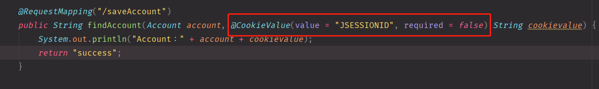

## 六. 请求参数的绑定

### 1. 基本类型和String 类型作为参数

```java
// 对应的请求 URL 为
<a href="account?accountId=100&accountName=aaa">账户请求</a>

@RequestMapping("/account")
    public String findAccount(Integer accountId, String accountName) {
        System.out.println("请求的ID：" + accountId + accountName);
        return "success";
    }

// 打印结果
请求的ID：100aaa
```

### 2. POJO 作为参数类型

> Spring MVC **会按请求参数名和 POJO 属性名进行自动匹配，自动为该对象填充属性值**。**支持级联属性**

#### Account 实体

```java
public class Account implements Serializable {
    private Integer id;
    private String name;
    private Float money;
    private Address address;
    // 省略 getter setter toString
}
```

#### Address 实体

```java
public class Address implements Serializable {
    private String city;
    private String province;
    // 省略 getter setter toString
}
```

#### 处理器

```java
@RequestMapping("/saveAccount")
    public String findAccount(Account account) {
        System.out.println("Account：" + account);
        return "success";
    }
```

#### 请求

​	注意： 对于 Address 对象，其 name 属性写法

```html
<form action="saveAccount" method="post">
    账户名称: <input type="text" name="name"><br/>
    账户金额: <input type="text" name="money"><br/>
    账户省份: <input type="text" name="address.province"><br/>
    账户城市: <input type="text" name="address.city"><br/>
    <input type="submit" value="保存">
  </form>
```

#### 结果

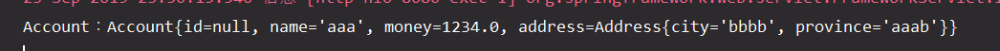

### 3. POJO  中包含集合类型参数

#### User 实体

```java
public class User implements Serializable {
    private String username;
    private List<Account> accounts;
    private Map<String, Account> accountMap;
        // 省略 getter setter toString
}
```

#### 处理器

```java
@RequestMapping("/saveUser")
    public String findAccount(User user) {
        System.out.println("User：" + user);
        return "success";
    }
```

#### 请求

```html
  <form action="saveUser" method="post">
    用户名称: <input type="text" name="username">
    账户1名称: <input type="text" name="accounts[0].name"><br/>
    账户1金额: <input type="text" name="accounts[0].money"><br/>
    账户1省份: <input type="text" name="accounts[0].address.province"><br/>
    账户1城市: <input type="text" name="accounts[0].address.city"><br/>
    账户2名称: <input type="text" name="accounts[1].name"><br/>
    账户2金额: <input type="text" name="accounts[1].money"><br/>
    账户2省份: <input type="text" name="accounts[1].address.province"><br/>
    账户2城市: <input type="text" name="accounts[1].address.city"><br/>
    账户3金额: <input type="text" name="accountMap['one'].money">
    <input type="submit" value="保存">
  </form>
```

#### 结果

```json
User：User{username='a', accounts=[Account{id=null, name='b', money=111.0, address=Address{city='dddd', province='cccd'}}, Account{id=null, name='e', money=333.0, address=Address{city='gggg', province='fff'}}], accountMap={one=Account{id=null, name='null', money=4444.0, address=null}}}
```

### 4. 原生API作为参数

#### MVC的Handler方法接受的参数

- HttpServletRequest

- HttpServletResponse

- HttpSession

- **java.security.Principal**

- **Locale**

- **InputStream**

- **OutputStream**

- **Reader**

- **Writer**

```java
@RequestMapping("/testServletAPI")
public void testServletAPI(HttpServletRequest request,HttpServletResponse response, Writer out) throws IOException {
System.out.println("testServletAPI, " + request + ", " + response);
out.write("hello springmvc");
//return "success";
}
```


## 七: 请求参数乱码解决

- 配置 SpringMVC 过滤器
- 过滤所有请求
- 配置 静态资源不过滤

#### Web.xml

> 注意编码过滤器 必须放在 所有 filter 之前，否则不起作用

```xml
<!-- 配置 SpringMVC 编码过滤器 -->
    <filter>
        <filter-name>CharacterEncodingFilter</filter-name>
        <filter-class>org.springframework.web.filter.CharacterEncodingFilter</filter-class>
        <!-- 设置过滤器中的属性值 -->
        <init-param>
            <param-name>encoding</param-name>
            <param-value>UTF-8</param-value>
        </init-param>
        <!-- 启动过滤器 -->
        <init-param>
            <param-name>forceEncoding</param-name>
            <param-value>true</param-value>
        </init-param>
    </filter>

    <!-- 过滤所有请求 -->
    <filter-mapping>
        <filter-name>CharacterEncodingFilter</filter-name>
        <url-pattern>/*</url-pattern>
    </filter-mapping>
```

#### SpringMVC.xml

```xml
<!-- 配置 静态资源不过滤 -->
    <mvc:resources mapping="/css/**" location="/css/"/>
    <mvc:resources mapping="/images/**" location="/images"/>
    <mvc:resources mapping="/javascript/**" location="/scripts"/>
```

## 八. Rest风格URL

### POST方式乱码解决

#### 处理器

```java
@RequestMapping(value = "/delete/{uid}", method = RequestMethod.DELETE)
    public String deleteUser(@PathVariable("uid") Integer id) {
        System.out.println(id);
        return "success";
    }
```

#### 问题:

由于 处理器中 指定 METHOD 为 DELETE,  而 Form 只支持 GET/POST 方法

==> Spring3.0 添加了一个 过滤器，将 浏览器请求 更改为 指定的 请求，因此可以支持 GET, POST, PUT 与 DELETE 方法

#### 使用:

#### 1. web.xml 中 配置过滤器

```xml
<!-- 配置 HiddenHttpMethodFilter 过滤器 -->
    <filter>
        <filter-name>hidden</filter-name>
        <filter-class>org.springframework.web.filter.HiddenHttpMethodFilter</filter-class>
    </filter>

    <filter-mapping>
        <filter-name>hidden</filter-name>
        <url-pattern>/*</url-pattern>
    </filter-mapping>
```

#### 2. 请求方式使用 Post 且 添加 隐藏域

- 如果想要请求变为 DELETE, 则需要添加一个 隐藏域，name 为 _method, 值为 DELETE

  > 过滤器 解析 _method 参数，修改 请求为  该参数指定的 值

```jsp
<form action="delete/1" method="post">
    <input type="hidden" name="_method" value="DELETE">
    <input type="submit" value="删除">
  </form>
```

#### 问题2:

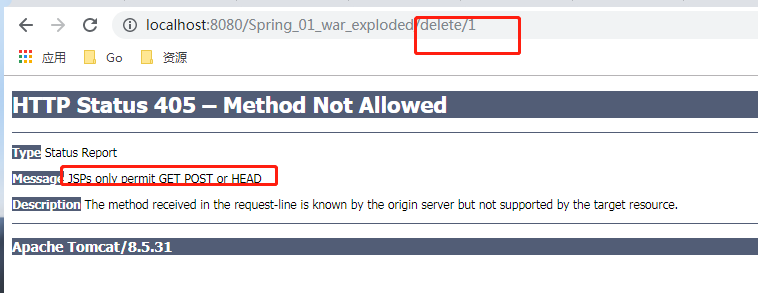

#### 解决:

> 在出错的jsp页面上，添加  isErrorPage="true" 即可

```jsp
<%@ page contentType="text/html;charset=UTF-8" language="java" isErrorPage="true" %>
<html>
<head>
    <title>Title</title>
</head>
<body>
Suc!!<br/>
</body>
</html>
```


#### 过滤器原理

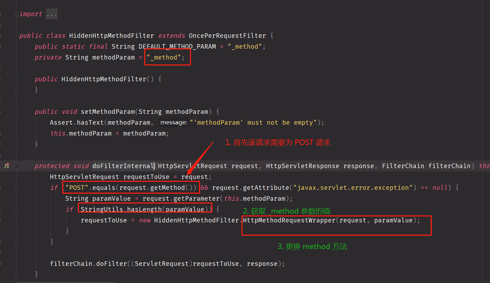

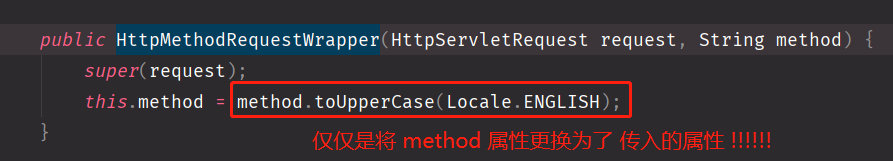

### Get方式乱码解决

> 对于Get方式的乱码，需要修改 tomcat 的 server.xml 配置文件

```xml
<Connector connectionTimeout="20000" port="8080"
protocol="HTTP/1.1" redirectPort="8443"/>
改为：
<Connector connectionTimeout="20000" port="8080"
protocol="HTTP/1.1" redirectPort="8443"
useBodyEncodingForURI="true"/>

如果遇到 ajax 请求仍然乱码，请把：
useBodyEncodingForURI="true"改为 URIEncoding="UTF-8"
即可
```

## 九. 响应数据的传出

### 1. ModelAndView

> 既包含视图信息，也包含模型数据信息

#### 添加模型数据:

- addObject
- ...

#### 设置视图

- setView
- setViewName

#### 示例:

##### 1. 控制器

```java
@RequestMapping("/testModelAndView")
public ModelAndView testModelAndView() {
    ModelAndView mv = new ModelAndView();
    // 设置视图
    mv.setViewName("success");
    // 1. 数据放入到了 request 域中
    mv.addObject("time", new Date().toString());
    return mv;
}
```

##### 2. 请求

```jsp
<a href="testModelAndView">测试ModelAndView</a>
```

##### 3. 返回界面

```jsp
<%@ page contentType="text/html;charset=UTF-8" language="java" isErrorPage="true" %>
<html>
<head>
    <title>Title</title>
</head>
<body>
Suc!!<br/>
time: ${requestScope.time}
</body>
</html>
```

##### 3. 结果

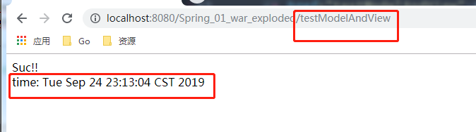

### 2. Map 和 Model

> SpringMVC 内部使用了一个 org.springframework.ui.Model 接口存储 模型数据

#### 使用步骤:

1. SpringMVC 在 调用方法之前，创建一个隐含的模型对象作为数据的存储容器

2. 如果方法入参 为 Map 或者 Model 类型， 那么SpringMVC 将隐含模型的引用传递给这些入参

3. 在方法体内，就可以使用这些入参对象访问到模型中的所有数据，也可以添加新的属性数据

#### 继承体系

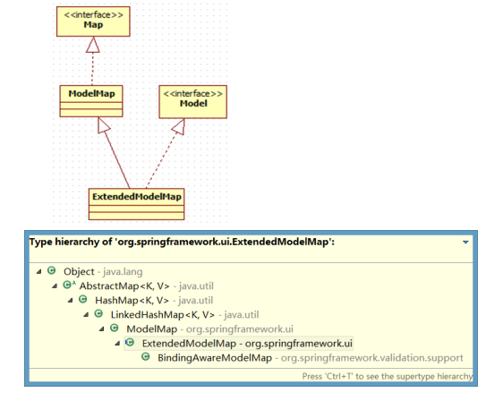

#### 示例：

##### 1. 控制器

```java
@RequestMapping("/testMap")
public String testMap(Map<String, List<String>> nameMap) {
    // 也是放到了 request 域中
    nameMap.put("names", Arrays.asList("aa", "bb", "cc"));
    return "success";
}
```

##### 2. 结果界面

```java
// 在 request域中，使用 key 即可取出存储的值
names: ${requestScope.names}
```

### 3. @SessionAttributes

> 1. 用来在多个请求之间共用 某个模型属性数据, SpringMVC 会把属性暂存到 HttpSession 中
> 2. 既可以通过 属性名指定哪些需要放到会话中，还可以通过 对象类型来指定

- 作用域

> 只能放在 类的上面

- 通过属性指定

> 使用 value 来指定 key 的值

- 通过类型指定

> 通过 types 来指定 类型

#### 示例:

```java
@SessionAttributes(value={"user"},types={String.class})
@Controller
public class SpringMVCController {
/**
 * @SessionAttributes
 *  除了可以通过属性名指定需要放到会话中的属性外(实际上是通过value指定key值)，
 *  还可以通过模型属性的对象类型指定哪些模型属性需要放到会话中(实际上是通过types指定类型)
 * 注意：只能放在类的上面，不能修饰方法
 */
@RequestMapping("/testSessionAttributes")
public String testSessionAttributes(Map<String,Object> map){
	User user = new User("Tom","123","tom@atguigu.com",22);
    /*
     * user 属性及被放到了request域，也被放到了session域中 (通过SessionAttribute注解 的 value 指定)
     * school 由于是 string 类型，符合 types 为 String.class 属性，因此也被放到了 session域中
     */
	map.put("user", user);
	map.put("school", "atguigu");  
	//默认是被存放到request 域，如果设置了@SessionAttribute注解，就同时存放到session域中
	return "success";
}
}
```

### 4. @ModelAttribute

#### 作用:

1. 在 Spring 4.3 之后加入，用户修饰方法和参数
2. 修饰方法时，表示当前方法会在 控制器方法之前执行
3. 修饰参数时，表示获取指定的数据给参数赋值

#### 属性

- value

> 用于获取数据的 key， 该key 可以是 POJO 的属性名称，也可以是 map 结构的 key

#### 1. 基本使用

> 1. 在方法之前执行
> 2. NewAccount 中 更改了 id，在 控制器方法中可以获取到更改后的值
>
> ==> 如果 是一个  update 请求，但是 只需要更新部分字段(为了 sql 语句写起来方便)
>
> 1. 使用 Model Attribute 从数据库 差取出来 该条数据
> 2. 使用 绑定，覆盖 需要更新的值
> 3. 使用update 更新所有属性的值 即可

```java
@ModelAttribute
public void NewAccount(Account account) {
    System.out.println("NewAccount: " + account);
    account.setId(1234);
}

@RequestMapping("/saveAccount")
public String findAccount(Account account) {
    System.out.println("Account：" + account);
    return "success";
}

// 执行结果：
NewAccount: Account{id=null, name='ffff', money=1234.0, address=Address{city='aaa', province='fff'}}
Account：Account{id=1234, name='ffff', money=1234.0, address=Address{city='aaa', province='fff'}}
```

## 十. 视图解析器

### 1. 转发

控制器中返回的视图默认都是通过视图解析器进行 拼接前缀和后缀，得到需要跳转的 jsp 路径

比如: 

```xml
<bean class="org.springframework.web.servlet.view.InternalResourceViewResolver">
        <property name="prefix" value="/WEB-INF/pages/"/>
        <property name="suffix" value=".jsp"/>
</bean>
/*
 * 比如控制器返回的 视图名为 success, 则 得到的jsp路径为  "/WEB-INF/pages/success.jsp"
 */
```

#### 问题: 

如果需要 跳转到 /hello.jsp, 如何实现呢?

#### 方法一:

> 通过相对路径的方式

```java
@RequestMapping("/hello01")
public String testHello() {
	return "../../hello";
}

/*
 * 同样是 使用视图解析器进行解析，得到 "/WEB-INF/pages/../../hello.jsp" 等价于 /hello.jsp
 */
```

#### 方法二: 

> 使用转发的方式

```java
/*
 * forward: 转发到一个页面， 该前缀不会被我们配置的视图解析器进行拼串
 * /hello.jsp： 对应 jsp的路径。 注意一定要添加 /, 否则是相对路径，容易出错
 */
@RequestMapping("/hello02")
public String testHello02() {
	return "forward:/hello.jsp";
}

/*
 * forward: 也可以转发到一个 路由
 */
@RequestMapping("/hello02")
public String testHello02() {
	return "forward:/hello01";
}
```

### 2.  重定向

```
/*
 * 原生的 Servlet 重定向，需要加上项目名 ( 因为是浏览器拿到路由，进行继续访问)
 * SpringMVC 的不需要 添加项目名，已经默认做了
 */
@RequestMapping("/hello02")
public String testHello02() {
	return "redirect:/hello01";
}

@RequestMapping("/hello02")
public String testHello02() {
	return "redirect:/hello.jsp";
}
```

### 3. 视图解析原理


## 十一. SpringMVC CRUD 实例

### 1. 配置环境问题

#### 1.1 jsp uri 错误

JSP 使用 <c:forEach> 时，可能会出现 uri 错误

```jsp
<%@ taglib uri="http://java.sun.com/jstl/core_rt" prefix="c"%>
```

- 解决

> 需要正确导入  **jstl.jar** 和 **standard.jar**

#### 1.2 mvc xsd 错误

xml 中 配置了 mvc 名称空间后，mvc 的 xsd 文件错误。

```xml
 xmlns:mvc="http://www.springframework.org/schema/mvc
 
 
 // 在 xsi:schemaLocation 中添加 下面两条
 http://www.springframework.org/schema/mvc 
 http://www.springframework.org/schema/mvc/spring-mvc.xsd
```

### 2. 前端控制器 

webxml 中配置

**注意配置 SpringMVC.xml** 配置文件

```xml
<servlet>
        <servlet-name>dispatcherServlet</servlet-name>
        <servlet-class>org.springframework.web.servlet.DispatcherServlet</servlet-class>
        <init-param>
            <param-name>contextConfigLocation</param-name>
            <param-value>classpath:SpringMVC.xml</param-value>
        </init-param>
    </servlet>
    <servlet-mapping>
        <servlet-name>dispatcherServlet</servlet-name>
        <url-pattern>/</url-pattern>
    </servlet-mapping>
```

### 3. 编码过滤器

> 主要要配置  **encoding** 参数的值

```xml
<filter>
        <filter-name>charaterEncodingFilter</filter-name>
        <filter-class>org.springframework.web.filter.CharacterEncodingFilter</filter-class>
        <init-param>
            <param-name>encoding</param-name>
            <param-value>UTF-8</param-value>
        </init-param>
    </filter>
    <filter-mapping>
        <filter-name>charaterEncodingFilter</filter-name>
        <url-pattern>/*</url-pattern>
    </filter-mapping>
```

### 4. POST 转 DELETE PUT 等方法

```xml
<filter>
        <filter-name>hiddenFilter</filter-name>
        <filter-class>org.springframework.web.filter.HiddenHttpMethodFilter</filter-class>
    </filter>
    <filter-mapping>
        <filter-name>hiddenFilter</filter-name>
        <url-pattern>/*</url-pattern>
    </filter-mapping>
```

### 5. /* 与  /  的区别

### 6. 删除 操作

- 前提
  1. 删除是一个 链接，放置在 table 中
  2. 删除使用 REST 风格，即使用 DELETE 方法

那么，如果使用 链接，达到 DELETE 方法的效果呢?

- 解决

> 使用 连接 + JQuery 的方式

```jsp
/* 
 * 1. 链接
 */
<td><a class="delete" href="empDelete/${emp.id}">Delete</a> </td>
/* 
 * 2. 定义一个form表单(用来将 POST 转换为 DELETE)
 */
<form action="" method="post">
    <input type="hidden" name="_method" value="DELETE">
</form>
/* 
 * 3. 使用 JQuery，达到点击 链接，实际是点击 form 的效果
 */
<script type="text/javascript" src="${pageContext.request.contextPath}/WEB-INF/scripts/jquery-1.9.1.min.js"></script>
<script type="text/javascript">
    $(function () {
        $(".delete").click(function () {
            console.log("fffff");
            var href = $(this).attr("href");
            $("form").attr("action", href).submit();
            return false;
        });
    });
</script>
```

#### 问题: 前端不能访问 js 静态文件？

##### 原因:

> 如果将DispatcherServlet请求映射配置为"/"，则Spring MVC将捕获Web容器所有的请求，包括静态资源的请求，Spring MVC会将它们当成一个普通请求处理，因此找不到对应处理器将导致错误

##### 方法一：

> **采用<mvc:default-servlet-handler />**

```xml
/*
 * 配置<mvc:default-servlet-handler />后，会在Spring MVC上下文中定义一个org.springframework.web.servlet.resource.DefaultServletHttpRequestHandler，它会像一个检查员，对进入DispatcherServlet的URL进行筛查，如果发现是静态资源的请求，就将该请求转由Web应用服务器默认的Servlet处理，如果不是静态资源的请求，才由DispatcherServlet继续处理。
一般 WEB 应用服务器默认的 Servlet 的名称都是 default。
若所使用的 WEB 服务器的默认 Servlet 名称不是 default，则需要通过 default-servlet-name 属性显式指定    
 */
<mvc:default-servlet-handler />
```

##### 方法二:

> **采用<mvc:resources />**

<mvc:default-servlet-handler />将静态资源的处理经由Spring MVC框架交回Web应用服务器处理。而<mvc:resources />更进一步，由Spring MVC框架自己处理静态资源，并添加一些有用的附加值功能

首先，<mvc:resources />允许静态资源放在任何地方，如WEB-INF目录下、类路径下等，你甚至可以将JavaScript等静态文件打到JAR包中。通过location属性指定静态资源的位置，由于location属性是Resources类型，因此可以使用诸如"classpath:"等的资源前缀指定资源位置。传统Web容器的静态资源只能放在Web容器的根路径下，<mvc:resources />完全打破了这个限制。

其次，<mvc:resources />依据当前著名的Page Speed、YSlow等浏览器优化原则对静态资源提供优化。你可以通过cacheSeconds属性指定静态资源在浏览器端的缓存时间，一般可将该时间设置为一年，以充分利用浏览器端的缓存。在输出静态资源时，会根据配置设置好响应报文头的Expires 和 Cache-Control值。

在接收到静态资源的获取请求时，会检查请求头的Last-Modified值，如果静态资源没有发生变化，则直接返回303相应状态码，提示客户端使用浏览器缓存的数据，而非将静态资源的内容输出到客户端，以充分节省带宽，提高程序性能

```
/*
 * 将Web根路径"/"及类路径下 /META-INF/publicResources/ 的目录映射为/resources路径。假设Web根路径下拥有images、js这两个资源目录,在images下面有bg.gif图片，在js下面有test.js文件，则可以通过 /resources/images/bg.gif 和 /resources/js/test.js 访问这二个静态资源。
 */
<mvc:resources location="/,classpath:/META-INF/publicResources/" mapping="/resources/**"/>
```

#### 问题2:

​	使用 <mvc:default-servlet-handler /> 后，静态资源可以访问，但是动态资源不能访问

##### 原因:

@RequestMapping方式配置的处理器这时候是没用的。因为没有相应的HandlerMapping和HandlerAdapter支持注解的使用。

##### 解决

```
<mvc:annotation-driven/>
```

### 7.  JSP的 form 标签

> l 通过 SpringMVC 的**表单标签**可以实现将模型数据中的属性和 HTML 表单元素相绑定，以实现表单数据**更便捷编辑和表单值的回显**

> 可以通过 **modelAttribute** 属性指定绑定的模型属性，若没有指定该属性，则默认从 request 域对象中读取 **command** 的表单 bean，如果该属性值也不存在，则会发生错误

> **path**：**表单字段，对应 html 元素的 name 属性，支持级联属性**

#### 更新用户时，使用form标签的方式达到回显

```jsp
<%@ taglib prefix="form" uri="http://www.springframework.org/tags/form" %>
<%@ page import="java.util.HashMap" %>
<%@ page import="java.util.Map" %>
<%@ page contentType="text/html;charset=UTF-8" language="java" %>
<html>
<head>
    <title>Title</title>
</head>
<body>
<%--
    1. modelAttribute 用来指定绑定的模型属性，即放在 request域中的值， 下面使用的path就是 该值的 key或者成员
    2. 如果 modelAttribute 没有显示指定，那么默认从 request 域中查找 command 对象
    3. form 标签使用的 path 属性对应的 值必须能找到，否则会出错
    --%>
<form:form action="${pageContext.request.contextPath}/empEdit/${emp.id}" method="POST" modelAttribute="emp">
    LastName: <form:input path="lastName"/><br/>
    <input type="hidden" name="_method" value="PUT">
    Email: <form:input path="email"/><br/>
    <%
        Map<String, String> map = new HashMap<String, String>();
        map.put("1", "男");
        map.put("0", "女");
        request.setAttribute("genders", map);
    %>
    Gender: <form:radiobuttons path="gender" items="${genders}" delimiter="<br>"/><br/>
    DeptName: <form:select path="department.id" items="${depList}" itemLabel="departmentName" itemValue="id"/>
    <input type="submit" value="提交"/>
</form:form>
</body>
</html>

```

## 十二. 拦截器

允许在目标方法之前进行拦截操作，或者目标方法之后，进行一些其他处理

与 Filter 类似，但 Filter 是 JavaWeb提供；拦截器是由 SpringMVC 提供

拦截器接口(HandlerInterceptor)


### 1. 基本使用

#### 创建一个拦截器

> 需要实现 HandlerInterceptor 接口

```java
package com.day;

import org.springframework.web.servlet.HandlerInterceptor;
import org.springframework.web.servlet.ModelAndView;

/* 实现拦截器的接口 */
public class Interceeptor implements HandlerInterceptor {
    /*
    * 目标方法运行之前*/
    @Override
    public boolean preHandle(javax.servlet.http.HttpServletRequest httpServletRequest, javax.servlet.http.HttpServletResponse httpServletResponse, Object o) throws Exception {
        System.out.println("目标方法运行之前。。。。");
        return true;
    }

    @Override
    public void postHandle(javax.servlet.http.HttpServletRequest httpServletRequest, javax.servlet.http.HttpServletResponse httpServletResponse, Object o, ModelAndView modelAndView) throws Exception {
        System.out.println("目标方法运行之后。。。。");
    }

    @Override
    public void afterCompletion(javax.servlet.http.HttpServletRequest httpServletRequest, javax.servlet.http.HttpServletResponse httpServletResponse, Object o, Exception e) throws Exception {
        System.out.println("进入目标页面之后。。。。");
    }
}

```

#### 加载拦截器

> springmvc.xml中配置

##### 方式一: 默认拦截所有请求

```xml
<!-- 3. 拦截器配置 -->
    <mvc:interceptors>
        <!-- 默认拦截所有请求 -->
		<bean class="com.day.Interceeptor"/>
    </mvc:interceptors>
```

##### 方式二: 拦截具体路径

```xml
<!-- 3. 拦截器配置 -->
    <mvc:interceptors>
        <mvc:interceptor>
            <mvc:mapping path="/hello"/>
            <bean class="com.day.Interceeptor"/>
        </mvc:interceptor>
    </mvc:interceptors>
```

#### 请求&结果

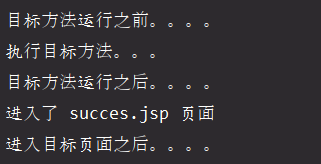

> 发现，afterComplation 在进入了 页面之后，才被调用

### 2. 执行流程

#### 正常流程

preHandle (放行)==> 目标方法 ==> postHandle ==> 进入页面 ==> afterCompletion

#### 拦截流程

preHandler(不放行, 直接结束) 

结果:

 只执行了 preHandle  方法，页面变空白，无后续流程

#### 目标方法出现异常流程

preHandle (放行)==> 目标方法 ==> 进入错误页面 ==> afterCompletion

afterCompletion 能执行的原因： 只要是放行了，都会执行该方法 （类似于 final）

##### 在目标方法中，添加异常

```java
@RequestMapping("/hello")
    public String hello() {
        System.out.println("执行目标方法。。。");
        int i = 10/0;
        return "success";
    }
```

##### 执行结果:

- 打印输出

```
目标方法运行之前。。。。
执行目标方法。。。
进入目标页面之后。。。。
```

- 页面显示

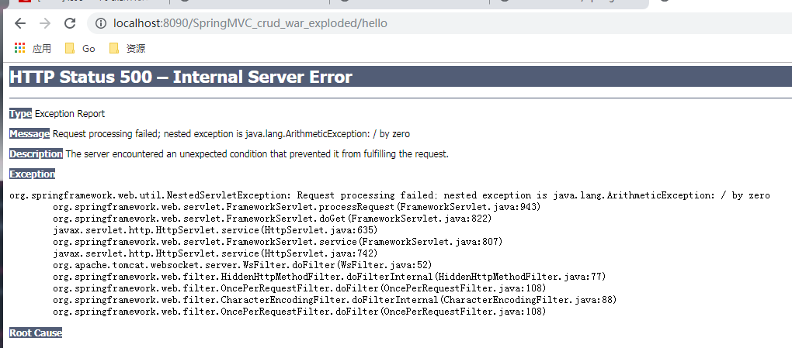

#### 多个拦截器

##### 配置两个拦截器

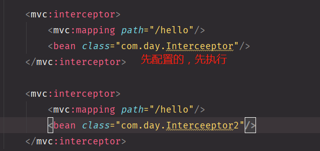

##### 全部放行执行流程

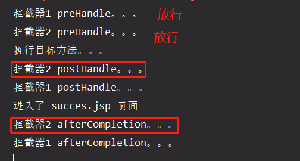

##### 拦截器2不放行执行流程

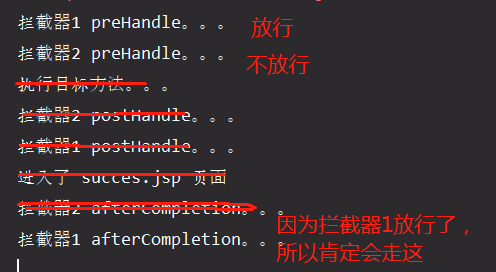

### 3. 源码分析

代码位置: DispatcherServlet 的 doDispatch 方法

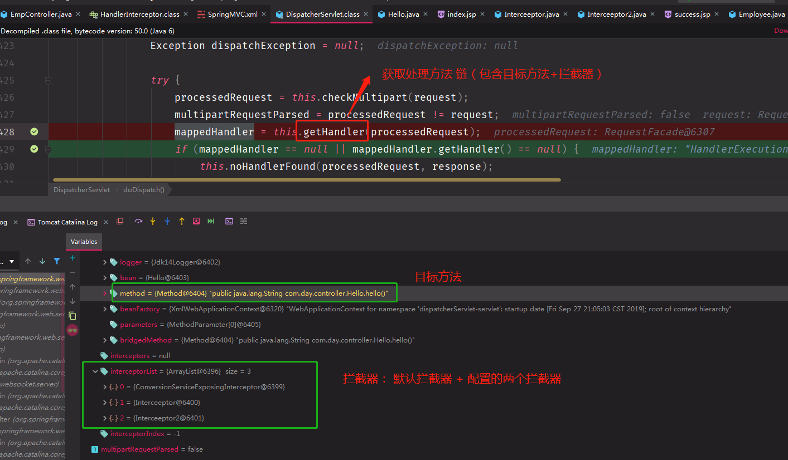

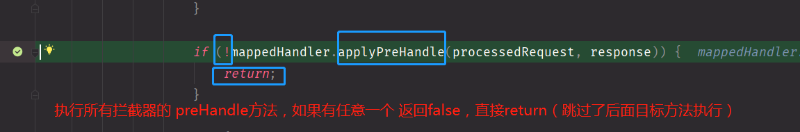

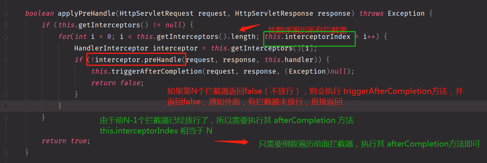

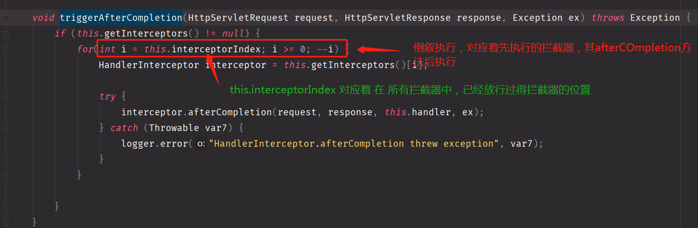

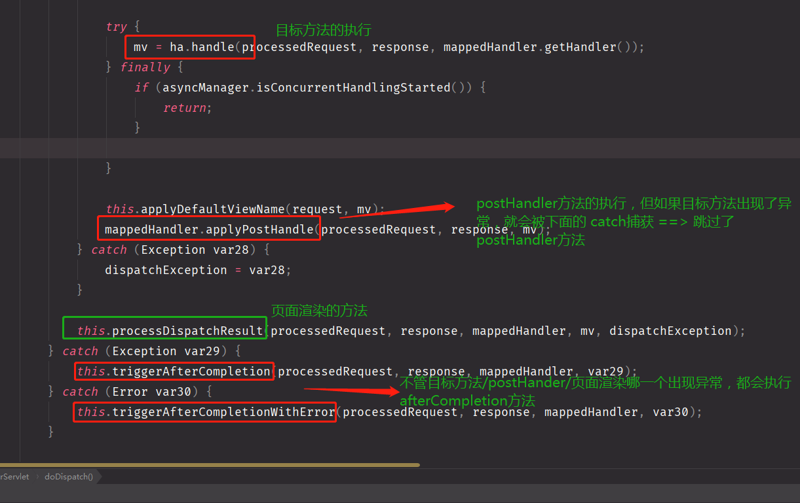

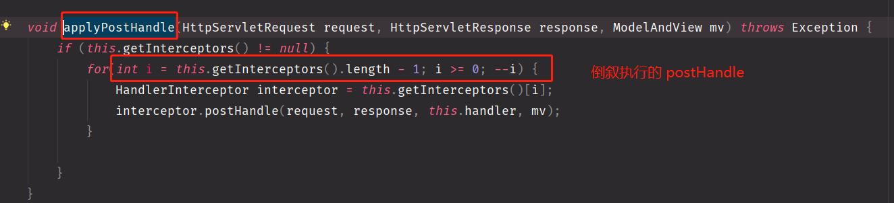

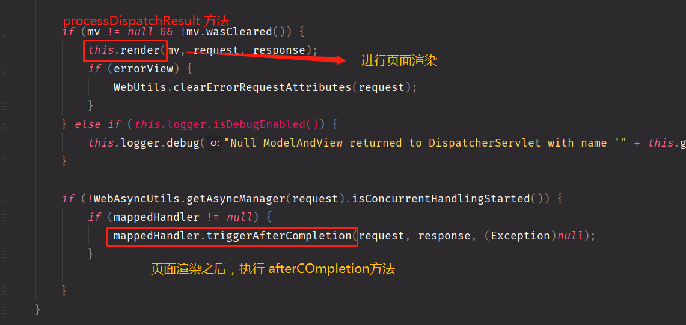

### 4. 拦截器与 filter

1. 拦截器 是 SpringMVC 的，可以添加到 IOC 容器中；
2. 在需要与其他组件配合使用的时候，使用拦截器；
3. 其他情况下，使用filter

## 十三. 国际化

### 问题:

这样一个登陆界面，如果做国际化功能，对应语言进行显示?

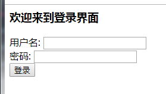

### 解决:

#### 1. 定义 不同语言的 properties 文件

##### **注意文件编码格式为 UTF-8**

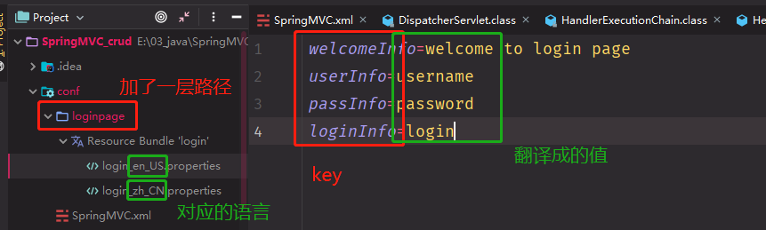

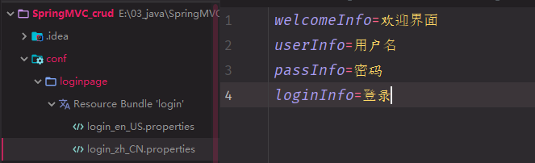

##### 配置IDEA编码为UTF-8

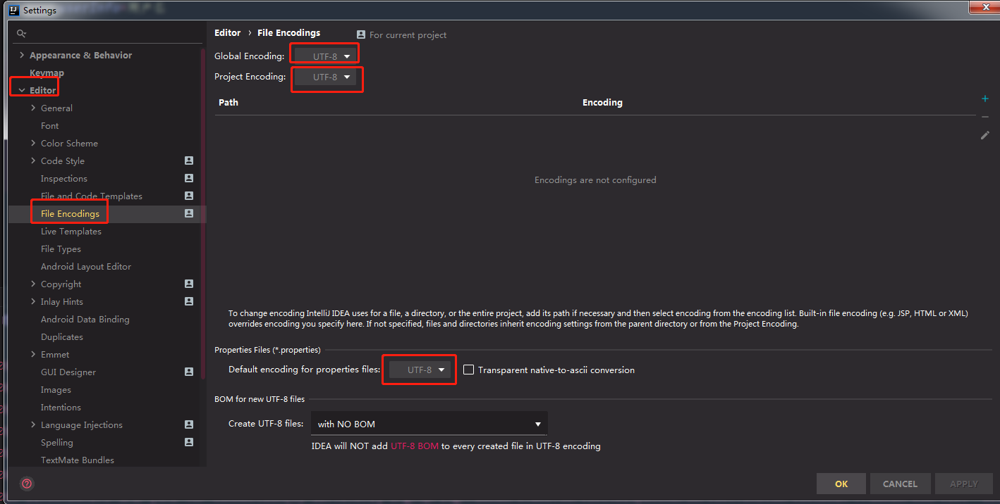

#### 2. 配置 国际化文件（web.xml）

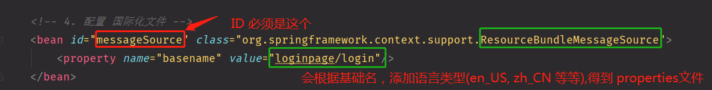

#### 3. jsp 中使用

**使用form标签**

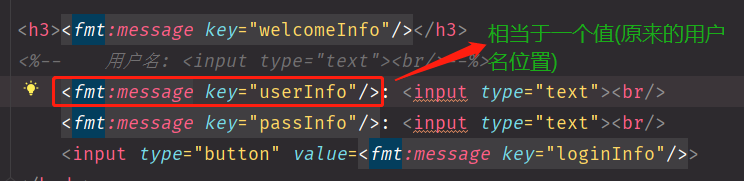

#### 4. 效果

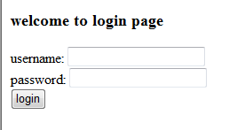

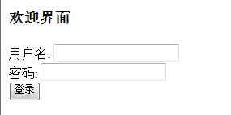

### 1. 原理

国际化信息是使用 SpringMVC 中的 区域解析器来解析的

- Dispatcher 中有一个 localeResolver 成员，该成员就是区域解析器

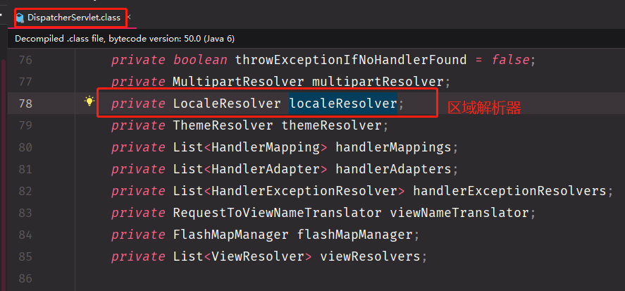

- Dispatcher 默认为 localeResolver 导入的 类是 **AcceptHeaderLocaleResolver**

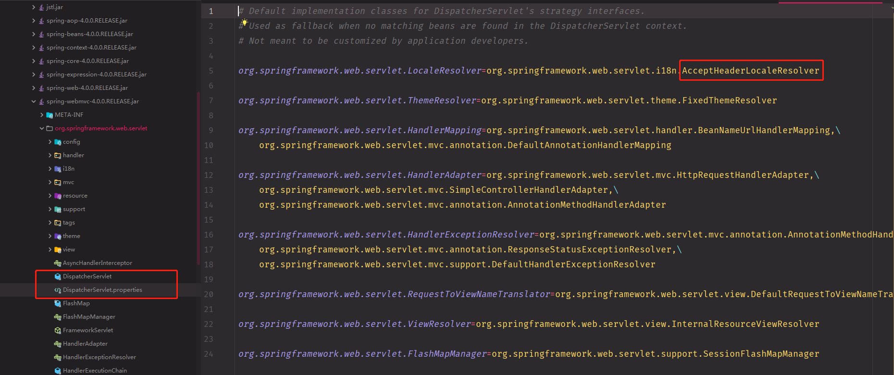

- AcceptHeaderLocaleResolver 实现的方法

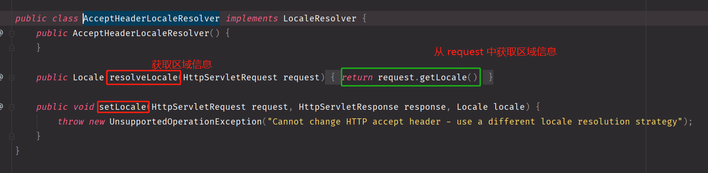

- 页面渲染的时候，首先获取 区域信息

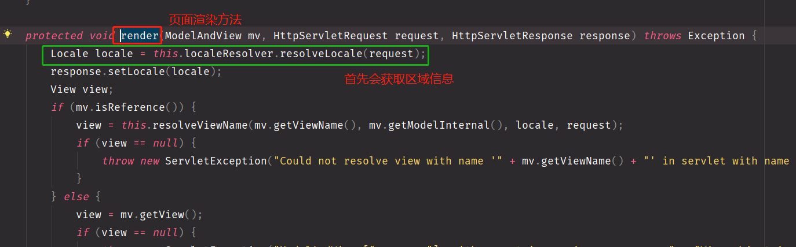

### 2. 程序中获取 国际化 值

- messageSource 为在 SpringMVC.xml中配置的 bean

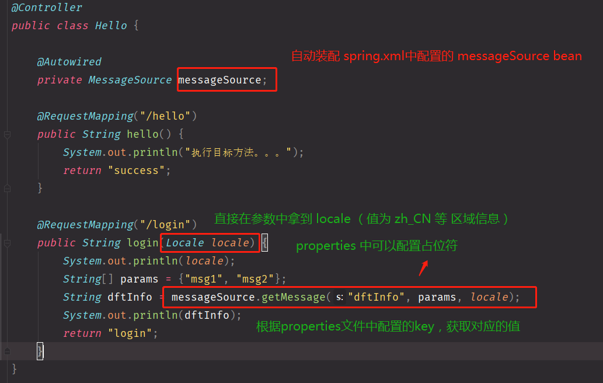

- properties 中 配置占位符

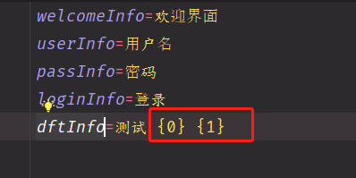

- 结果打印

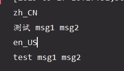

### 3. 链接切换中英文

- 效果

1. 点击 中文界面、英文界面，进行中英文切换

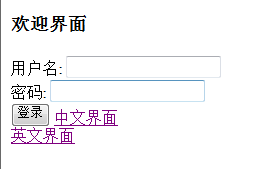

- 思路

  页面中英文是使用 localResolver 进行解析

  ==> localResolver 主要是使用 resolveLocale 来获取区域信息

  ​    ==>  自定义一个 localResolver， 覆盖 resolveLocale  方法，在其中返回我们指定的 区域类型

   		==> resolveLocale  接受了一个 req，那么可以在 req 中增加参数，标识 区域类型

  ​				==> 自定义的 resolveLocale  方法中，解析req，拿到区域类型，创建一个 Local 返回即可

#### 方式一： 自定义 resolver

##### 1. 创建一个 自定义的 resolver

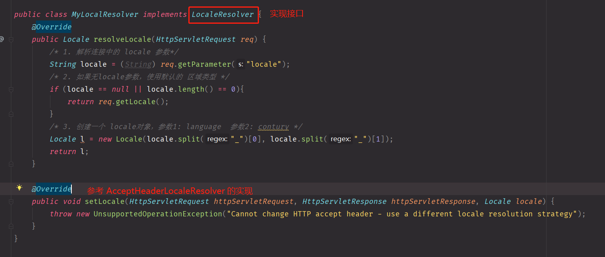

##### 2. 配置 resolver

DispatchServlet 是如何 加载 resolver 的呢？

​	==>initLocaleResolver 方法，首先看 IOC容器中有没有 用户自定义的 resolver，有就 使用 用户自定义的 resolver;如果没有，就使用  关联的 properties文件中配置的 默认 resolver

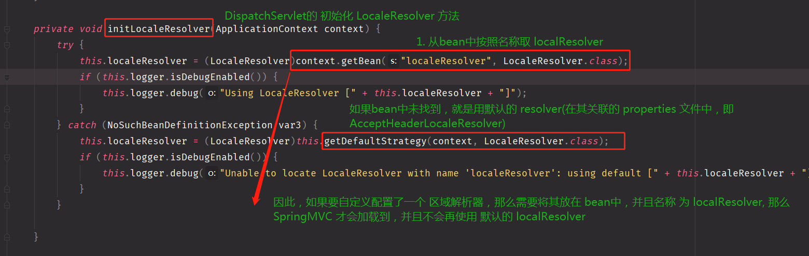

==> 在 SpringMVC.xml 中，创建一个 id 为 localeResolver 的 bean

```xml
<!-- 5. 配置自定义 区域解析器-->
    <bean id="localeResolver" class="com.day.MyLocalResolver" />
```

##### 3. jsp使用

```jsp
<a href="${pageContext.request.contextPath}/login?locale=zh_CN">中文界面</a><br/>
<a href="${pageContext.request.contextPath}/login?locale=en_US">英文界面</a><br/>
```

#### 方式二: SessionLocaleResolver

##### 1. LocalResolver 的实现类

**其中 SessionLocaleResolver 和 CookieLocaleResolver 支持 设置 resolver**

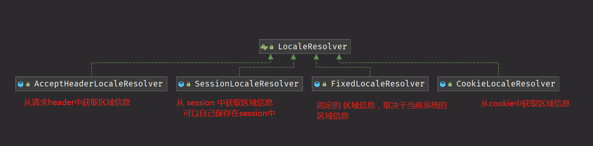

##### 2. SessionLocaleResolver 原理

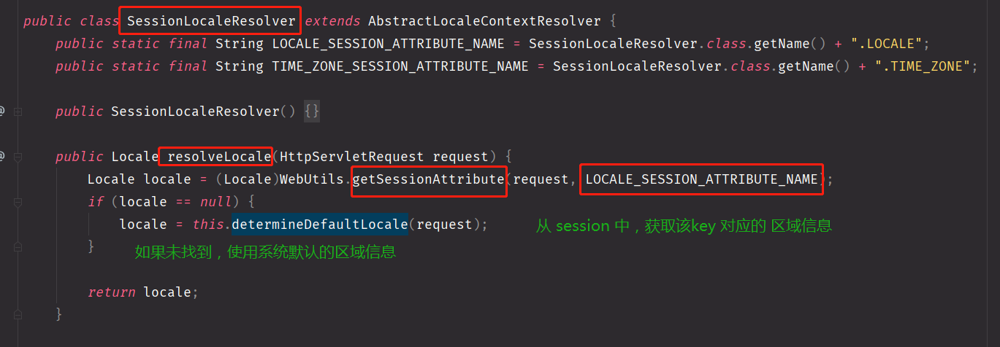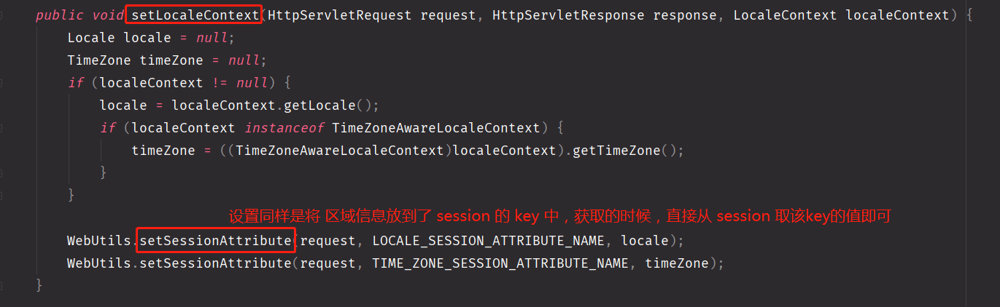

##### 3. 使用

- springmvc.xml 中配置 SessionLocaleResolver  bean

```xml
<bean id="localeResolver" class="org.springframework.web.servlet.i18n.SessionLocaleResolver" />
```

- 控制器

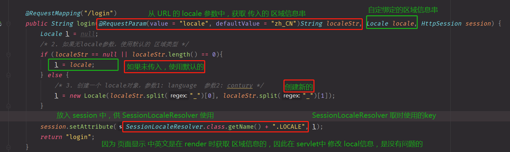

#### 方式三: SessionLocaleResolver + LocaleChangeInterceptor

前面两种方式，都需要自己 通过 区域对象 str， 解析 并创建  Locale 对象，比较麻烦

SpringMVC 提供了 一个 拦截器

​	其预处理方法功能：

	1. 从 请求的 locale 参数，获取  区域信息 字符串 （locale 参数名可配置)
 	2. 获取当前使用的 区域解析器
 	3. 根据 区域信息字符串，创建 Locale 对象
 	4. 调用 区域解析器的 setLocale 方法，设置 Locale对象

==> 完美替代了 我们上面两种方法 

- LocaleChangeInterceptor

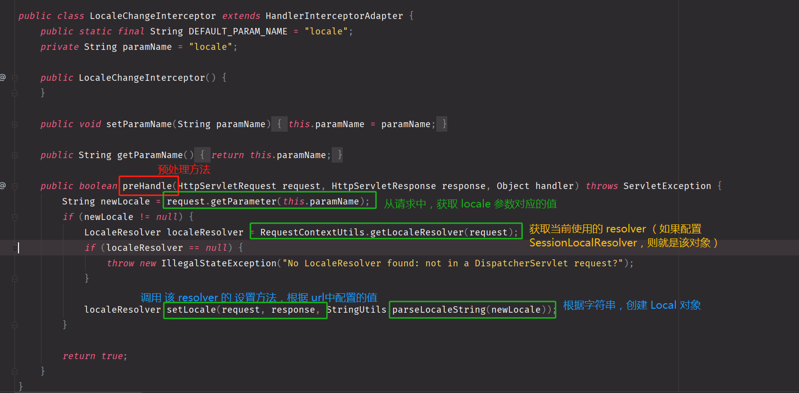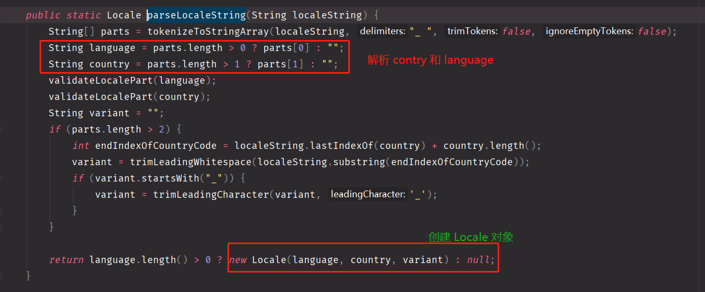

##### 1. 使用

只需要在 SpringMVC.xml 中配置 SessionLocaleResolver 和  LocaleChangeInterceptor 即可

```xml
<bean id="localeResolver" class="org.springframework.web.servlet.i18n.SessionLocaleResolver" />
    <mvc:interceptors>
        <mvc:interceptor>
            <mvc:mapping path="/login"/>
            <bean class="org.springframework.web.servlet.i18n.LocaleChangeInterceptor"/>
        </mvc:interceptor>
    </mvc:interceptors>
```

##### 2. 原理

1. LocaleChangeInterceptor  拦截请求，获取 locale 参数对应 zh_CN
2. LocaleChangeInterceptor  获取 当前使用的 SessionLocaleResolver  对象
3. 使用 zh_CN 创建 Locale 对象， 并设置到 SessionLocaleResolver   中
4. 处理器中无操作
5. render时，SessionLocaleResolver   获取 区域信息( 第3步已经set进去了)，然后渲染界面

## 十四. SpringMVC 自定义组件

1. 在 DispatchServlet 中，查找 该组件 初始化方法  init...
2. init。。。方法中，如果发现 其从 IOC容器中 拿取 固定id的 bean，将自定义组件id修改为 该固定id即可


