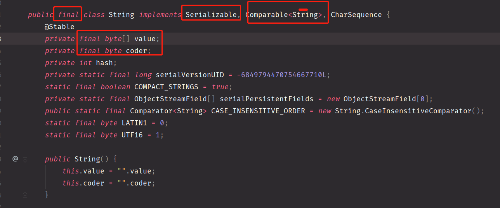

> Java 中 string

<!-- more-->

## JAVA String

<!-- more -->

### 1.特性

- 类实现



- 特点

> 1. 声明为 final, 不可被继承
>
> 2. 实现了 Serialzable 接口，支持序列化
> 3. 实现了Comparable接口，支持比较大小
> 4. 内部定义了 final char [] value, 用来存储字符串数据
> 5. 代表一个不可变的字符序列 （不可变的特性)
>    1. 当对字符串重新赋值时，需要重新制定一个区域，而不能在现有位置更改
>    2. 对现有字符串进行连接操作时，也需要重新制定一个区域
>    3. 使用 replace（）方法时，也是重新指定内存区域赋值

### 2. 字符串常量值

> 使用字符串常量值的方式 给一个字符串 赋值
>
> 字符串常量值 存储在  内存中方法区的 字符串常量池中

```java
String s1 = "abc";
String s2 = "abc";
// 因此， s1 == s2 可能为 true （==对引用类型比较的是地址)
```

### 3. 实例化对比

#### 3.1 字面量方式

> 1. 对象定义在 内存中 方法去中的 字符串常量池中 （为了共享)

#### 3.2 new 构造器方式

> 1. 对象保存在 堆空间中 (new方式都在 堆中)

### 4. 字符串相加

> 常量与常量的拼接结果是在 常量池中，并且常量池中不会存在相同内容的常量 （本身意义就是为了共享)
>
> 拼接中，只要一个是 变量， 结果就在 堆中
>
> 可以使用 intern()方法， 该方法返回的 string 指向 常量池中

```java
String s1 = "abc";
String s2 = "ab" + "c";
String s3 = "ab";
String s4 = s3 + "c";
// s1 == s2
// s1 != s4
```

### 5. 转换

- String 转 基本数据类型， 包装类

> 调用 包装类的 静态方法   parseXXXX(str)

```java
String s1 = "123";
int num = Integer.parseInt(s1);
```

- 基本数据类型，包装类  转 String

> 调用 String 重载的 ValueOf(xxx) 方法

```
String str3 = String.valueOf(num);
```

- String 转 char[]

> 调用 public char[] toCharArray() 方法

- char [] 转 String

> 调用 String 的构造方法

- String 转 byte[]

> 调用 public byte[] getBytes() 方法 （使用默认的编码集)
>
> getBytes(Charset charset)  指定对应的编码
>
> getBytes(String charsetName)

### 6. StringBuffer

> 可变的字符序列
>
> 线程安全的 (效率低)
>
> 底层使用 char[]存储
>
> 创建时，默认 容量是 16

```
String str = new String(); // new char[0]
String str = new String("abc"); // new char[]{'a', 'b', 'c'}

StringBuffer sb1 = new StringBuffer(); // new char[16]; 其中  16 为其 capacity
```

> 如果append时，将要超出容量，会扩容底层的数组
>
> ==》建议使用 带容量的构造方法，减少 扩容拷贝次数

```java
// 源码 扩容部分
private void ensureCapacityInternal(int minimumCapacity) {
        int oldCapacity = this.value.length >> this.coder;
        if (minimumCapacity - oldCapacity > 0) {
            this.value = Arrays.copyOf(this.value, this.newCapacity(minimumCapacity) << this.coder);
        }

    }
```

- 常用的方法

```java
// 拼接
StringBuffer append(xxx)； xxx 对应各种类型

// 替换
StringBuffer replace(int start, int end, String str)

// 插入
StringBuffer insert(int offset, xxxx);

// 反转
StringBuffer reverse();

// 子串
String substring​(int start, int end);
String substring(int start)
    
// 查询位置
int	indexOf​(String str)
int	lastIndexOf​(String str)
    
// 修改单个字符
void setCharAt​(int index, char ch)
.....
```


### 7. StringBuilder

> 可变的字符序列
>
> 线程不安全的 (效率高)
>
> 底层使用 char[]存储
>
> 其余与 StringBuffer 基本一致

