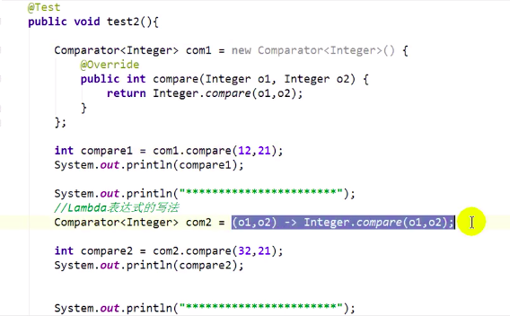
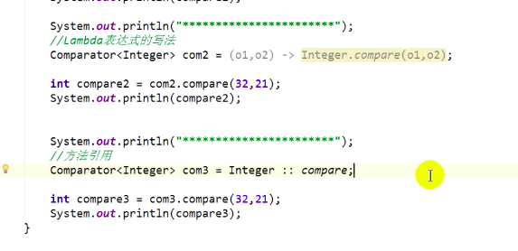
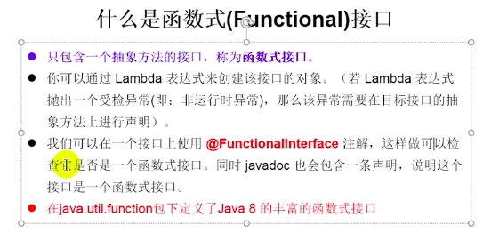
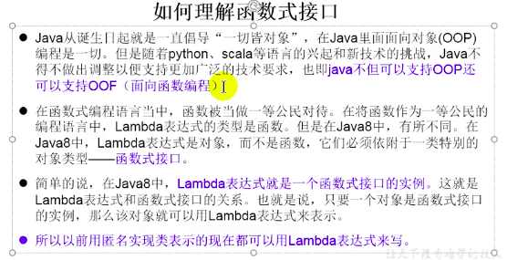
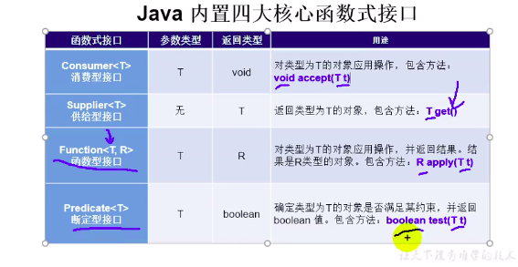
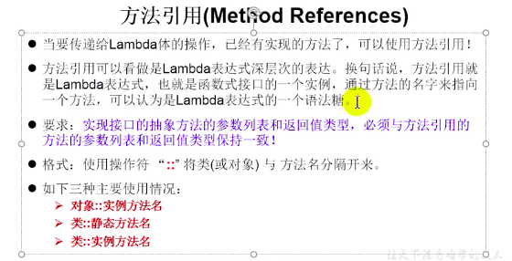

## 1. Lambda表达式

格式:

```
举例：  (o1, o2) -> {Integer.compare(o1, o2)};
其中:
	->     lanbda操作符或者箭头操作符
	->左边内容: lambada形参列表 (其实就是 接口中的抽象方法的形参列表)
	->右边内容: lambda题(其实就是 重写的抽象方法的方法体内容)
```

本质:

```java
	  @Test
    void test1() {
        Runnable r1 = new Runnable() {
            @Override
            public void run() {
                System.out.println("这是run方法");
            }
        };
        r1.run();
    }
==> 想要写一个 Runnable接口的匿名实现类，然后调用他的 run 方法。但是这个 Runnable 只有一个方法，那么每次这样写就会很麻烦
  => 既然只有一个方法，那么我只需要写出 形参，和方法体。就可以标识这个方法了呗
  Runnable r2 = () -> {System.out.println("sss")};
要求：接口只能有一个方法
```






语法格式:

```
1. Lambda 如果只需要一个参数时，参数的小括号可以省略
2. Lambda 如果只有一条执行语句，{} 可以省略， 有return，return也可以省略
```

## 2. 函数式接口



如果一个接口中，只声明了一个方法，就成为 函数式接口 （@FunctionalInterface)





## 3. 方法引用

