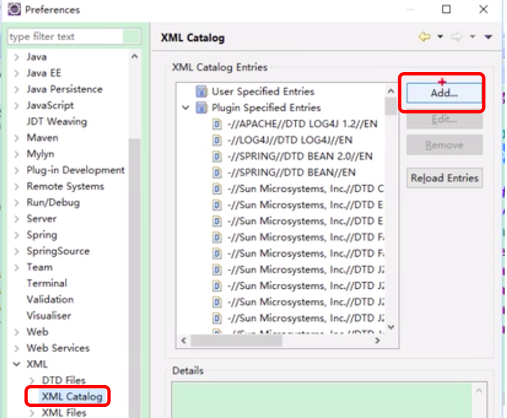
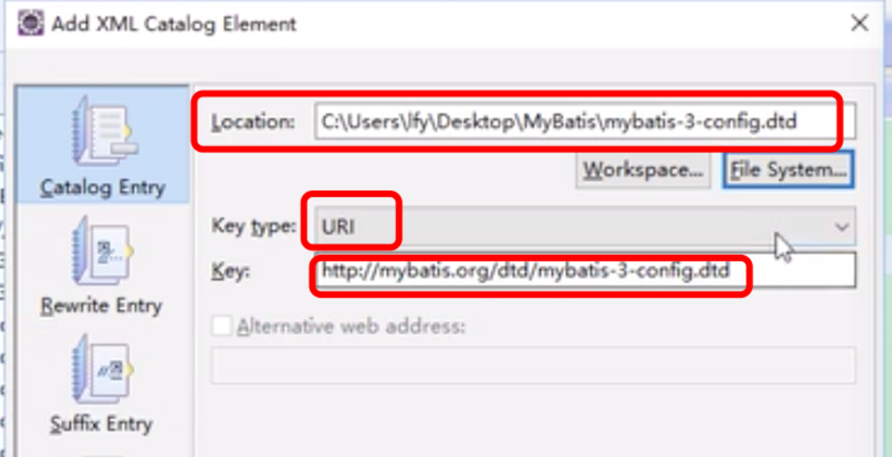
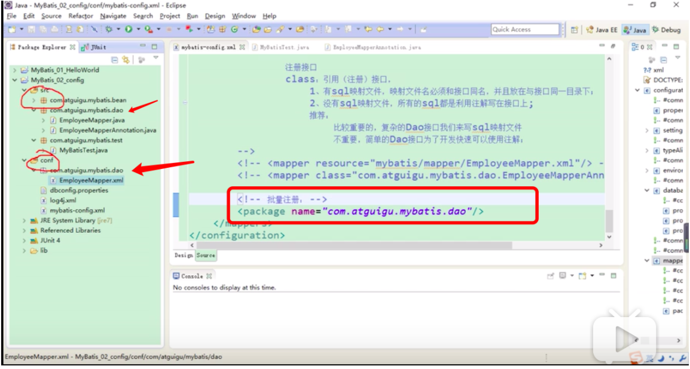
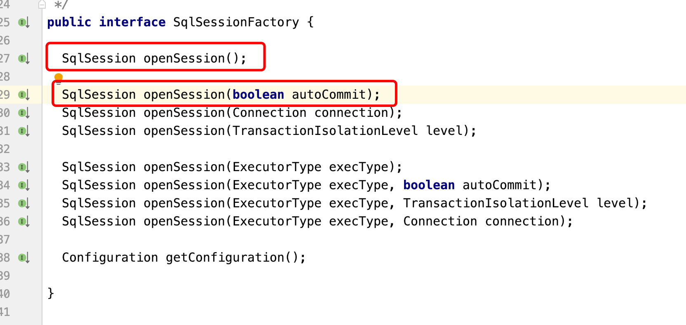
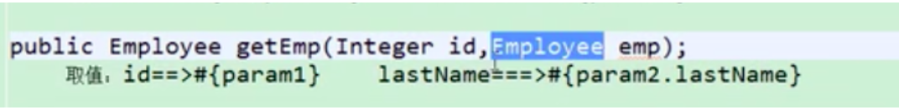
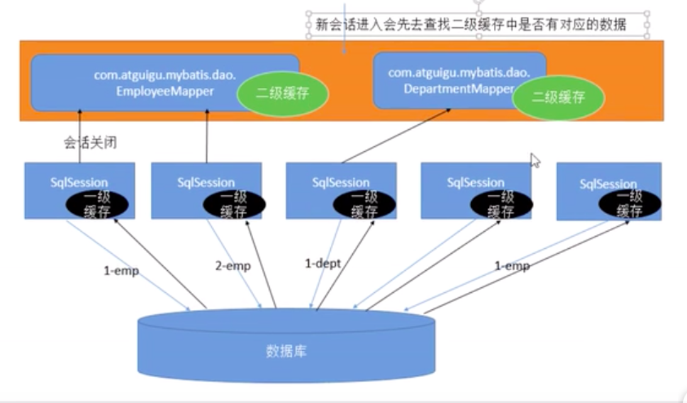
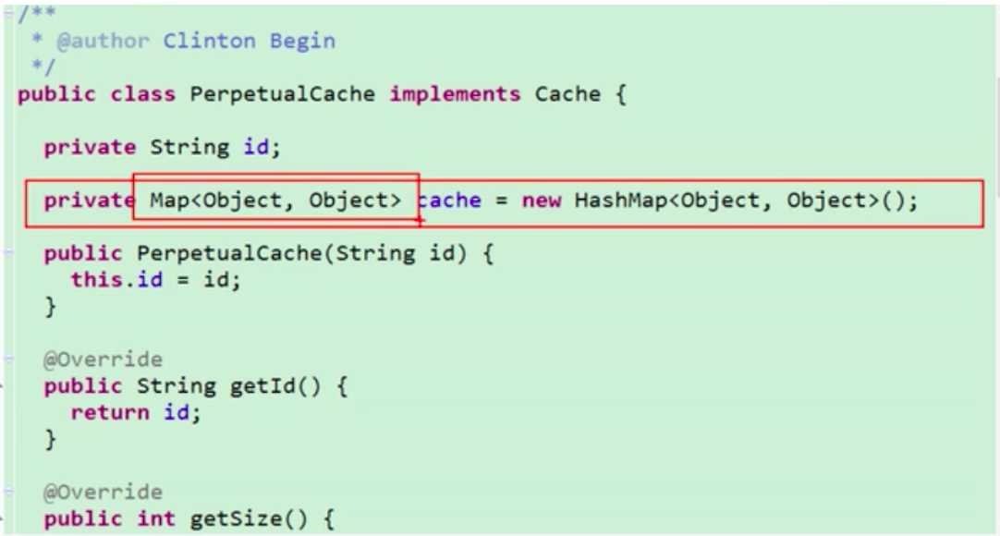

### 摘要

>Mybatis的简单使用

<!-- more-->

# 1. JDBC 的使用

# 2. JdbcTemplate的使用

# 3. Hibernate

# 4. Mybatis

## 1. 背景

### JDBC

编写sql => 预编译 => 设置参数 => 执行sql => 封装结果

#### 特点:

	1. sql 语句编写在 java代码里面 （硬编码，高耦合)
 	2. 预编译，设置参数，执行sql，封装结果 等需要手动，每次操作比较麻烦

### Hibernate

全自动全映射ORM(Object Relation Mapping)框架，意在消除sql

用户只需要 提供 JavaBean, 其余的 编写sql=>预编译=>设置参数=>执行sql=>封装结果 等是黑箱操作，对用户不可见

#### 特点:

1. 使用简单

2. 黑箱操作，编写sql都由底部实现

3. 全映射，自定义sql语句成本较高

==>能否有一个框架，sql语句的编写由 开发人员控制，但是 其他操作进行封装？

## 2. 简单使用

### 1. 导入jar包

```
mybatis
mysql-connector
log4j
```

### 2. mybatis 全局配置文件

全局文件用来配置以下信息

1. 数据源
2. 事务管理
3. mapper xml文件的位置
4. mybatis 其他全局配置

```xml
<?xml version="1.0" encoding="UTF-8" ?>
<!DOCTYPE configuration
 PUBLIC "-//mybatis.org//DTD Config 3.0//EN"
 "http://mybatis.org/dtd/mybatis-3-config.dtd">
<configuration>
	<environments default="development">
		<environment id="development">
			<transactionManager type="JDBC" />
			<dataSource type="POOLED">
				<property name="driver" value="com.mysql.jdbc.Driver" />
				<property name="url" value="jdbc:mysql://localhost:3306/mybatis" />
				<property name="username" value="root" />
				<property name="password" value="123456" />
			</dataSource>
		</environment>
	</environments>
	<!-- 将我们写好的sql映射文件（EmployeeMapper.xml）一定要注册到全局配置文件（mybatis-config.xml）中 -->
	<mappers>
		<mapper resource="EmployeeMapper.xml" />
	</mappers>
</configuration>
```

### 3. 获取 sqlSession

#### SqlSession

> 1. SqlSession代表和数据库的一次会话；用完必须关闭
> 2. SqlSession和connection一样她都是非线程安全。每次使用都应该去获取新的对象
> 3. SqlSession 通过 SqlSessionFactoryBuilder 获取

```java
public SqlSessionFactory getSqlSessionFactory() throws IOException {
		String resource = "mybatis-config.xml";
		InputStream inputStream = Resources.getResourceAsStream(resource);
		return new SqlSessionFactoryBuilder().build(inputStream);
}
// 1、获取sqlSessionFactory对象
SqlSessionFactory sqlSessionFactory = getSqlSessionFactory();
// 2、获取sqlSession对象
SqlSession openSession = sqlSessionFactory.openSession();
try {
  // 处理
} finally {
  openSession.close();
}
```

### 4. 创建 dao层接口

```java
package com.atguigu.mybatis.dao;

import com.atguigu.mybatis.bean.Employee;

public interface EmployeeMapper {
	
	public Employee getEmpById(Integer id);

}
```

### 5. 编写 mapper xml 文件

1. mapper 中 namespace 指向 dao层接口 （对其进行实现)

```xml
<?xml version="1.0" encoding="UTF-8" ?>
<!DOCTYPE mapper
 PUBLIC "-//mybatis.org//DTD Mapper 3.0//EN"
 "http://mybatis.org/dtd/mybatis-3-mapper.dtd">
<mapper namespace="com.atguigu.mybatis.dao.EmployeeMapper">
<!-- 
namespace:名称空间;指定为接口的全类名
id：唯一标识
resultType：返回值类型
#{id}：从传递过来的参数中取出id值

public Employee getEmpById(Integer id);
 -->
	<select id="getEmpById" resultType="com.atguigu.mybatis.bean.Employee">
		select id,last_name lastName,email,gender from tbl_employee where id = #{id}
	</select>
</mapper>
```

### 6. 获取dao接口实现类对象，测试

通过 sqlSession 的 getMapper 方法，获取 dao接口 对应的实现类对象 （一个代理对象) 

然后调用接口实现类对象的方法，进行实际执行

```java
@Test
	public void test01() throws IOException {
		// 1、获取sqlSessionFactory对象
		SqlSessionFactory sqlSessionFactory = getSqlSessionFactory();
		// 2、获取sqlSession对象
		SqlSession openSession = sqlSessionFactory.openSession();
		try {
			// 3、获取接口的实现类对象
			//会为接口自动的创建一个代理对象，代理对象去执行增删改查方法
			EmployeeMapper mapper = openSession.getMapper(EmployeeMapper.class);
			Employee employee = mapper.getEmpById(1);
			System.out.println(mapper.getClass());
			System.out.println(employee);
		} finally {
			openSession.close();
		}
	}
```

### 7. 总结

用户只需要定义dao接口和接口对应sql操作。mybatis自动根据 sql和接口生成对应的代理对象！

```
1. 用户只需要编写 dao 层的 数据库操作接口
2. 然后在 mapper xml 中 编写 实际的 sql 操作，并指定 这个操作是对 哪个接口进行实现
3. service层，可以通过 dao接口，获取到 实现类对象，调用实现类对象的方法，进行调用
```

## 3. 全局配置

### 1. 配置文件dtd约束

编写时，如果需要提示 ==> 需要引入 dtd 文件

联网时:  点击 dtd 连接，进入文件，然后退出即可

未联网时: 告诉编译器，该dtd url 对应的 本地 dtd文件即可

#### 1. 从jar包中，获取dtd文件

1> 解压 mybatis-*.jar包，获取到 

​	mybatis-3-config.dtd (全局配置文件使用的dtd约束)

​	mybatis-3-mapper.dtd (mapper xml配置文件使用的dtd约束)

2> 在xml中，配置 url 与对应的 dtd

注意：全局配置文件中，使用 mybatis-3-config.dtd

mapper xml文件中，使用 mybatis-3-mapper.dtd





### 2. properties 标签

> 用来引入外部 properties 配置文件的内容

resource 属性用来: 引入类路径下的资源

Url 属性用来: 引入网络路径或者磁盘路径下的资源

```xml
<?xml version="1.0" encoding="UTF-8" ?>
<!DOCTYPE configuration
 PUBLIC "-//mybatis.org//DTD Config 3.0//EN"
 "http://mybatis.org/dtd/mybatis-3-config.dtd">
<configuration>
	<properties resource="dbconfig.properties"></properties>
	<properties url=""></properties>
</configuration>
```

### 3. settings

#### 1. 开启驼峰命名

```xml
<!-- 
		2、settings包含很多重要的设置项
		setting:用来设置每一个设置项
			name：设置项名
			value：设置项取值
	 -->
<settings>
		<setting name="mapUnderscoreToCamelCase" value="true"/>
	</settings>
```

### 4. typeAliases

> 用来给 java 全限定类名 起一个别名

```xml
<typeAliases>
		<!-- 1、typeAlias:为某个java类型起别名
				type:指定要起别名的类型全类名;默认别名就是类名小写；employee
				alias:指定新的别名
		 -->
		<!-- <typeAlias type="com.atguigu.mybatis.bean.Employee" alias="emp"/> -->
		
		<!-- 2、package:为某个包下的所有类批量起别名 
				name：指定包名（为当前包以及下面所有的后代包的每一个类都起一个默认别名（类名小写），）
		-->
		<package name="com.atguigu.mybatis.bean"/>
		
		<!-- 3、批量起别名的情况下，使用@Alias注解为某个类型指定新的别名 -->
	</typeAliases>
```

### 5. Environments

mybatis 可以配置多种环境，每个环境就是一个 environment

1> 每个 environment 必须包含一个 transactionManager 和 dataSource

2>  id 是 当前环境的 唯一标识

3> environments 使用 default 指定某个环境，达到快速切换

4> transactionManager 是 事务管理器

- JDBC: JdbcTransactionFactory
- MANAGED: ManagedTransactionFactory
- 自定义事务管理器: 实现 TransactionFactory接口

注: Configuration.class 配置了 JDBC MANAGED 等别名以及其真实类型

5> dataSource 数据源

- UNPOOLED
- POOLED
- JNDI
- 自定义数据源: 实现 DataSourceFactory接口

```xml
<environments default="dev_mysql">
		<environment id="dev_mysql">
			<transactionManager type="JDBC"></transactionManager>
			<dataSource type="POOLED">
				<property name="driver" value="${jdbc.driver}" />
				<property name="url" value="${jdbc.url}" />
				<property name="username" value="${jdbc.username}" />
				<property name="password" value="${jdbc.password}" />
			</dataSource>
		</environment>
	
		<environment id="dev_oracle">
			<transactionManager type="JDBC" />
			<dataSource type="POOLED">
				<property name="driver" value="${orcl.driver}" />
				<property name="url" value="${orcl.url}" />
				<property name="username" value="${orcl.username}" />
				<property name="password" value="${orcl.password}" />
			</dataSource>
		</environment>
	</environments>
```

### 6. databaseIdProvider

用来支持多数据库厂商（同一个查询操作，有多个版本的sql语句，一个语句支持mysql，一个语句支持orcale等)

#### 1. 配置 databaseIdProvider

如果知道实际的数据库厂商?

​	数据库驱动  => 有 getDatabaseProductName()方法 ==> 能够获取到 数据库厂商的标识信息

```xml
<databaseIdProvider type="DB_VENDOR">
		<!-- 为不同的数据库厂商起别名 -->
		<property name="MySQL" value="mysql"/>
		<property name="Oracle" value="oracle"/>
		<property name="SQL Server" value="sqlserver"/>
	</databaseIdProvider>
```

#### 2. 在 sql 语句中，指定 databaseId

```xml
<mapper namespace="com.atguigu.mybatis.dao.EmployeeMapper">
 -->
 	<select id="getEmpById" resultType="com.atguigu.mybatis.bean.Employee">
		select * from tbl_employee where id = #{id}
	</select>
	<select id="getEmpById" resultType="com.atguigu.mybatis.bean.Employee"
		databaseId="mysql">
		select * from tbl_employee where id = #{id}
	</select>
	<select id="getEmpById" resultType="com.atguigu.mybatis.bean.Employee"
		databaseId="oracle">
		select EMPLOYEE_ID id,LAST_NAME	lastName,EMAIL email 
		from employees where EMPLOYEE_ID=#{id}
	</select>
</mapper>
```

### 7. mappers

将我们写好的sql映射文件（EmployeeMapper.xml）注册到全局配置文件（mybatis-config.xml）中

#### 1. 注册配置文件方式

此种方式下，dao层定义接口，然后 开发人员编写 xml 文件 （因此需要在全局配置文件中标明，xml配置文件在哪)

```xml
<mappers>
		<!-- 
			mapper:注册一个sql映射 
				注册配置文件
				resource：引用类路径下的sql映射文件
					mybatis/mapper/EmployeeMapper.xml
				url：引用网路路径或者磁盘路径下的sql映射文件
					file:///var/mappers/AuthorMapper.xml
		-->
	<mapper resource="mybatis/mapper/EmployeeMapper.xml"/> 
</mappers>
```

#### 2. 注册接口的方式

```xml
<mappers>
		<!-- 	
				注册接口
				class：引用（注册）接口，
					1、有sql映射文件，映射文件名必须和接口同名，并且放在与接口同一目录下；
					2、没有sql映射文件，所有的sql都是利用注解写在接口上;
					推荐：
						比较重要的，复杂的Dao接口我们来写sql映射文件
						不重要，简单的Dao接口为了开发快速可以使用注解；
		-->
		<mapper class="com.atguigu.mybatis.dao.EmployeeMapperAnnotation"/>
	</mappers>
```

#### 3. 批量注册的方式

通过 package name 方式，指定 一个包下 所有的 接口都被注册，那么如何放置接口对应的 映射文件呢?

​	1) 将 映射文件 与 接口 文件 放在同一个包下

​	2) 方式一虽然可行，但是 java 与 xml 混合在一起，看起来比较不合理

​	==> 由于 类路径下，相同包接口 最终都是放在一起的，那么可以在 conf 下，新建一个同样的包，将xml 放在此包下，实际位置都是在同一个目录下

```xml
<mappers>
		<!-- 批量注册： -->
		<package name="com.atguigu.mybatis.dao"/>
	</mappers>
```



## 4. mapper 映射文件

### 1. 影响行数

mybatis 允许 增删改 直接 定义以下类型的返回值

- Integer
- Long
- Boolean
- void

==> 对于 Insert, Update, Delete 等方法，如果想要影响行数，直接定义 上述类型的返回值即可

注意: 直接在接口返回值填写，mybatis 会根据结果进行封装，不需要 写 resultType

### 2. 自动提交与手动提交



使用 openSession() 方法时，对于 增删改，需要手动提交；

如果想要自动提交，可以使用 openSession(true); 方法来获取 sqlSession

### 3. 自增主键

1. useGeneratedKeys="true"；使用自增主键获取主键值策略
2. keyProperty；指定对应的主键属性，也就是mybatis获取到主键值以后，将这个值封装给javaBean的哪个属性

```xml
<!-- public void addEmp(Employee employee); -->
	<!-- parameterType：参数类型，可以省略， 
	获取自增主键的值：
		mysql支持自增主键，自增主键值的获取，mybatis也是利用statement.getGenreatedKeys()；
		useGeneratedKeys="true"；使用自增主键获取主键值策略
		keyProperty；指定对应的主键属性，也就是mybatis获取到主键值以后，将这个值封装给javaBean的哪个属性
	-->
	<insert id="addEmp" parameterType="com.atguigu.mybatis.bean.Employee"
		useGeneratedKeys="true" keyProperty="id" databaseId="mysql">
		insert into tbl_employee(last_name,email,gender) 
		values(#{lastName},#{email},#{gender})
	</insert>
```

### 4. 参数处理

#### 1. 单个参数

单个参数时，mybatis不做自动处理， #{任何名称} 都可以取到参数的值

#### 2. 多个参数

多个参数时，会做特殊的处理。mybatis 将多个参数，封装成了一个map，其中 map 的key值 为 param1, param2  , .... paramN 或者 参数的索引 0, 1, value对应的就是 传入的参数值

==> 因此 直接使用 #{id} #{lastname} 方式 是取不到值的

​	解决: 使用命名参数的方式 @Param("自定义的key")

​			明确指定封装参数为map时，使用自定义的key值，而不是 param1的方式

#### 3. 传入单个 pojo

 \#{pojo的属性名} 取出对应的值即可

#### 4. 传入单个 map的方式

\#{map中的key} 取出对应的值即可

#### 5. TO(Transfer Object)对象

如果 查询时，传入的参数不是一个javabean，可以封装一个 TO 对象，直接传入

#### 6. 多个参数 + POJO



#### 7. Collection参数

对 Collection(List, Set)类型，或者 数组类型，也会做特殊的处理，将传入的list或者数组，封装到map中。封装map是，如果是 List，key就是 list; 如果是数组类型，key就是 array

### 5. \#{}与${}的区别

#### 1. \#{}

以预编译的形式，将参数设置到 sql语句中。PreparedStatement 方式

#### 2. ${}

只是将参数拼接到 sql 语句中

#### 3. 作用

\#{} 用来使用 预编译方式

```
select * from t_1 where id=#{id}
==> select * from t_1 where id=?
```

${} 用来 动态的替换 表名，行名等

```
select * from t_1 where ${列名称}=3
==> select * from t_1 where 列名=3
```

### 6.select元素

####  1. id 属性

唯一标识符

#### 2. parameterType: 

参数类型, 可以不传，mybatis 会根据 TypeHandler 自动推断

#### 3. resultType:

返回值类型. 别名 或者 全类名。不能和 resultMap同时使用

注意: 如果返回值是一个集合，那么要写集合中元素的类型

#### 4. 返回值为 Map<Integer, Employee>

其中 key 是 这条记录的主键值， value 是 封装的 java pojo对象

1. resultType 是 Employee 对象类型

```xml
<!--public Map<Integer, Employee> getEmpByLastNameLikeReturnMap(String lastName);  -->
 	<select id="getEmpByLastNameLikeReturnMap" resultType="com.atguigu.mybatis.bean.Employee">
 		select * from tbl_employee where last_name like #{lastName}
 	</select>
```

2. 指定 map 的key 应该使用哪个列的值

```java
public interface EmployeeMapper {
	
	//多条记录封装一个map：Map<Integer,Employee>:键是这条记录的主键，值是记录封装后的javaBean
	//@MapKey:告诉mybatis封装这个map的时候使用哪个属性作为map的key
	@MapKey("lastName")
	public Map<String, Employee> getEmpByLastNameLikeReturnMap(String lastName);
}
```

### 7. 自动映射

前提:

​	1> select 标签，使用 resultType 属性

​	2> resultType 中 定义一个 java bean 时

当 sql 语句查询出结果时，如果对应输出配置的 Java 包装类中有相同名称的属性，且拥有 set 方法，则该结果就会被自动映射

配置:

​	全局setting配置中，autoMappingBehavior 属性

### 8. ResultMap

自定义结果集映射

#### 1. 简单映射

注意: 对于主键列，要使用 id，会加快速度

1) 其中 column 是 数据库中列名，property 是 java 对象中的属性	

2) 其他不指定的列会被自动封装，但是，建议将全部的映射规则都写上

```xml
<mapper namespace="com.atguigu.mybatis.dao.EmployeeMapperPlus">
	<!--自定义某个javaBean的封装规则
	type：自定义规则的Java类型
	id:唯一id方便引用
	  -->
	<resultMap type="com.atguigu.mybatis.bean.Employee" id="MySimpleEmp">
		<!--指定主键列的封装规则
		id定义主键会底层有优化；
		column：指定哪一列
		property：指定对应的javaBean属性
		  -->
		<id column="id" property="id"/>
		<!-- 定义普通列封装规则 -->
		<result column="last_name" property="lastName"/>
		<!-- 其他不指定的列会自动封装：我们只要写resultMap就把全部的映射规则都写上。 -->
		<result column="email" property="email"/>
		<result column="gender" property="gender"/>
	</resultMap>
	
	<!-- resultMap:自定义结果集映射规则；  -->
	<!-- public Employee getEmpById(Integer id); -->
	<select id="getEmpById"  resultMap="MySimpleEmp">
		select * from tbl_employee where id=#{id}
	</select>
</mapper>	
```

#### 2. 高级封装

##### 1. Java bean 中 包含 java bean

```java
@Data
public class Employee {
	private Integer id;
	private String lastName;
	private String email;
	private String gender;
	private Department dept;
}

@Data
public class Department {
	private Integer id;
	private String departmentName;
	private List<Employee> emps;
}

```

方式一: 查询出员工的同时，查询出部门的信息

级联属性的方式: 

```xml
<resultMap type="com.atguigu.mybatis.bean.Employee" id="MyDifEmp">
		<id column="id" property="id"/>
		<result column="last_name" property="lastName"/>
		<result column="gender" property="gender"/>
		<result column="did" property="dept.id"/>
		<result column="dept_name" property="dept.departmentName"/>
	</resultMap>
	<select id="getEmpAndDept" resultMap="MyDifEmp">
		SELECT e.id id,e.last_name last_name,e.gender gender,e.d_id d_id,
		d.id did,d.dept_name dept_name FROM tbl_employee e,tbl_dept d
		WHERE e.d_id=d.id AND e.id=#{id}
	</select>
```

association的方式:

```xml
<resultMap type="com.atguigu.mybatis.bean.Employee" id="MyDifEmp2">
		<id column="id" property="id"/>
		<result column="last_name" property="lastName"/>
		<result column="gender" property="gender"/>
		
		<!--  association可以指定联合的javaBean对象
		property="dept"：指定哪个属性是联合的对象
		javaType:指定这个属性对象的类型[不能省略]
		-->
		<association property="dept" javaType="com.atguigu.mybatis.bean.Department">
			<id column="did" property="id"/>
			<result column="dept_name" property="departmentName"/>
		</association>
	</resultMap>
	<select id="getEmpAndDept" resultMap="MyDifEmp2">
		SELECT e.id id,e.last_name last_name,e.gender gender,e.d_id d_id,
		d.id did,d.dept_name dept_name FROM tbl_employee e,tbl_dept d
		WHERE e.d_id=d.id AND e.id=#{id}
	</select>
```

方式二: 使用 association 进行分步查询

```xml
<!-- 使用association进行分步查询：
		1、先按照员工id查询员工信息
		2、根据查询员工信息中的d_id值去部门表查出部门信息
		3、部门设置到员工中；
	 -->
	 
	 <!--  id  last_name  email   gender    d_id   -->
	 <resultMap type="com.atguigu.mybatis.bean.Employee" id="MyEmpByStep">
	 	<id column="id" property="id"/>
	 	<result column="last_name" property="lastName"/>
	 	<result column="email" property="email"/>
	 	<result column="gender" property="gender"/>
	 	<!-- association定义关联对象的封装规则
	 		select:表明当前属性是调用select指定的方法查出的结果
	 		column:指定将哪一列的值传给这个方法
	 		
	 		流程：使用select指定的方法（传入column指定的这列参数的值）查出对象，并封装给property指定的属性
	 	 -->
 		<association property="dept" 
	 		select="com.atguigu.mybatis.dao.DepartmentMapper.getDeptById"
	 		column="d_id">
 		</association>
	 </resultMap>
	 <!--  public Employee getEmpByIdStep(Integer id);-->
	 <select id="getEmpByIdStep" resultMap="MyEmpByStep">
	 	select * from tbl_employee where id=#{id}
	 	<if test="_parameter!=null">
	 		and 1=1
	 	</if>
	 </select>
```

方式三: association分步查询 + 延迟加载

即每次先查询得到 Employee信息，但是 部门信息在每次使用到的时候才会去进行查询

延迟加载的配置：

```xml
<!-- 
		2、settings包含很多重要的设置项
		setting:用来设置每一个设置项
			name：设置项名
			value：设置项取值
	 -->
	<settings>
		<!-- <setting name="mapUnderscoreToCamelCase" value="true"/> -->
		<setting name="jdbcTypeForNull" value="NULL"/>
		
		<!--显示的指定每个我们需要更改的配置的值，即使他是默认的。防止版本更新带来的问题  -->
		<setting name="lazyLoadingEnabled" value="true"/>
		<setting name="aggressiveLazyLoading" value="false"/>
	</settings>
```

### 9. discriminator(鉴别器)

```xml
<!-- =======================鉴别器============================ -->
	<!-- <discriminator javaType=""></discriminator>
		鉴别器：mybatis可以使用discriminator判断某列的值，然后根据某列的值改变封装行为
		封装Employee：
			如果查出的是女生：就把部门信息查询出来，否则不查询；
			如果是男生，把last_name这一列的值赋值给email;
	 -->
	 <resultMap type="com.atguigu.mybatis.bean.Employee" id="MyEmpDis">
	 	<id column="id" property="id"/>
	 	<result column="last_name" property="lastName"/>
	 	<result column="email" property="email"/>
	 	<result column="gender" property="gender"/>
	 	<!--
	 		column：指定判定的列名
	 		javaType：列值对应的java类型  -->
	 	<discriminator javaType="string" column="gender">
	 		<!--女生  resultType:指定封装的结果类型；不能缺少。/resultMap-->
	 		<case value="0" resultType="com.atguigu.mybatis.bean.Employee">
	 			<association property="dept" 
			 		select="com.atguigu.mybatis.dao.DepartmentMapper.getDeptById"
			 		column="d_id">
		 		</association>
	 		</case>
	 		<!--男生 ;如果是男生，把last_name这一列的值赋值给email; -->
	 		<case value="1" resultType="com.atguigu.mybatis.bean.Employee">
		 		<id column="id" property="id"/>
			 	<result column="last_name" property="lastName"/>
			 	<result column="last_name" property="email"/>
			 	<result column="gender" property="gender"/>
	 		</case>
	 	</discriminator>
	 </resultMap>
```

### 10. collection

需要查询部门信息，同时查询该部门下所有的 员工信息

#### 1. 嵌套结果的方式

```xml
<!--嵌套结果集的方式，使用collection标签定义关联的集合类型的属性封装规则  -->
	<resultMap type="com.atguigu.mybatis.bean.Department" id="MyDept">
		<id column="did" property="id"/>
		<result column="dept_name" property="departmentName"/>
		<!-- 
			collection定义关联集合类型的属性的封装规则 
			ofType:指定集合里面元素的类型
		-->
		<collection property="emps" ofType="com.atguigu.mybatis.bean.Employee">
			<!-- 定义这个集合中元素的封装规则 -->
			<id column="eid" property="id"/>
			<result column="last_name" property="lastName"/>
			<result column="email" property="email"/>
			<result column="gender" property="gender"/>
		</collection>
	</resultMap>
	<!-- public Department getDeptByIdPlus(Integer id); -->
	<select id="getDeptByIdPlus" resultMap="MyDept">
		SELECT d.id did,d.dept_name dept_name,
				e.id eid,e.last_name last_name,e.email email,e.gender gender
		FROM tbl_dept d
		LEFT JOIN tbl_employee e
		ON d.id=e.d_id
		WHERE d.id=#{id}
	</select>
```

#### 2. 分段查询的方式

```xml
<!-- collection：分段查询 -->
	<resultMap type="com.atguigu.mybatis.bean.Department" id="MyDeptStep">
		<id column="id" property="id"/>
		<id column="dept_name" property="departmentName"/>
		<collection property="emps" 
			select="com.atguigu.mybatis.dao.EmployeeMapperPlus.getEmpsByDeptId"
			column="{deptId=id}" fetchType="lazy"></collection>
	</resultMap>
	<!-- public Department getDeptByIdStep(Integer id); -->
	<select id="getDeptByIdStep" resultMap="MyDeptStep">
		select id,dept_name from tbl_dept where id=#{id}
	</select>
```

### 11. 动态 SQL

#### 1. where+if

where: 用来去除最左侧的 and

if: 满足时，才会添加条件

```xml
 <!-- 查询员工，要求，携带了哪个字段查询条件就带上这个字段的值 -->
	 <!-- public List<Employee> getEmpsByConditionIf(Employee employee); -->
	 <select id="getEmpsByConditionIf" resultType="com.atguigu.mybatis.bean.Employee">
	 	select * from tbl_employee
	 	<!-- where -->
	 	<where>
		 	<!-- test：判断表达式（OGNL）
		 	OGNL参照PPT或者官方文档。
		 	  	 c:if  test
		 	从参数中取值进行判断
		 	
		 	遇见特殊符号应该去写转义字符：
		 	&&：
		 	-->
		 	<if test="id!=null">
		 		id=#{id}
		 	</if>
		 	<if test="lastName!=null &amp;&amp; lastName!=&quot;&quot;">
		 		and last_name like #{lastName}
		 	</if>
		 	<if test="email!=null and email.trim()!=&quot;&quot;">
		 		and email=#{email}
		 	</if> 
		 	<!-- ognl会进行字符串与数字的转换判断  "0"==0 -->
		 	<if test="gender==0 or gender==1">
		 	 	and gender=#{gender}
		 	</if>
	 	</where>
	 </select>
```

#### 2. trim+if方式

```xml
<!--public List<Employee> getEmpsByConditionTrim(Employee employee);  -->
	 <select id="getEmpsByConditionTrim" resultType="com.atguigu.mybatis.bean.Employee">
	 	select * from tbl_employee
	 	<!-- 后面多出的and或者or where标签不能解决 
	 	prefix="":前缀：trim标签体中是整个字符串拼串 后的结果。
	 			prefix给拼串后的整个字符串加一个前缀 
	 	prefixOverrides="":
	 			前缀覆盖： 去掉整个字符串前面多余的字符
	 	suffix="":后缀
	 			suffix给拼串后的整个字符串加一个后缀 
	 	suffixOverrides=""
	 			后缀覆盖：去掉整个字符串后面多余的字符
	 			
	 	-->
	 	<!-- 自定义字符串的截取规则 -->
	 	<trim prefix="where" suffixOverrides="and">
	 		<if test="id!=null">
		 		id=#{id} and
		 	</if>
		 	<if test="lastName!=null &amp;&amp; lastName!=&quot;&quot;">
		 		last_name like #{lastName} and
		 	</if>
		 	<if test="email!=null and email.trim()!=&quot;&quot;">
		 		email=#{email} and
		 	</if> 
		 	<!-- ognl会进行字符串与数字的转换判断  "0"==0 -->
		 	<if test="gender==0 or gender==1">
		 	 	gender=#{gender}
		 	</if>
		 </trim>
	 </select>
```

#### 3. where+choose

```xml
<!-- public List<Employee> getEmpsByConditionChoose(Employee employee); -->
	 <select id="getEmpsByConditionChoose" resultType="com.atguigu.mybatis.bean.Employee">
	 	select * from tbl_employee 
	 	<where>
	 		<!-- 如果带了id就用id查，如果带了lastName就用lastName查;只会进入其中一个 -->
	 		<choose>
	 			<when test="id!=null">
	 				id=#{id}
	 			</when>
	 			<when test="lastName!=null">
	 				last_name like #{lastName}
	 			</when>
	 			<when test="email!=null">
	 				email = #{email}
	 			</when>
	 			<otherwise>
	 				gender = 0
	 			</otherwise>
	 		</choose>
	 	</where>
	 </select>
```

#### 4. set+if

```xml
<!--public void updateEmp(Employee employee);  -->
	 <update id="updateEmp">
	 	<!-- Set标签的使用 -->
	 	update tbl_employee 
		<set>
			<if test="lastName!=null">
				last_name=#{lastName},
			</if>
			<if test="email!=null">
				email=#{email},
			</if>
			<if test="gender!=null">
				gender=#{gender}
			</if>
		</set>
		where id=#{id} 
```

#### 5. foreach

```xml
<!--public List<Employee> getEmpsByConditionForeach(List<Integer> ids);  -->
	 <select id="getEmpsByConditionForeach" resultType="com.atguigu.mybatis.bean.Employee">
	 	select * from tbl_employee
	 	<!--
	 		collection：指定要遍历的集合：
	 			list类型的参数会特殊处理封装在map中，map的key就叫list
	 		item：将当前遍历出的元素赋值给指定的变量
	 		separator:每个元素之间的分隔符
	 		open：遍历出所有结果拼接一个开始的字符
	 		close:遍历出所有结果拼接一个结束的字符
	 		index:索引。遍历list的时候是index就是索引，item就是当前值
	 				      遍历map的时候index表示的就是map的key，item就是map的值
	 		
	 		#{变量名}就能取出变量的值也就是当前遍历出的元素
	 	  -->
	 	<foreach collection="ids" item="item_id" separator=","
	 		open="where id in(" close=")">
	 		#{item_id}
	 	</foreach>
	 </select>
```

#### 6. 批量保存

```xml
<!-- 批量保存 -->
	 <!--public void addEmps(@Param("emps")List<Employee> emps);  -->
	 <!--MySQL下批量保存：可以foreach遍历   mysql支持values(),(),()语法-->
	<insert id="addEmps">
	 	insert into tbl_employee(
	 		<include refid="insertColumn"></include>
	 	) 
		values
		<foreach collection="emps" item="emp" separator=",">
			(#{emp.lastName},#{emp.email},#{emp.gender},#{emp.dept.id})
		</foreach>
	 </insert><!--   -->
```

### 12. 抽取sql

```xml
<!-- 
	  	抽取可重用的sql片段。方便后面引用 
	  	1、sql抽取：经常将要查询的列名，或者插入用的列名抽取出来方便引用
	  	2、include来引用已经抽取的sql：
	  	3、include还可以自定义一些property，sql标签内部就能使用自定义的属性
	  			include-property：取值的正确方式${prop},
	  			#{不能使用这种方式}
	  -->
	  <sql id="insertColumn">
	  		<if test="_databaseId=='oracle'">
	  			employee_id,last_name,email
	  		</if>
	  		<if test="_databaseId=='mysql'">
	  			last_name,email,gender,d_id
	  		</if>
	  </sql>
```

## 5. 缓存

### 1. 一级缓存

又称(本地缓存): sqlSession级别的缓存。一级缓存是一直开启的；SqlSession级别的一个Map

- 与数据库同一次会话期间查询到的数据会放在本地缓存中
- 以后如果需要获取相同的数据，直接从缓存中拿，没必要再去查询数据库

#### 失效情况

- sqlSession不同
- sqlSession相同，查询条件不同.(当前一级缓存中还没有这个数据)
- sqlSession相同，两次查询之间执行了增删改操作(这次增删改可能对当前数据有影响)
- sqlSession相同，手动清除了一级缓存（缓存清空）

### 2. 二级缓存

又称（全局缓存）：基于namespace级别的缓存：一个namespace对应一个二级缓存

#### 工作机制

1. 一个会话，查询一条数据，这个数据就放在了当前会话的一级缓存中
2. 如果会话关闭，一级缓存中的数据会被保存到二级缓存中
3. 新的会话在查询时，会参照二级缓存中的信息

#### 注意:

- 不同的namespace，不同的缓存
- 会话关闭之后，一级缓存中的数据，才会被保存到 二级缓存中

#### 使用:

1. 开启二级缓存

```xml
<settings>
		<!--显式的指定每个我们需要更改的配置的值，即使他是默认的。防止版本更新带来的问题  -->
		<setting name="cacheEnabled" value="true"/>
	</settings>
```

2. 在 mapper xml 中，使用cache配置

注意: 由于缓存可能会序列化对象 ==> POJO 需要实现 序列化接口

```xml
<!--  
	eviction:缓存的回收策略：
		• LRU – 最近最少使用的：移除最长时间不被使用的对象。
		• FIFO – 先进先出：按对象进入缓存的顺序来移除它们。
		• SOFT – 软引用：移除基于垃圾回收器状态和软引用规则的对象。
		• WEAK – 弱引用：更积极地移除基于垃圾收集器状态和弱引用规则的对象。
		• 默认的是 LRU。
	flushInterval：缓存刷新间隔
		缓存多长时间清空一次，默认不清空，设置一个毫秒值
	readOnly:是否只读：
		true：只读；mybatis认为所有从缓存中获取数据的操作都是只读操作，不会修改数据。
				 mybatis为了加快获取速度，直接就会将数据在缓存中的引用交给用户。不安全，速度快
		false：非只读：mybatis觉得获取的数据可能会被修改。
				mybatis会利用序列化&反序列的技术克隆一份新的数据给你。安全，速度慢
	size：缓存存放多少元素；
	type=""：指定自定义缓存的全类名；
			实现Cache接口即可；
	-->
<cache eviction="FIFO" flushInterval="60000" readOnly="false" size="1024"></cache>
```

引用缓存

```xml
<mapper namespace="com.atguigu.mybatis.dao.DepartmentMapper">
	<!-- 引用缓存：namespace：指定和哪个名称空间下的缓存一样 -->
	<cache-ref namespace="com.atguigu.mybatis.dao.EmployeeMapper"/>
```

### 3. 相关属性，设置

```
和缓存有关的设置/属性：
	1）、cacheEnabled=true：false：关闭缓存（二级缓存关闭）(一级缓存一直可用的)
	2）、每个select标签都有useCache="true"：
			false：不使用缓存（一级缓存依然使用，二级缓存不使用）
	3）、【每个增删改标签的：flushCache="true"：（一级二级都会清除）】
			增删改执行完成后就会清楚缓存；
	 		测试：flushCache="true"：一级缓存就清空了；二级也会被清除；
      查询标签：flushCache="false"：
      如果flushCache=true;每次查询之后都会清空缓存；缓存是没有被使用的；
	4）、sqlSession.clearCache();只是清楚当前session的一级缓存；
	5）、localCacheScope：本地缓存作用域：（一级缓存SESSION）；当前会话的所有数据保存在会话缓存中；
   		STATEMENT：可以禁用一级缓存；	
```



### 4. 缓存接口

Mybatis 对缓存做的不是特别专业 ==> 可以整合其他缓存框架（Mybatis 提供了 Cache 接口)



## 6. 整合ehcache

### 1. 整合步骤

1. 在 mybatis github的项目列表中，找到 ehache-cache 适配包
2. 导入包 ehcache 的 核心包，日志包，整合包
3. 添加 ehcache.xml 文件
4. 在 cache标签中，type指定为 EhcacheCache

```xml
<mapper namespace="com.atguigu.mybatis.dao.EmployeeMapper">
	<cache type="org.mybatis.caches.ehcache.EhcacheCache"></cache>
```

## 7. Spring 整合 Mybatis

1. Spring 管理数据源
2. Spring 管理事务
3. Spring 创建出SqlSessionFactory bean
4. Spring 创建出 sqlSession bean
5. 扫描所有mapper，让mapper 可以自动注入

```xml
<?xml version="1.0" encoding="UTF-8"?>
<beans xmlns="http://www.springframework.org/schema/beans"
	xmlns:xsi="http://www.w3.org/2001/XMLSchema-instance"
	xmlns:context="http://www.springframework.org/schema/context"
	xmlns:mybatis-spring="http://mybatis.org/schema/mybatis-spring"
	xmlns:tx="http://www.springframework.org/schema/tx"
	xsi:schemaLocation="http://www.springframework.org/schema/beans http://www.springframework.org/schema/beans/spring-beans.xsd
		http://mybatis.org/schema/mybatis-spring http://mybatis.org/schema/mybatis-spring-1.2.xsd
		http://www.springframework.org/schema/tx http://www.springframework.org/schema/tx/spring-tx-4.0.xsd
		http://www.springframework.org/schema/context http://www.springframework.org/schema/context/spring-context-4.0.xsd">

	<!-- Spring希望管理所有的业务逻辑组件，等。。。 -->
	<context:component-scan base-package="com.atguigu.mybatis">
		<context:exclude-filter type="annotation"
			expression="org.springframework.stereotype.Controller" />
	</context:component-scan>

	<!-- 引入数据库的配置文件 -->
	<context:property-placeholder location="classpath:dbconfig.properties" />
	<!-- Spring用来控制业务逻辑。数据源、事务控制、aop -->
	<bean id="dataSource" class="com.mchange.v2.c3p0.ComboPooledDataSource">
		<property name="jdbcUrl" value="${jdbc.url}"></property>
		<property name="driverClass" value="${jdbc.driver}"></property>
		<property name="user" value="${jdbc.username}"></property>
		<property name="password" value="${jdbc.password}"></property>
	</bean>
	<!-- spring事务管理 -->
	<bean id="dataSourceTransactionManager" class="org.springframework.jdbc.datasource.DataSourceTransactionManager">
		<property name="dataSource" ref="dataSource"></property>
	</bean>

	<!-- 开启基于注解的事务 -->
	<tx:annotation-driven transaction-manager="dataSourceTransactionManager"/>
	
	<!-- 
	整合mybatis 
		目的：1、spring管理所有组件。mapper的实现类。
				service==>Dao   @Autowired:自动注入mapper；
			2、spring用来管理事务，spring声明式事务
	-->
	<!--创建出SqlSessionFactory对象  -->
	<bean id="sqlSessionFactoryBean" class="org.mybatis.spring.SqlSessionFactoryBean">
		<property name="dataSource" ref="dataSource"></property>
		<!-- configLocation指定全局配置文件的位置 -->
		<property name="configLocation" value="classpath:mybatis-config.xml"></property>
		<!--mapperLocations: 指定mapper文件的位置-->
		<property name="mapperLocations" value="classpath:mybatis/mapper/*.xml"></property>
	</bean>
	
	<!--配置一个可以进行批量执行的sqlSession  -->
	<bean id="sqlSession" class="org.mybatis.spring.SqlSessionTemplate">
		<constructor-arg name="sqlSessionFactory" ref="sqlSessionFactoryBean"></constructor-arg>
		<constructor-arg name="executorType" value="BATCH"></constructor-arg>
	</bean>
	
	<!-- 扫描所有的mapper接口的实现，让这些mapper能够自动注入；
	base-package：指定mapper接口的包名
	 -->
	<mybatis-spring:scan base-package="com.atguigu.mybatis.dao"/>
	<!-- <bean class="org.mybatis.spring.mapper.MapperScannerConfigurer">
		<property name="basePackage" value="com.atguigu.mybatis.dao"></property>
	</bean> -->
	
</beans>

```

## 8. MyBatis 逆向工程

简称MBG，是一个专门为MyBatis框架使用者定 制的代码生成器，可以快速的根据表生成对应的 映射文件，接口，以及bean类。支持基本的增删 改查，以及QBC风格的条件查询。但是表连接、 存储过程等这些复杂sql的定义需要我们手工编写 

## 9. PageHelper 插件

https://github.com/pagehelper/Mybatis-PageHelper/blob/master

