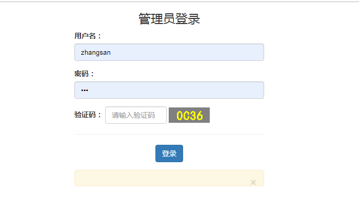
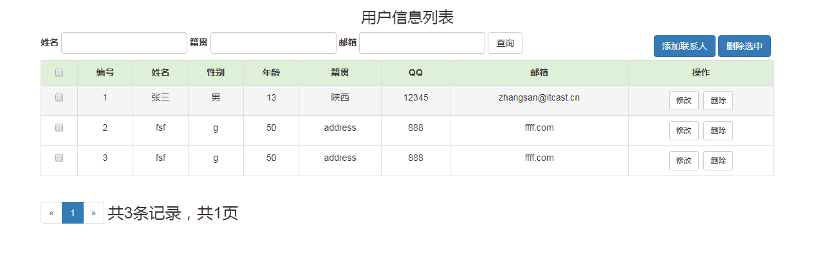
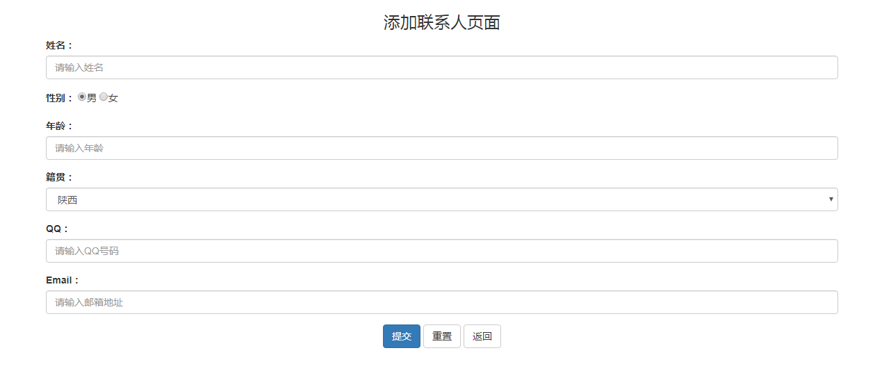
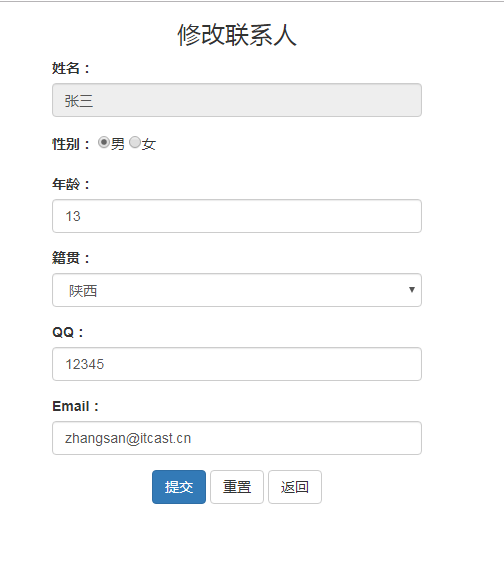
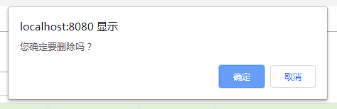
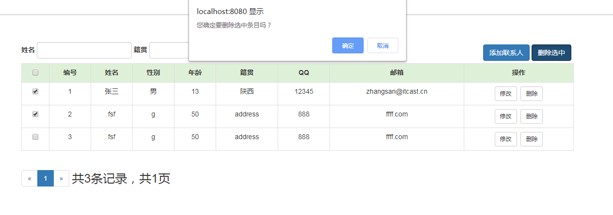
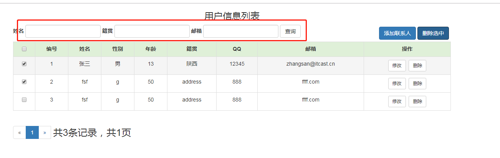
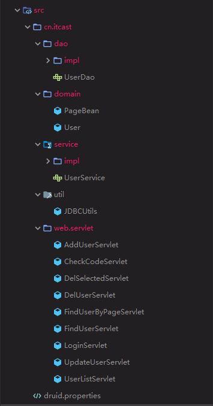
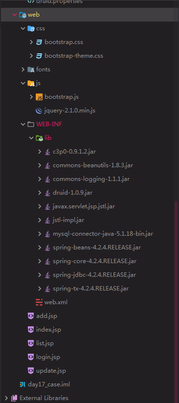

> JSP + JDBCTemplate + mysql + Servlet 实现的用户信息系统Demo

<!-- more-->

## 1. 运行界面

### 1.1 登录页面



### 1.2 登录成功页面


### 1.3  用户信息列表界面



### 1.4 添加联系人界面



### 1.5 修改联系人界面



### 1.6 删除联系人



### 1.7 删除选中



### 1.8 查询界面



## 2. 项目截图

### 2.1 Src 目录



### 2.2 web 目录



## 3. 实现

### 3.1 项目搭建

1. 创建 Java Web 项目
2. 导入依赖

### 3.2 数据库工具类

#### src目录下新建 druid.properties文件

```properties
driverClassName=com.mysql.jdbc.Driver
url=jdbc:mysql:///db1
username=root
password=123456
# 初始化连接数量
initialSize=5
# 最大连接数
maxActive=10
# 最大等待时间
maxWait=3000
```

#### 创建工具类 com.itcast.util.JDBCUtils

```java
package cn.itcast.util;

import com.alibaba.druid.pool.DruidDataSourceFactory;

import javax.sql.DataSource;
import java.io.IOException;
import java.io.InputStream;
import java.sql.Connection;
import java.sql.SQLException;
import java.util.Properties;

/**
 * JDBC工具类 使用Durid连接池
 */
public class JDBCUtils {

    private static DataSource ds ;

    static {

        try {
            //1.加载配置文件
            Properties pro = new Properties();
            //使用ClassLoader加载配置文件，获取字节输入流
            InputStream is = JDBCUtils.class.getClassLoader().getResourceAsStream("druid.properties");
            pro.load(is);

            //2.初始化连接池对象
            ds = DruidDataSourceFactory.createDataSource(pro);

        } catch (IOException e) {
            e.printStackTrace();
        } catch (Exception e) {
            e.printStackTrace();
        }
    }

    /**
     * 获取连接池对象
     */
    public static DataSource getDataSource(){
        return ds;
    }


    /**
     * 获取连接Connection对象
     */
    public static Connection getConnection() throws SQLException {
        return  ds.getConnection();
    }
}

```

#### user表创建

```sql
SET FOREIGN_KEY_CHECKS=0;

-- ----------------------------
-- Table structure for user
-- ----------------------------
DROP TABLE IF EXISTS `user`;
CREATE TABLE `user` (
  `id` int(11) NOT NULL AUTO_INCREMENT,
  `name` varchar(20) CHARACTER SET utf8 NOT NULL,
  `gender` varchar(5) CHARACTER SET utf8 DEFAULT NULL,
  `age` int(11) DEFAULT NULL,
  `address` varchar(32) CHARACTER SET utf8 DEFAULT NULL,
  `qq` varchar(20) CHARACTER SET utf8 DEFAULT NULL,
  `email` varchar(50) CHARACTER SET utf8 DEFAULT NULL,
  `username` varchar(255) DEFAULT NULL,
  `password` varchar(255) DEFAULT NULL,
  PRIMARY KEY (`id`)
) ENGINE=InnoDB AUTO_INCREMENT=8 DEFAULT CHARSET=latin1;

```

### 3.3 Domain 层

- User.java

与数据库中 User 表对应

```java
package cn.itcast.domain;

public class User {
    private int id;
    private String name;
    private String gender;
    private int age;
    private String address;
    private String qq;
    private String email;

    private String username;
    private String password;

    public String getUsername() {
        return username;
    }

    public void setUsername(String username) {
        this.username = username;
    }

    public String getPassword() {
        return password;
    }

    public void setPassword(String password) {
        this.password = password;
    }

    public int getId() {
        return id;
    }

    public void setId(int id) {
        this.id = id;
    }

    public String getName() {
        return name;
    }

    public void setName(String name) {
        this.name = name;
    }

    public String getGender() {
        return gender;
    }

    public void setGender(String gender) {
        this.gender = gender;
    }

    public int getAge() {
        return age;
    }

    public void setAge(int age) {
        this.age = age;
    }

    public String getAddress() {
        return address;
    }

    public void setAddress(String address) {
        this.address = address;
    }

    public String getQq() {
        return qq;
    }

    public void setQq(String qq) {
        this.qq = qq;
    }

    public String getEmail() {
        return email;
    }

    public void setEmail(String email) {
        this.email = email;
    }

    @Override
    public String toString() {
        return "User{" +
                "id=" + id +
                ", name='" + name + '\'' +
                ", gender='" + gender + '\'' +
                ", age=" + age +
                ", address='" + address + '\'' +
                ", qq='" + qq + '\'' +
                ", email='" + email + '\'' +
                ", username='" + username + '\'' +
                ", password='" + password + '\'' +
                '}';
    }
}

```

- PageBeam.java

分页对象，用来处理分页

```java
package cn.itcast.domain;

import java.util.List;

/**
 * 分页对象
 */
public class PageBean<T> {
    private int totalCount; // 总记录数
    private int totalPage ; // 总页码
    private List<T> list ; // 每页的数据
    private int currentPage ; //当前页码
    private int rows;//每页显示的记录数

    public int getTotalCount() {
        return totalCount;
    }

    public void setTotalCount(int totalCount) {
        this.totalCount = totalCount;
    }

    public int getTotalPage() {
        return totalPage;
    }

    public void setTotalPage(int totalPage) {
        this.totalPage = totalPage;
    }

    public List<T> getList() {
        return list;
    }

    public void setList(List<T> list) {
        this.list = list;
    }

    public int getCurrentPage() {
        return currentPage;
    }

    public void setCurrentPage(int currentPage) {
        this.currentPage = currentPage;
    }

    public int getRows() {
        return rows;
    }

    public void setRows(int rows) {
        this.rows = rows;
    }

    @Override
    public String toString() {
        return "PageBean{" +
                "totalCount=" + totalCount +
                ", totalPage=" + totalPage +
                ", list=" + list +
                ", currentPage=" + currentPage +
                ", rows=" + rows +
                '}';
    }
}

```

### 3.4 Dao 层

- UserDao.java  接口

```java
package cn.itcast.dao;

import cn.itcast.domain.User;

import java.util.List;
import java.util.Map;

/**
 * 用户操作的DAO
 */
public interface UserDao {
    /* 查询所有用户信息 */
    public List<User> findAll();
    /* 根据用户名+密码查询 ==》 login 判断用户是否存在 */
    User findUserByUsernameAndPassword(String username, String password);
    /* 添加用户信息 */
    void add(User user);
    /* 删除用户信息 */
    void delete(int id);
    /* 根据UserId 查询 User*/
    User findById(int i);
    /* 更新 User信息*/
    void update(User user);
    /* 查询总记录数 */
    int findTotalCount(Map<String, String[]> condition);
    /**分页查询每页记录*/
    List<User> findByPage(int start, int rows, Map<String, String[]> condition);
}

```

- UserDaoImpl.java 实现

```java
package cn.itcast.dao.impl;

import cn.itcast.dao.UserDao;
import cn.itcast.domain.User;
import cn.itcast.util.JDBCUtils;
import org.springframework.jdbc.core.BeanPropertyRowMapper;
import org.springframework.jdbc.core.JdbcTemplate;

import java.util.ArrayList;
import java.util.List;
import java.util.Map;
import java.util.Set;

public class UserDaoImpl implements UserDao {

    private JdbcTemplate template = new JdbcTemplate(JDBCUtils.getDataSource());

    @Override
    public List<User> findAll() {
        //使用JDBC操作数据库...
        //1.定义sql
        String sql = "select * from user";
        List<User> users = template.query(sql, new BeanPropertyRowMapper<User>(User.class));

        return users;
    }

    @Override
    public User findUserByUsernameAndPassword(String username, String password) {
        try {
            String sql = "select * from user where username = ? and password = ?";
            User user = template.queryForObject(sql, new BeanPropertyRowMapper<User>(User.class), username, password);
            return user;
        } catch (Exception e) {
            e.printStackTrace();
            return null;
        }

    }

    @Override
    public void add(User user) {
        //1.定义sql
        String sql = "insert into user values(null,?,?,?,?,?,?,null,null)";
        //2.执行sql
        template.update(sql, user.getName(), user.getGender(), user.getAge(), user.getAddress(), user.getQq(), user.getEmail());
    }

    @Override
    public void delete(int id) {
        //1.定义sql
        String sql = "delete from user where id = ?";
        //2.执行sql
        template.update(sql, id);
    }

    @Override
    public User findById(int id) {
        String sql = "select * from user where id = ?";
        return template.queryForObject(sql, new BeanPropertyRowMapper<User>(User.class), id);
    }

    @Override
    public void update(User user) {
        String sql = "update user set name = ?,gender = ? ,age = ? , address = ? , qq = ?, email = ? where id = ?";
        template.update(sql, user.getName(), user.getGender(), user.getAge(), user.getAddress(), user.getQq(), user.getEmail(), user.getId());
    }

    @Override
    public int findTotalCount(Map<String, String[]> condition) {
        //1.定义模板初始化sql
        String sql = "select count(*) from user where 1 = 1 ";
        StringBuilder sb = new StringBuilder(sql);
        //2.遍历map
        Set<String> keySet = condition.keySet();
        //定义参数的集合
        List<Object> params = new ArrayList<Object>();
        for (String key : keySet) {

            //排除分页条件参数
            if("currentPage".equals(key) || "rows".equals(key)){
                continue;
            }

            //获取value
            String value = condition.get(key)[0];
            //判断value是否有值
            if(value != null && !"".equals(value)){
                //有值
                sb.append(" and "+key+" like ? ");
                params.add("%"+value+"%");//？条件的值
            }
        }
        System.out.println(sb.toString());
        System.out.println(params);

        return template.queryForObject(sb.toString(),Integer.class,params.toArray());
    }

    @Override
    public List<User> findByPage(int start, int rows, Map<String, String[]> condition) {
        String sql = "select * from user  where 1 = 1 ";

        StringBuilder sb = new StringBuilder(sql);
        //2.遍历map
        Set<String> keySet = condition.keySet();
        //定义参数的集合
        List<Object> params = new ArrayList<Object>();
        for (String key : keySet) {

            //排除分页条件参数
            if("currentPage".equals(key) || "rows".equals(key)){
                continue;
            }

            //获取value
            String value = condition.get(key)[0];
            //判断value是否有值
            if(value != null && !"".equals(value)){
                //有值
                sb.append(" and "+key+" like ? ");
                params.add("%"+value+"%");//？条件的值
            }
        }

        //添加分页查询
        sb.append(" limit ?,? ");
        //添加分页查询参数值
        params.add(start);
        params.add(rows);
        sql = sb.toString();
        System.out.println(sql);
        System.out.println(params);

        return template.query(sql,new BeanPropertyRowMapper<User>(User.class),params.toArray());
    }
}

```

### 3.5 Service 层

- UserService.java 接口

```java
package cn.itcast.service;

import cn.itcast.domain.PageBean;
import cn.itcast.domain.User;

import java.util.List;
import java.util.Map;

/**
 * 用户管理的业务接口
 */
public interface UserService {

    /**
     * 查询所有用户信息
     * @return
     */
    public List<User> findAll();

    /**
     * 登录方法
     * @param user
     * @return
     */
    User login(User user);

    /**
     * 保存User
     * @param user
     */
    void addUser(User user);

    /**
     * 根据id删除User
     * @param id
     */
    void deleteUser(String id);

    /**
     * 根据id查询
     * @param id
     * @return
     */
    User findUserById(String id);

    /**
     * 修改用户信息
     * @param user
     */
    void updateUser(User user);

    /**
     * 批量删除用户
     * @param ids
     */
    void delSelectedUser(String[] ids);

    /**
     * 分页条件查询
     * @param currentPage
     * @param rows
     * @param condition
     * @return
     */
    PageBean<User> findUserByPage(String currentPage, String rows, Map<String, String[]> condition);
}

```

- UserServiceImpl.java 实现

```java
package cn.itcast.service.impl;

import cn.itcast.dao.UserDao;
import cn.itcast.dao.impl.UserDaoImpl;
import cn.itcast.domain.PageBean;
import cn.itcast.domain.User;
import cn.itcast.service.UserService;

import java.util.List;
import java.util.Map;

public class UserServiceImpl implements UserService {
    private UserDao dao = new UserDaoImpl();

    @Override
    public List<User> findAll() {
        //调用Dao完成查询
        return dao.findAll();
    }

    @Override
    public User login(User user) {
        return dao.findUserByUsernameAndPassword(user.getUsername(),user.getPassword());
    }

    @Override
    public void addUser(User user) {
        dao.add(user);
    }

    @Override
    public void deleteUser(String id) {
        dao.delete(Integer.parseInt(id));
    }

    @Override
    public User findUserById(String id) {
        return dao.findById(Integer.parseInt(id));
    }

    @Override
    public void updateUser(User user) {
        dao.update(user);
    }

    @Override
    public void delSelectedUser(String[] ids) {
        if(ids != null && ids.length > 0){
            //1.遍历数组
            for (String id : ids) {
                //2.调用dao删除
                dao.delete(Integer.parseInt(id));
            }
        }

    }

    @Override
    public PageBean<User> findUserByPage(String _currentPage, String _rows, Map<String, String[]> condition) {

        int currentPage = Integer.parseInt(_currentPage);
        int rows = Integer.parseInt(_rows);

        if(currentPage <=0) {
            currentPage = 1;
        }
        //1.创建空的PageBean对象
        PageBean<User> pb = new PageBean<User>();
        //2.设置参数
        pb.setCurrentPage(currentPage);
        pb.setRows(rows);

        //3.调用dao查询总记录数
        int totalCount = dao.findTotalCount(condition);
        pb.setTotalCount(totalCount);
        //4.调用dao查询List集合
        //计算开始的记录索引
        int start = (currentPage - 1) * rows;
        List<User> list = dao.findByPage(start,rows,condition);
        pb.setList(list);

        //5.计算总页码
        int totalPage = (totalCount % rows)  == 0 ? totalCount/rows : (totalCount/rows) + 1;
        pb.setTotalPage(totalPage);


        return pb;
    }
}

```


### 3.6 登录页面 Jsp

#### JSP页面

- 关键点

```
1. 通过 EL表达式，获取当前虚拟目录 + 路由
	"${pageContext.request.contextPath}/loginServlet"
2. 验证码 每次请求url 都拼接一个 时间戳，防止缓存问题导致 总是取到缓存照片，造成不能刷新
	"${pageContext.request.contextPath}/checkCodeServlet?time="+new Date().getTime();
3. 登录失败(用户密码错误、认证码错误等)，调回该界面时，通过 request 域中的 login_msg 提示对应错误
	${login_msg}
```

- login.jsp 代码

```jsp
<%@ page contentType="text/html;charset=UTF-8" language="java" %>

<!DOCTYPE html>
<html lang="zh-CN">
<head>
    <meta charset="utf-8"/>
    <meta http-equiv="X-UA-Compatible" content="IE=edge"/>
    <meta name="viewport" content="width=device-width, initial-scale=1"/>
    <title>管理员登录</title>

    <!-- 1. 导入CSS的全局样式 -->
    <link href="css/bootstrap.min.css" rel="stylesheet">
    <!-- 2. jQuery导入，建议使用1.9以上的版本 -->
    <script src="js/jquery-2.1.0.min.js"></script>
    <!-- 3. 导入bootstrap的js文件 -->
    <script src="js/bootstrap.min.js"></script>
    <script type="text/javascript">
        //切换验证码
        function refreshCode(){
            //1.获取验证码图片对象
            var vcode = document.getElementById("vcode");

            //2.设置其src属性，加时间戳
            vcode.src = "${pageContext.request.contextPath}/checkCodeServlet?time="+new Date().getTime();
        }
    </script>
</head>
<body>
<div class="container" style="width: 400px;">
    <h3 style="text-align: center;">管理员登录</h3>
    <form action="${pageContext.request.contextPath}/loginServlet" method="post">
        <div class="form-group">
            <label for="user">用户名：</label>
            <input type="text" name="username" class="form-control" id="user" placeholder="请输入用户名"/>
        </div>

        <div class="form-group">
            <label for="password">密码：</label>
            <input type="password" name="password" class="form-control" id="password" placeholder="请输入密码"/>
        </div>

        <div class="form-inline">
            <label for="vcode">验证码：</label>
            <input type="text" name="verifycode" class="form-control" id="verifycode" placeholder="请输入验证码" style="width: 120px;"/>
            <a href="javascript:refreshCode();">
                
            </a>
        </div>
        <hr/>
        <div class="form-group" style="text-align: center;">
            <input class="btn btn btn-primary" type="submit" value="登录">
        </div>
    </form>

    <!-- 出错显示的信息框 -->
    <div class="alert alert-warning alert-dismissible" role="alert">
        <button type="button" class="close" data-dismiss="alert" >
            <span>&times;</span>
        </button>
        <strong>${login_msg}</strong>
    </div>
</div>
</body>
</html>
```

### 3.7  验证码 Servlet

- 关键点

```java
1. 通知浏览器不要缓存该图片信息
    response.setHeader("pragma","no-cache");
    response.setHeader("cache-control","no-cache");
    response.setHeader("expires","0");
2. 验证码 生成步骤
3. 存储验证码到 session 中
	request.getSession().setAttribute("CHECKCODE_SERVER",checkCode);
4. 将内存的图片输出到浏览器
	ImageIO.write(image,"PNG",response.getOutputStream());
```

#### CheckCodeServlet.java

```java
package cn.itcast.web.servlet;

import javax.imageio.ImageIO;
import javax.servlet.ServletException;
import javax.servlet.annotation.WebServlet;
import javax.servlet.http.HttpServlet;
import javax.servlet.http.HttpServletRequest;
import javax.servlet.http.HttpServletResponse;
import java.awt.*;
import java.awt.image.BufferedImage;
import java.io.IOException;
import java.util.Random;

/**
 * 验证码
 */
@WebServlet("/checkCodeServlet")
public class CheckCodeServlet extends HttpServlet {
	public void doGet(HttpServletRequest request, HttpServletResponse response)throws ServletException, IOException {
		
		//服务器通知浏览器不要缓存
		response.setHeader("pragma","no-cache");
		response.setHeader("cache-control","no-cache");
		response.setHeader("expires","0");
		
		//在内存中创建一个长80，宽30的图片，默认黑色背景
		//参数一：长
		//参数二：宽
		//参数三：颜色
		int width = 80;
		int height = 30;
		BufferedImage image = new BufferedImage(width,height,BufferedImage.TYPE_INT_RGB);
		
		//获取画笔
		Graphics g = image.getGraphics();
		//设置画笔颜色为灰色
		g.setColor(Color.GRAY);
		//填充图片
		g.fillRect(0,0, width,height);
		
		//产生4个随机验证码，12Ey
		String checkCode = getCheckCode();
		//将验证码放入HttpSession中
		request.getSession().setAttribute("CHECKCODE_SERVER",checkCode);
		
		//设置画笔颜色为黄色
		g.setColor(Color.YELLOW);
		//设置字体的小大
		g.setFont(new Font("黑体",Font.BOLD,24));
		//向图片上写入验证码
		g.drawString(checkCode,15,25);
		
		//将内存中的图片输出到浏览器
		//参数一：图片对象
		//参数二：图片的格式，如PNG,JPG,GIF
		//参数三：图片输出到哪里去
		ImageIO.write(image,"PNG",response.getOutputStream());
	}
	/**
	 * 产生4位随机字符串 
	 */
	private String getCheckCode() {
		String base = "0123456789ABCDEFGabcdefg";
		int size = base.length();
		Random r = new Random();
		StringBuffer sb = new StringBuffer();
		for(int i=1;i<=4;i++){
			//产生0到size-1的随机值
			int index = r.nextInt(size);
			//在base字符串中获取下标为index的字符
			char c = base.charAt(index);
			//将c放入到StringBuffer中去
			sb.append(c);
		}
		return sb.toString();
	}
	public void doPost(HttpServletRequest request, HttpServletResponse response) throws ServletException, IOException {
		this.doGet(request,response);
	}
}

```

### 3.8  登录认证 

#### LoginServlet

- 流程

```
1. 从参数 和 session中获取 验证码，并判断验证码是否正确
2. 如果验证码错误，跳转回登录界面，并在 request域设置 login_msg，使得 jsp可以提示具体信息
3. 如果验证码正确，调用 service 的login接口 判断登录信息是否正确
4. 登录成功，跳转 index.jsp; 是否 跳转回 登录界面
```

- 关键点

```
1. 从 session 中取出 验证码进行 比对校验
2. 从 session 中取出 验证码之后，删除 session中验证码（表明该认证码只能使用一次)
3. 请求时，传递的 username， password 等参数，转换为 User 对象，通过BeanUtils 实现
	BeanUtils.populate(user,map);
	避免了一个一个属性的赋值，更加方便
4. Servlet -> service -> Dao
```

```java
package cn.itcast.web.servlet;

import cn.itcast.domain.User;
import cn.itcast.service.UserService;
import cn.itcast.service.impl.UserServiceImpl;
import org.apache.commons.beanutils.BeanUtils;

import javax.servlet.ServletException;
import javax.servlet.annotation.WebServlet;
import javax.servlet.http.HttpServlet;
import javax.servlet.http.HttpServletRequest;
import javax.servlet.http.HttpServletResponse;
import javax.servlet.http.HttpSession;
import java.io.IOException;
import java.lang.reflect.InvocationTargetException;
import java.util.Map;

@WebServlet("/loginServlet")
public class LoginServlet extends HttpServlet {
    protected void doPost(HttpServletRequest request, HttpServletResponse response) throws ServletException, IOException {
        //1.设置编码
        request.setCharacterEncoding("utf-8");

        //2.获取数据
        //2.1获取用户填写验证码
        String verifycode = request.getParameter("verifycode");

        //3.验证码校验
        HttpSession session = request.getSession();
        String checkcode_server = (String) session.getAttribute("CHECKCODE_SERVER");
        session.removeAttribute("CHECKCODE_SERVER");//确保验证码一次性
        if(!checkcode_server.equalsIgnoreCase(verifycode)){
            //验证码不正确
            //提示信息
            request.setAttribute("login_msg","验证码错误！");
            //跳转登录页面
            request.getRequestDispatcher("/login.jsp").forward(request,response);

            return;
        }
        Map<String, String[]> map = request.getParameterMap();
        //4.封装User对象
        User user = new User();
        try {
            BeanUtils.populate(user,map);
        } catch (IllegalAccessException e) {
            e.printStackTrace();
        } catch (InvocationTargetException e) {
            e.printStackTrace();
        }
        //5.调用Service查询
        UserService service = new UserServiceImpl();
        User loginUser = service.login(user);
        //6.判断是否登录成功
        if(loginUser != null){
            //登录成功
            //将用户存入session
            session.setAttribute("user",loginUser);
            //跳转页面
            response.sendRedirect(request.getContextPath()+"/index.jsp");
        }else{
            //登录失败
            //提示信息
            request.setAttribute("login_msg","用户名或密码错误！");
            //跳转登录页面
            request.getRequestDispatcher("/login.jsp").forward(request,response);

        }
    }

    protected void doGet(HttpServletRequest request, HttpServletResponse response) throws ServletException, IOException {
        this.doPost(request, response);
    }
}

```

### 3.9 登录成功界面 jsp

#### index.jsp

```jsp
<%@ page contentType="text/html;charset=UTF-8" language="java" %>
<%@ taglib prefix="c" uri="http://java.sun.com/jsp/jstl/core" %>

<!DOCTYPE html>
<html lang="zh-CN">
<head>
  <meta charset="utf-8"/>
  <meta http-equiv="X-UA-Compatible" content="IE=edge"/>
  <meta name="viewport" content="width=device-width, initial-scale=1"/>
  <title>首页</title>

  <!-- 1. 导入CSS的全局样式 -->
  <link href="css/bootstrap.min.css" rel="stylesheet">
  <!-- 2. jQuery导入，建议使用1.9以上的版本 -->
  <script src="js/jquery-2.1.0.min.js"></script>
  <!-- 3. 导入bootstrap的js文件 -->
  <script src="js/bootstrap.min.js"></script>
  <script type="text/javascript">
  </script>
</head>
<body>
  <div >${user.name},欢迎您</div>
  <div align="center">
    <a
            href="${pageContext.request.contextPath}/findUserByPageServlet" style="text-decoration:none;font-size:33px">查询所有用户信息
    </a>
  </div>
</body>
</html>
```

### 3.10 查询所有用户信息功能

#### findUserByPageServlet

- 关键点

```
1. 查询时，如果未指定 page信息，使用 默认
2. 查询时，可能使用 查询条件， 在Dao层，动态生成 sql 进行执行
```

```java
package cn.itcast.web.servlet;

import cn.itcast.domain.PageBean;
import cn.itcast.domain.User;
import cn.itcast.service.UserService;
import cn.itcast.service.impl.UserServiceImpl;

import javax.servlet.ServletException;
import javax.servlet.annotation.WebServlet;
import javax.servlet.http.HttpServlet;
import javax.servlet.http.HttpServletRequest;
import javax.servlet.http.HttpServletResponse;
import java.io.IOException;
import java.util.Map;

@WebServlet("/findUserByPageServlet")
public class FindUserByPageServlet extends HttpServlet {
    protected void doPost(HttpServletRequest request, HttpServletResponse response) throws ServletException, IOException {
        request.setCharacterEncoding("utf-8");
        //1.获取参数
        String currentPage = request.getParameter("currentPage");//当前页码
        String rows = request.getParameter("rows");//每页显示条数
        if(currentPage == null || "".equals(currentPage)){
            currentPage = "1";
        }
        if(rows == null || "".equals(rows)){
            rows = "5";
        }
        //获取条件查询参数
        Map<String, String[]> condition = request.getParameterMap();
        //2.调用service查询
        UserService service = new UserServiceImpl();
        PageBean<User> pb = service.findUserByPage(currentPage,rows,condition);
        System.out.println(pb);
        //3.将PageBean存入request
        request.setAttribute("pb",pb);
        request.setAttribute("condition",condition);//将查询条件存入request
        //4.转发到list.jsp
        request.getRequestDispatcher("/list.jsp").forward(request,response);
    }

    protected void doGet(HttpServletRequest request, HttpServletResponse response) throws ServletException, IOException {
        this.doPost(request, response);
    }
}

```

#### list.jsp

- 关键点

```
1. 使用 EL表达式的 forEach 实现 列表每一行
```


```jsp
<%@ page contentType="text/html;charset=UTF-8" language="java" %>

<%@taglib prefix="c" uri="http://java.sun.com/jsp/jstl/core" %>

<!DOCTYPE html>
<!-- 网页使用的语言 -->
<html lang="zh-CN">
<head>
    <!-- 指定字符集 -->
    <meta charset="utf-8">
    <!-- 使用Edge最新的浏览器的渲染方式 -->
    <meta http-equiv="X-UA-Compatible" content="IE=edge">
    <!-- viewport视口：网页可以根据设置的宽度自动进行适配，在浏览器的内部虚拟一个容器，容器的宽度与设备的宽度相同。
    width: 默认宽度与设备的宽度相同
    initial-scale: 初始的缩放比，为1:1 -->
    <meta name="viewport" content="width=device-width, initial-scale=1">
    <!-- 上述3个meta标签*必须*放在最前面，任何其他内容都*必须*跟随其后！ -->
    <title>用户信息管理系统</title>

    <!-- 1. 导入CSS的全局样式 -->
    <link href="css/bootstrap.min.css" rel="stylesheet">
    <!-- 2. jQuery导入，建议使用1.9以上的版本 -->
    <script src="js/jquery-2.1.0.min.js"></script>
    <!-- 3. 导入bootstrap的js文件 -->
    <script src="js/bootstrap.min.js"></script>
    <style type="text/css">
        td, th {
            text-align: center;
        }
    </style>

    <script>
        function deleteUser(id){
            //用户安全提示
            if(confirm("您确定要删除吗？")){
                //访问路径
                location.href="${pageContext.request.contextPath}/delUserServlet?id="+id;
            }
        }

        window.onload = function(){
            //给删除选中按钮添加单击事件
            document.getElementById("delSelected").onclick = function(){
                if(confirm("您确定要删除选中条目吗？")){

                   var flag = false;
                    //判断是否有选中条目
                    var cbs = document.getElementsByName("uid");
                    for (var i = 0; i < cbs.length; i++) {
                        if(cbs[i].checked){
                            //有一个条目选中了
                            flag = true;
                            break;
                        }
                    }

                    if(flag){//有条目被选中
                        //表单提交
                        document.getElementById("form").submit();
                    }

                }

            }
            //1.获取第一个cb
            document.getElementById("firstCb").onclick = function(){
                //2.获取下边列表中所有的cb
                var cbs = document.getElementsByName("uid");
                //3.遍历
                for (var i = 0; i < cbs.length; i++) {
                    //4.设置这些cbs[i]的checked状态 = firstCb.checked
                    cbs[i].checked = this.checked;

                }

            }


        }


    </script>
</head>
<body>
<div class="container">
    <h3 style="text-align: center">用户信息列表</h3>

    <div style="float: left;">

        <form class="form-inline" action="${pageContext.request.contextPath}/findUserByPageServlet" method="post">
            <div class="form-group">
                <label for="exampleInputName2">姓名</label>
                <input type="text" name="name" value="${condition.name[0]}" class="form-control" id="exampleInputName2" >
            </div>
            <div class="form-group">
                <label for="exampleInputName3">籍贯</label>
                <input type="text" name="address" value="${condition.address[0]}" class="form-control" id="exampleInputName3" >
            </div>

            <div class="form-group">
                <label for="exampleInputEmail2">邮箱</label>
                <input type="text" name="email" value="${condition.email[0]}" class="form-control" id="exampleInputEmail2"  >
            </div>
            <button type="submit" class="btn btn-default">查询</button>
        </form>

    </div>

    <div style="float: right;margin: 5px;">

        <a class="btn btn-primary" href="${pageContext.request.contextPath}/add.jsp">添加联系人</a>
        <a class="btn btn-primary" href="javascript:void(0);" id="delSelected">删除选中</a>

    </div>
    <form id="form" action="${pageContext.request.contextPath}/delSelectedServlet" method="post">
        <table border="1" class="table table-bordered table-hover">
        <tr class="success">
            <th><input type="checkbox" id="firstCb"></th>
            <th>编号</th>
            <th>姓名</th>
            <th>性别</th>
            <th>年龄</th>
            <th>籍贯</th>
            <th>QQ</th>
            <th>邮箱</th>
            <th>操作</th>
        </tr>

        <c:forEach items="${pb.list}" var="user" varStatus="s">
            <tr>
                <td><input type="checkbox" name="uid" value="${user.id}"></td>
                <td>${s.count}</td>
                <td>${user.name}</td>
                <td>${user.gender}</td>
                <td>${user.age}</td>
                <td>${user.address}</td>
                <td>${user.qq}</td>
                <td>${user.email}</td>
                <td><a class="btn btn-default btn-sm" href="${pageContext.request.contextPath}/findUserServlet?id=${user.id}">修改</a>&nbsp;
                    <a class="btn btn-default btn-sm" href="javascript:deleteUser(${user.id});">删除</a></td>
            </tr>

        </c:forEach>


    </table>
    </form>
    <div>
        <nav aria-label="Page navigation">
            <ul class="pagination">
                <c:if test="${pb.currentPage == 1}">
                    <li class="disabled">
                </c:if>

                <c:if test="${pb.currentPage != 1}">
                    <li>
                </c:if>


                    <a href="${pageContext.request.contextPath}/findUserByPageServlet?currentPage=${pb.currentPage - 1}&rows=5&name=${condition.name[0]}&address=${condition.address[0]}&email=${condition.email[0]}" aria-label="Previous">
                        <span aria-hidden="true">&laquo;</span>
                    </a>
                </li>


                <c:forEach begin="1" end="${pb.totalPage}" var="i" >


                    <c:if test="${pb.currentPage == i}">
                        <li class="active"><a href="${pageContext.request.contextPath}/findUserByPageServlet?currentPage=${i}&rows=5&name=${condition.name[0]}&address=${condition.address[0]}&email=${condition.email[0]}">${i}</a></li>
                    </c:if>
                    <c:if test="${pb.currentPage != i}">
                        <li><a href="${pageContext.request.contextPath}/findUserByPageServlet?currentPage=${i}&rows=5&name=${condition.name[0]}&address=${condition.address[0]}&email=${condition.email[0]}">${i}</a></li>
                    </c:if>

                </c:forEach>


                <li>
                    <a href="${pageContext.request.contextPath}/findUserByPageServlet?currentPage=${pb.currentPage + 1}&rows=5&name=${condition.name[0]}&address=${condition.address[0]}&email=${condition.email[0]}" aria-label="Next">
                        <span aria-hidden="true">&raquo;</span>
                    </a>
                </li>
                <span style="font-size: 25px;margin-left: 5px;">
                    共${pb.totalCount}条记录，共${pb.totalPage}页
                </span>

            </ul>
        </nav>


    </div>


</div>


</body>
</html>

```

### 3.11 添加 联系人


- 关键点

```
1. addUserServlet 在 成功添加用户信息之后，需要首先跳转到 userListServlet 页面，重新获取所有用户信息，然后在转到 list.jsp 进行刷新显示
```

#### add.jsp

```java
<%@ page contentType="text/html;charset=UTF-8" language="java" %>

<!-- HTML5文档-->
<!DOCTYPE html>
<!-- 网页使用的语言 -->
<html lang="zh-CN">
<head>
    <!-- 指定字符集 -->
    <meta charset="utf-8">
    <!-- 使用Edge最新的浏览器的渲染方式 -->
    <meta http-equiv="X-UA-Compatible" content="IE=edge">
    <!-- viewport视口：网页可以根据设置的宽度自动进行适配，在浏览器的内部虚拟一个容器，容器的宽度与设备的宽度相同。
    width: 默认宽度与设备的宽度相同
    initial-scale: 初始的缩放比，为1:1 -->
    <meta name="viewport" content="width=device-width, initial-scale=1">
    <!-- 上述3个meta标签*必须*放在最前面，任何其他内容都*必须*跟随其后！ -->
    <title>添加用户</title>

    <!-- 1. 导入CSS的全局样式 -->
    <link href="css/bootstrap.min.css" rel="stylesheet">
    <!-- 2. jQuery导入，建议使用1.9以上的版本 -->
    <script src="js/jquery-2.1.0.min.js"></script>
    <!-- 3. 导入bootstrap的js文件 -->
    <script src="js/bootstrap.min.js"></script>
</head>
<body>
<div class="container">
    <center><h3>添加联系人页面</h3></center>
    <form action="${pageContext.request.contextPath}/addUserServlet" method="post">
        <div class="form-group">
            <label for="name">姓名：</label>
            <input type="text" class="form-control" id="name" name="name" placeholder="请输入姓名">
        </div>

        <div class="form-group">
            <label>性别：</label>
            <input type="radio" name="gender" value="男" checked="checked"/>男
            <input type="radio" name="gender" value="女"/>女
        </div>

        <div class="form-group">
            <label for="age">年龄：</label>
            <input type="text" class="form-control" id="age" name="age" placeholder="请输入年龄">
        </div>

        <div class="form-group">
            <label for="address">籍贯：</label>
            <select name="address" class="form-control" id="address">
                <option value="陕西">陕西</option>
                <option value="北京">北京</option>
                <option value="上海">上海</option>
            </select>
        </div>

        <div class="form-group">
            <label for="qq">QQ：</label>
            <input type="text" class="form-control" id="qq" name="qq" placeholder="请输入QQ号码"/>
        </div>

        <div class="form-group">
            <label for="email">Email：</label>
            <input type="text" class="form-control" id="email" name="email" placeholder="请输入邮箱地址"/>
        </div>

        <div class="form-group" style="text-align: center">
            <input class="btn btn-primary" type="submit" value="提交" />
            <input class="btn btn-default" type="reset" value="重置" />
            <input class="btn btn-default" type="button" value="返回" />
        </div>
    </form>
</div>
</body>
</html>
```

#### addUserServlet

```java
@WebServlet("/addUserServlet")
public class AddUserServlet extends HttpServlet {
    protected void doPost(HttpServletRequest request, HttpServletResponse response) throws ServletException, IOException {
        //1.设置编码
        request.setCharacterEncoding("utf-8");
        //2.获取参数
        Map<String, String[]> map = request.getParameterMap();
        //3.封装对象
        User user = new User();
        try {
            BeanUtils.populate(user,map);
        } catch (IllegalAccessException e) {
            e.printStackTrace();
        } catch (InvocationTargetException e) {
            e.printStackTrace();
        }

        //4.调用Service保存
        UserService service = new UserServiceImpl();
        service.addUser(user);

        //5.跳转到userListServlet
        response.sendRedirect(request.getContextPath()+"/userListServlet");
    }

    protected void doGet(HttpServletRequest request, HttpServletResponse response) throws ServletException, IOException {
        this.doPost(request, response);
    }
}
```

#### userListServlet

```java
@WebServlet("/userListServlet")
public class UserListServlet extends HttpServlet {
    protected void doPost(HttpServletRequest request, HttpServletResponse response) throws ServletException, IOException {
        //1.调用UserService完成查询
        UserService service = new UserServiceImpl();
        List<User> users = service.findAll();
        //2.将list存入request域
        request.setAttribute("users",users);
        //3.转发到list.jsp
        request.getRequestDispatcher("/list.jsp").forward(request,response);
    }

    protected void doGet(HttpServletRequest request, HttpServletResponse response) throws ServletException, IOException {
        this.doPost(request, response);
    }
}
```

### 3.12 删除联系人

#### delUserServlet

```java
package cn.itcast.web.servlet;

import cn.itcast.service.UserService;
import cn.itcast.service.impl.UserServiceImpl;

import javax.servlet.ServletException;
import javax.servlet.annotation.WebServlet;
import javax.servlet.http.HttpServlet;
import javax.servlet.http.HttpServletRequest;
import javax.servlet.http.HttpServletResponse;
import java.io.IOException;

@WebServlet("/delUserServlet")
public class DelUserServlet extends HttpServlet {
    protected void doPost(HttpServletRequest request, HttpServletResponse response) throws ServletException, IOException {
        //1.获取id
        String id = request.getParameter("id");
        //2.调用service删除
        UserService service = new UserServiceImpl();
        service.deleteUser(id);

        //3.跳转到查询所有Servlet
        response.sendRedirect(request.getContextPath()+"/userListServlet");
    }

    protected void doGet(HttpServletRequest request, HttpServletResponse response) throws ServletException, IOException {
        this.doPost(request, response);
    }
}

```

### 3.13 更新用户信息


#### 修改按钮对应 url

```
1. 通过 拼接一个 id参数，可知道要对哪个 用户进行修改
<a class="btn btn-default btn-sm" href="${pageContext.request.contextPath}/findUserServlet?id=${user.id}">修改</a>&nbsp;
```

#### update.jsp

- 关键点

```
1. 对于 radio，下拉列表等组件，使用 EL表达式进行判断显示
```

```java
<%@ page contentType="text/html;charset=UTF-8" language="java" %>
<%@taglib prefix="c" uri="http://java.sun.com/jsp/jstl/core" %>
<!DOCTYPE html>
<!-- 网页使用的语言 -->
<html lang="zh-CN">
    <head>
        <!-- 指定字符集 -->
        <meta charset="utf-8">
        <meta http-equiv="X-UA-Compatible" content="IE=edge">
        <meta name="viewport" content="width=device-width, initial-scale=1">
        <title>修改用户</title>

        <link href="css/bootstrap.min.css" rel="stylesheet">
        <script src="js/jquery-2.1.0.min.js"></script>
        <script src="js/bootstrap.min.js"></script>
        
    </head>
    <body>
        <div class="container" style="width: 400px;">
        <h3 style="text-align: center;">修改联系人</h3>
        <form action="${pageContext.request.contextPath}/updateUserServlet" method="post">
            <!--  隐藏域 提交id-->
            <input type="hidden" name="id" value="${user.id}">

          <div class="form-group">
            <label for="name">姓名：</label>
            <input type="text" class="form-control" id="name" name="name"  value="${user.name}" readonly="readonly" placeholder="请输入姓名" />
          </div>

          <div class="form-group">
            <label>性别：</label>
              <c:if test="${user.gender == '男'}">
                  <input type="radio" name="gender" value="男" checked />男
                  <input type="radio" name="gender" value="女"  />女
              </c:if>

              <c:if test="${user.gender == '女'}">
                  <input type="radio" name="gender" value="男"  />男
                  <input type="radio" name="gender" value="女" checked  />女
              </c:if>


          </div>

          <div class="form-group">
            <label for="age">年龄：</label>
            <input type="text" class="form-control" value="${user.age}" id="age"  name="age" placeholder="请输入年龄" />
          </div>

          <div class="form-group">
            <label for="address">籍贯：</label>
             <select name="address" id="address" class="form-control" >
                 <c:if test="${user.address == '陕西'}">
                    <option value="陕西" selected>陕西</option>
                    <option value="北京">北京</option>
                    <option value="上海">上海</option>
                 </c:if>

                 <c:if test="${user.address == '北京'}">
                     <option value="陕西" >陕西</option>
                     <option value="北京" selected>北京</option>
                     <option value="上海">上海</option>
                 </c:if>

                 <c:if test="${user.address == '上海'}">
                     <option value="陕西" >陕西</option>
                     <option value="北京">北京</option>
                     <option value="上海" selected>上海</option>
                 </c:if>
            </select>
          </div>

          <div class="form-group">
            <label for="qq">QQ：</label>
            <input type="text" id="qq" class="form-control" value="${user.qq}" name="qq" placeholder="请输入QQ号码"/>
          </div>

          <div class="form-group">
            <label for="email">Email：</label>
            <input type="text" id="email" class="form-control" value="${user.email}" name="email" placeholder="请输入邮箱地址"/>
          </div>

             <div class="form-group" style="text-align: center">
                <input class="btn btn-primary" type="submit" value="提交" />
                <input class="btn btn-default" type="reset" value="重置" />
                <input class="btn btn-default" type="button" value="返回"/>
             </div>
        </form>
        </div>
    </body>
</html>
```

#### updateUserServlet

```java
package cn.itcast.web.servlet;

import cn.itcast.domain.User;
import cn.itcast.service.UserService;
import cn.itcast.service.impl.UserServiceImpl;
import org.apache.commons.beanutils.BeanUtils;

import javax.servlet.ServletException;
import javax.servlet.annotation.WebServlet;
import javax.servlet.http.HttpServlet;
import javax.servlet.http.HttpServletRequest;
import javax.servlet.http.HttpServletResponse;
import java.io.IOException;
import java.lang.reflect.InvocationTargetException;
import java.util.Map;

@WebServlet("/updateUserServlet")
public class UpdateUserServlet extends HttpServlet {
    protected void doPost(HttpServletRequest request, HttpServletResponse response) throws ServletException, IOException {
        //1.设置编码
        request.setCharacterEncoding("utf-8");
        //2.获取map
        Map<String, String[]> map = request.getParameterMap();
        //3.封装对象
        User user = new User();
        try {
            BeanUtils.populate(user,map);
        } catch (IllegalAccessException e) {
            e.printStackTrace();
        } catch (InvocationTargetException e) {
            e.printStackTrace();
        }

        //4.调用Service修改
        UserService service = new UserServiceImpl();
        service.updateUser(user);

        //5.跳转到查询所有Servlet
        response.sendRedirect(request.getContextPath()+"/userListServlet");
    }

    protected void doGet(HttpServletRequest request, HttpServletResponse response) throws ServletException, IOException {
        this.doPost(request, response);
    }
}

```

### 3.14 删除选中

#### 获取选中，提交

- 要点

```
1. 判断是否有选中条目
2. 如果有选中条目，进行表单提交，此时只会提交选中的列
```

```javascript
window.onload = function(){
            //给删除选中按钮添加单击事件
            document.getElementById("delSelected").onclick = function(){
                if(confirm("您确定要删除选中条目吗？")){

                   var flag = false;
                    //判断是否有选中条目
                    var cbs = document.getElementsByName("uid");
                    for (var i = 0; i < cbs.length; i++) {
                        if(cbs[i].checked){
                            //有一个条目选中了
                            flag = true;
                            break;
                        }
                    }

                    if(flag){//有条目被选中
                        //表单提交
                        document.getElementById("form").submit();
                    }

                }

            }
```

#### deleteSelectedServle

```java
package cn.itcast.web.servlet;

import cn.itcast.service.UserService;
import cn.itcast.service.impl.UserServiceImpl;

import javax.servlet.ServletException;
import javax.servlet.annotation.WebServlet;
import javax.servlet.http.HttpServlet;
import javax.servlet.http.HttpServletRequest;
import javax.servlet.http.HttpServletResponse;
import java.io.IOException;

@WebServlet("/delSelectedServlet")
public class DelSelectedServlet extends HttpServlet {
    protected void doPost(HttpServletRequest request, HttpServletResponse response) throws ServletException, IOException {
        //1.获取所有id
        String[] ids = request.getParameterValues("uid");
        //2.调用service删除
        UserService service = new UserServiceImpl();
        service.delSelectedUser(ids);

        //3.跳转查询所有Servlet
        response.sendRedirect(request.getContextPath()+"/userListServlet");
    }

    protected void doGet(HttpServletRequest request, HttpServletResponse response) throws ServletException, IOException {
        this.doPost(request, response);
    }
}

```

